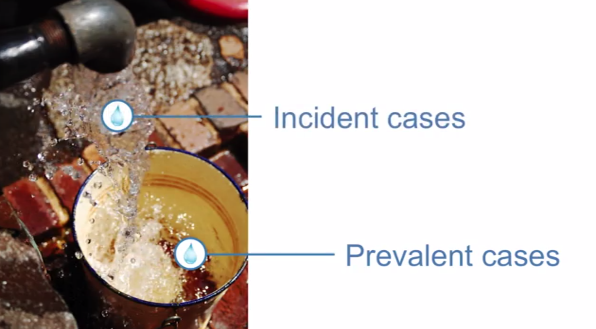
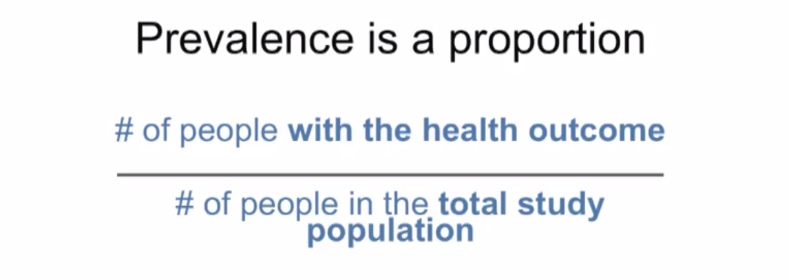
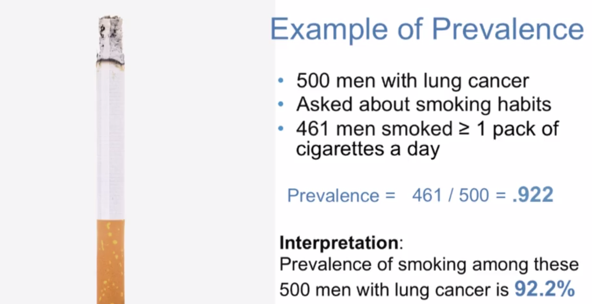

# *Understanding Measures of Disease Frequency*

Date: 11.22.2014

## Prevalent vs Incident Cases

* **prevalent case**: All cases (both existing and new), individual with outcome of interest, regardless of when diagnosed.
    * Calculating prevalence.

* **Incident case**: A new case, individual who change in status over a specified period of time.
    * Calculating risks, rates.

## Prevalence

* The most common epidemiological measure.
* Proportion of a defined population that has the health outcome.
* Uses existing cases of the health outcome: cases whose health outcome developed or was diagnosed before they were identified for the study.
* Quantifies the **burden** on a population.
* Useful planning prevention services.

Examples: Malaria infects 10% of the world's population.

### Prevalence is a proportion

* Numerator: Prevalent cases (i.e. all cases at a given time: existing + new)
* Denominator: Total study population (i.e. total number of individuals at risk)

* Important to specify the time period which the prevalence was measured.

* Prevalence is often cross-sectional measure:
    * Point prevalence: prevalence at a point of time
        * example: do you currently have asthma? (moment)
    * Period prevalence: number people with a health outcome over a specified period of the time.
        * example: Have you had asthma during the past 3 years? (period)

