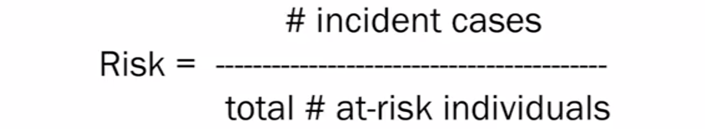
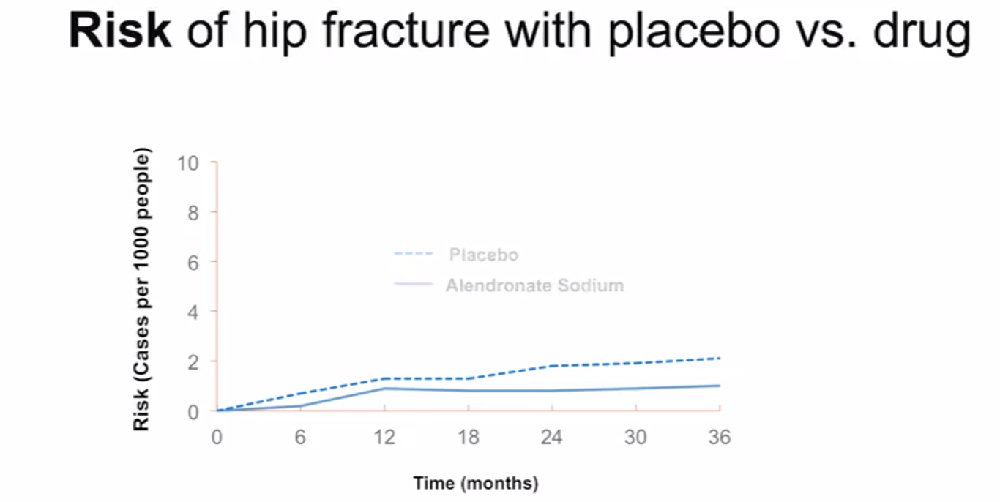
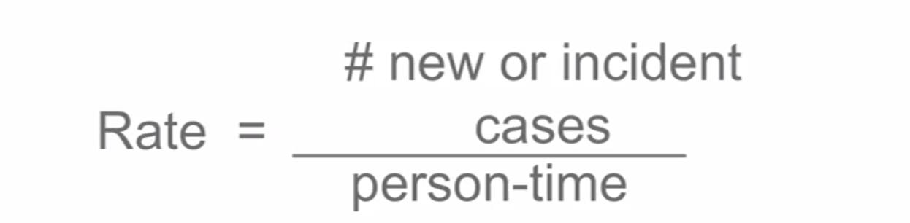
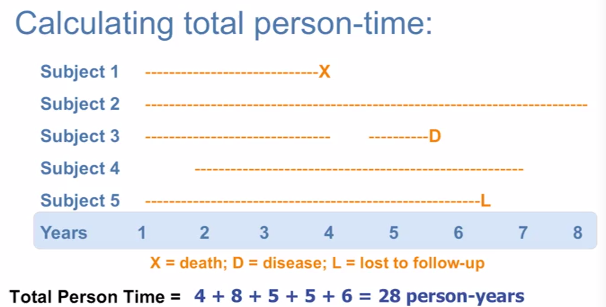
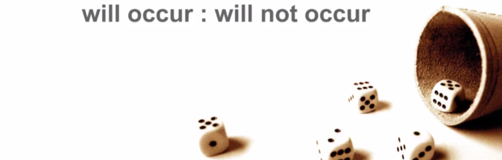

# *Understanding Measures of Disease Frequency*

Date: 11.22.2014

## Prevalent vs Incident Cases

* **prevalent case**: All cases (both existing and new), individual with outcome of interest, regardless of when diagnosed.
    * Calculating prevalence.

* **Incident case**: A new case, individual who change in status over a specified period of time.
    * Calculating risks, rates.

## Prevalence

* The most common epidemiological measure.
* Proportion of a defined population that has the health outcome.
* Uses existing cases of the health outcome: cases whose health outcome developed or was diagnosed before they were identified for the study.
* Quantifies the **burden** on a population.
* Useful planning prevention services.

Examples: Malaria infects 10% of the world's population.

### Prevalence is a proportion

* Numerator: Prevalent cases (i.e. all cases at a given time: existing + new)
* Denominator: Total study population (i.e. total number of individuals in the study)

* Important to specify the time period which the prevalence was measured.

* Prevalence is often cross-sectional measure:
    * Point prevalence: prevalence at a point of time
        * example: do you currently have asthma? (moment)
    * Period prevalence: number people with a health outcome over a specified period of the time.
        * example: Have you had asthma during the past 3 years? (period)

## Risk

* Risk is a common word with a broader meaning, but in epidemiology, we have a very specific definition.
* Numerator: Incident cases (i.e. new cases identified during study follow-up)
* Denominator: Study population at risk at beginning of follow-up.

* Risk measure the number of **new** cases of the health outcome that develop among people in the population at risk, over a specified time period.
* Risk refers to the probability that a health outcome will occur.
* Risk can be expressed as a proportion and ranges from 0% to 100%.

### Why use risk as a measure?

1. Easy to calculate and interpret.
2. Have clear meaning to clinicians and lay-people.
3. Patients understand basic percentages.

**The above are all applied to the business setting as well!**

### Calculation

When calculating risk, we assume:

1. a specified time period.
2. closed study population.
3. people do not leave or enter the study.

How to calculate risk:

1. Define Study Population (population at risk)
2. Determine number of incidents or new cases.
3. Specify the time period.

### Simple Example

11,000 people in an area around a large nuclear power plant were followed for 7 years, or until the development of any cancer of the blood. 
30 cases were identified over the 7 year study period. What is the risk of developing the outcome of interest: cancer of the blood?

Risk = 30 / 11000 = 0.27%
Risk = 2.7 people per 1000 over 7 year period.

The researcher receive a grant to continue studying cancer of the blood. They travel to a nearby country that also has a nuclear power plant.
They recruit 10000 residents living near the power plant. The researchers follow the residents for 6 years or until the development of any cancer
of the blood. Over the 5 year study period, 25 cases are identified. What is the risk of developing the outcome of interest: cancer of the blood?

Risk = 25 / 10000 = .25%
Risk = 2.5 people per 1000 per 5 year period.

## Rates

* Measures the occurrence of new cases of a disease or health outcome in a population.
* Not a proportion because the denominator is not fixed.
* Accounts well for the realistic situation in which a population is changing over time.

### Why use rates as a measure?

* Rate takes into account the sum of time.
* Rates are more flexible, Exact, capture reality of changing population.
* Can study repeated events.

### How to a calculate a rate:

1. Define Study Population (population at risk).
2. Determine the number of new cases.
3. Determine denominator (person-time at risk)

### What is person-time?

* The sum of time that each person remains at risk for the health outcome and under study observation.
* The sum of times of follow up for each participant in the group.
* Person-years, person-months, person-days or some other scale.

**When does person-time stop?**

* Death.
* Leaving the study.
* Person develops the health outcome during the study.
* Unable to follow-up.

(it's just like censoring)

Rate over 8 years = 1/28 = 0.357 or 3.57 cases per 100 person-years.

### Simple Examples:

The researchers followed 3 participants in a 5 years study. Begin by calculating the person-time for each participant.
The, calculate the total person-time by adding up the three individual person-times. If you find it helpful, 
you might want to create a graph to help visualize this information. What's the total person-time in this study.

* Participant 1: Year 1: follow-up, Year 2: lost to follow-up at the end of the year.
* Participant 2: Year 1: follow-up, year 2: follow-up, year 3: follow-up, Year 4: disease at the end of the year.
* Participant 3: Year 1: no observation, Year 2: follow-up, Year 3: follow-up, Year 4: follow-up, Year 5: death at the end of the year.

Rate =  2 / (2 + 4 + 4) = 0.2 or 2 cases per 10 person-years.

Calculate rate of viral infection:

* 5,031 female cancer patients undergoing treatment were followed in several large medical centers.
* 128,557 person-days of observation.
* 609 patients developed a viral infection while in the hospital or within 48 hours of discharge.

Rate = 609 / 128557 = 0.0047 or 4.7 cases per 1000 person-days.

The researchers followed 3 participants in a 5 year study. You have already calculated the total person-time and found out that it is 10 years.
During the study, there was one case of the disease. Calculate the rate.

Rate = 1 / 10 = 0.1 or 1 case of 10 person-years.

## Odds

Odds of an event is the ratio of the probability that an event will occur, to the probability that the event will not occur.

mathematical property of odds: p / (1 - p)

### Why use odds as a measure?

1. Easy to calculate and interpret.
2. Have clear meaning to clinician and lay-people.
3. Can be used when risk or rate data are not available.
4. Odds are more convenient at Case-control studies.

### How to calculate odds:

* If the probability of an event is 0.2, the the odds are: 0.2/(1-0.2) = 0.25 or 1:4
* If the probability of an event is 5%, then the odds of diabetes are: 0.05/(1-0.05) = 0.052632 or 1:19
* Out of 100 births, the probability of having a boy is 51% while the probability of having a girl is 49%. The odds of having a boy are 51/49 = 1.04 

