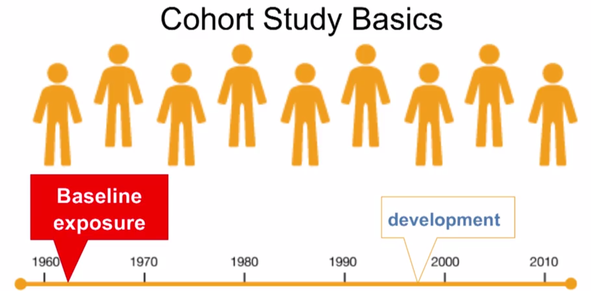

# *Study Designs*

Date: 01.10.2015

## Experimental Study Designs

Characteristics:
* Investigator generally determines who's getting the intervention and who's not getting the intervention.
* Investigator randomly **assigns** exposure
* Exposure is the intervention in Epidemiological studies.

### 1 Randomized Control Trials

- Characteristics:
    - Randomly break down the sample into two groups and assign *drug* and *placebo*.
    - Used to test new drugs or medical treatments.
        - Drug or treatment is randomized: randomization helps to reduce or prevent bias.
    - *Intervention group and control group should be comparable in all aspects (Counterfactual)*.
    - Strongest evidence for causal inference.

- study types:
    1. individual intervention study (Unit of Analysis: individual)
    2. community intervention study (Unit of Analysis: community)
    
- Key Advantages:
    1. Reduces influence of other determinants of exposure and outcome (confounding)
    2. Strong evidence for causality or causal inference
    3. Temporality

- Key Disadvantages:
    1. Costly
    2. External validity - generalizability
    3. Narrow focus
    4. Ethical considerations

### 2 Clinical Case Crossover Trials

- Characteristics:
    - subject switch one treatment to the other over time.
    - Wash-out period between the two exposures.
    - Order of exposure is randomized.
    - Shorter interventions are preferred.

### Blinding

1. Non-blinded: 
    - Subject: Not blinded, Researcher: Not blinded, Analyst: Not blinded
2. Single-blinded
    - Subject or Research is blinded but Analyst is not blinded
3. Double-blinded
    - Subject and Researcher is blinded but Analyst is not blinded
4. Triple-blinded
    - Subject, Researcher and Analyst are all blinded

the purpose of a *double blind* study is to avoid observer and interviewee bias.

### Vocabulary

- Equipoise: genuine uncertainty about the benefits /harms of treatments or exposure
- Placebo: sham treatment that appears identical to the real treatment
- Compliance/ Adherence: whether or not participants follow treatment recommendations
- Intention-to-treat analysis: when subject are analyzed according to their treatment

## Non-Experimental Studies

Characteristics:
* Observational
* Investigator does not assign the intervention.
* Used when it's not ethical to random assign exposure to participants.

### 1 Cohort Study Design

- Cohort: a group of persons sharing a common characteristic such as geographical locations, socioeconomic status, age, gender, occupation and race.
- Source population: identify the eligible participants. Outcome must not be present at baseline. Participants must be free of the outcome to support a causal relationship.
- Basics:

- Example: Smoking
- Common measure: Risk or Rate

**Open vs. Close study**

- Open Study Population: 
    - Join at any point, within limitations
    - Person-Time
    - Less prone to problems with sample size
    
- Close Study Population: 
    - closed to new participants

**Retrospective vs. Prospective**

- Retrospective study design is used to evaluate occupational exposures such as cancers and other chronic diseases.

- Advantages:
    1. Directly estimate rates and risks
    2. Good for rare exposures
    3. Good for multiple outcomes
    4. Provides evidence of temporality between exposure and outcome
    
- Disadvantage:
    1. Expensive
    2. Time-consuming
    3. Resource-intensive
    4. Inefficient for rare outcomes
    5. Loss to follow up

### 2 Case Control Study Design

Characteristics:
- The case-control study aims at achieving the same goals (comparison of exposed and unexposed) as cohort study but does so more efficiently, by use of sampling.
- Efficient method to study rare diseases
- Retrospective
- case: a group of participants with the outcome
- control: a group of participants without the outcome

- Key steps:
    1. Define and select cases
        - determine diagnostic criteria
        - Incident vases are preferable over prevalent cases
        
    2. Define and select controls
        - Multiple controls per case (statistical power)
        - Multiple control groups (consistency = credibility)
        
    3. Compare exposure prevalence
        - Use odds ratio: Odds of exposure for cases over Odds of exposure for controls
        - Do not directly measure the risk or rate of an outcome.

- When to use a **case-control** study?
    1. When the disease is rare
        - Example: studying risk factor for birth defects
    
    2. When exposure data are expensive or difficult to obtain
        - Example: Lab tests for pesticides in blood
    
    3. When disease has a long induction and latent period
        - Example: Cancer, cardiovascular disease
    
    4. When little is known about the disease
        - Example: Early studies of AIDS

**Matching**

- Matching is used for one or two strong risk factors.
- Matching may be by sex, age, race, etc.

**Summary**

- Advantages:
    1. Good for rare outcomes
    2. Take less time
    3. Use fewer resources and $
    4. CAn examine multiple exposures
    5. Likely to be replicable in other populations
    6. If sampled accurately, odds ratio provides estimate of risk or rate ratio

- Disadvantages:
    1. Some possible biases in selection or subjects, measurement of exposures, and analysis
    2. No direct estimate proxy for risk or rate ratio
    3. Not good for rare exposures
    4. Sometimes time sequence between exposure and outcome is uncertain

### 3 Cross-Sectional Study Design

Characteristics:
    - Exposure and outcome are assessed at the same time.
    - **Snap shot** of exposure and outcome at one point of time.
    - Describe the occurrence of health outcome or exposure in a population.
    - Measure used to describe the occurrence is prevalence.

Ways to use cross-sectional studies
    - Characterize the prevalence of a health outcome in a specified population, in a defined period of time.
    - Obtain data on the prevalence of exposure and the health outcome.

Prevalence = Rate * Average Duration

Limitations:
    1. Prevalence is influenced by the (incidence) rate and duration of a health outcome.
    2. Antecedent-consequent bias (Chicken vs. egg)
    3. Cannot be sure that the exposure preceded the disease.

When to use *Cross-Sectional* Studies?
    - Estimating occurrence of risk factors, or health outcomes in a population.
    - Surveillance of changes in behavioral risk factors, and long-lasting diseases.
    - Obtaining data on the prevalence of exposure and the outcome

### 4 Ecologic Study Design

