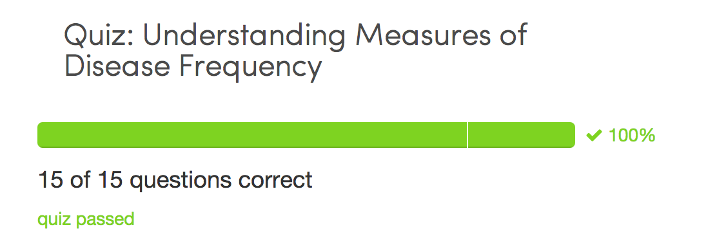

Quiz
====

* What is the primary difference between risk and prevalence?
    1. Prevalence describes the number of diseased persons present in the population divided by the number of persons in the population in a specified time period, whereas risk describes the number of newly diseased person present in the population divided by the number of at-risk persons in the population in a specified time period.
    2. Risk describes the number of diseased persons present in the population divided by the number of persons in the population during a specified time period, whereas prevalence describes the number of newly diseased person present in the population in a specified time period divided by the number of at- risk persons in the population.
    3. Prevalence describes the number of diseased person present in the population in a specified time period whereas risk describes the number of people who die from the disease in the population in a specified time period.

Answer: 1

* Which of the following types of events can be measured by a risk and/or a rate?
    1. Recurrence of a disease
    2. Newly developed cases of disease
    3. All of the above
    4. Development of a drug or treatment side effect

Answer: 3

* True or false: The term “incidence” is used to refer to prevalence, risks and rates.

Answer: False

* True or False: The formula for a rate is the number of existing cases of the disease outcome divided by the number of people studied, with a mention of the time period under observation.

Answer: False

* True or False: The denominator of a risk is not fixed by the “at-risk” population size at the beginning of a study observation period.

Answer: False

* In order to calculate a risk, which of the following steps must be taken? Select all that apply.
    1. define a case definition for the health outcome under study
    2. determine the number of new cases of the outcome under study
    3. define the at-risk study population
    4. determine how many people in the study were exposed or unexposed to the exposure under study
    5. determine the number of males and females in the study

Answer: 1,2,3,4,5

* The denominator of a rate is affected by which of the following? Select all that apply.
    1. births
    2. migration
    3. deaths
    4. study drop-outs
    5. loss to follow-up

Answer: 1,2,3,4,5

* Which of the following are advantages of using a rate measure? Select all that apply.
    1. flexibility
    2. can accommodate repeated events that affect the same study participant
    3. suitable for a dynamic population
    4. good for health outcomes or diseases that are of long duration
    5. good for health outcomes or diseases with long latent periods

Answer: 1,2,3,4,5

* Which of the following measure(s) is/are able to capture the reality of a dynamic population? Select all that apply.
    1. risk
    2. rate
    3. odds
    4. prevalence

Answer: 2

* If you are studying the rate of leukemia, which of the following events would affect a participant’s person-time? Select all that apply.
    1. loss to follow-up
    2. participant goes out of town for a weekend
    3. death
    4. being sick with influenza
    5. participant decides to no longer participate in the study

Answer: 1, 3, 5

* If you are studying the rate of breast cancer, which of the following events would affect a participant’s person-time? Select all that apply.
    1. participant decides to no longer participate in the study
    2. patient undergoes a double mastectomy
    3. diagnosis with uterine cancer
    4. loss to follow-up
    5. death

Answer: 1,2,4,5

* If you are studying the rate of relapse for lung cancer after treatment, which of the following events would affect a participant’s person-time? Select all that apply.
    1. time period(s) the patient is in remission from lung cancer
    2. time of initial diagnosis with lung cancer
    3. time period(s) when the patient is considered to have active lung cancer
    4. participant decides to no longer participate in the study

Answer: 1,3,4

* Once the study population has been defined, the denominator of a risk is affected by which of the following? Select all that apply.
    1. loss to follow-up
    2. deaths
    3. births
    4. who is at risk of developing the health outcome
    5. migration
    
Answer: 4    

* Which of the following are acceptable ways to express “person-time”? Select all that apply.
    1. person-years
    2. person-minutes
    3. person-days
    4. person-months

Answer: 1,2,3,4

* Which of the following measures is sometimes used because of its convenient mathematical properties?
    1. prevalence
    2. risk
    3. rate
    4. odds

Answer: 4