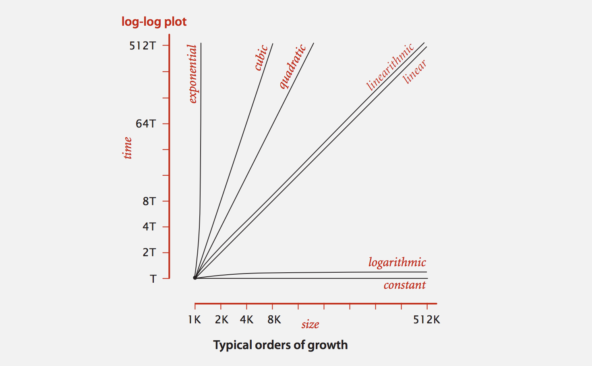

# *Analysis of Algorithms (Week1)*

Date: 06.22.2014

Key we are focusing on here is to running time (performance)

## Reasons to analyze algorithms:
1. predict performance.
2. Compare algorithms.
3. Provide guarantees.
4. Understand theoretical basis.
5. Avoid Performance bugs. (Practical Reason)

Some algorithmic success:
* Brute Force: *N^2* steps.
* FFT algorithm: *NlogN* steps, enables new technology.

### Q.Will my problem be able to solve a large practical input?
- Scientific Method to find out.

## Scientific Method
* **Observe** some feature of the natural world.
* **Hypothesize** a model that is consistent with the observations.
* **Predict** events using the hypothesis.
* **Verify** the predictions by making further observations.
* **Validate** by repeating until the hypothesis and observations agree.

## Principles
* Experiments must be **reproducible**.
* Hypothesis must be **falsifiable**.

## Example: 3-SUM

Given *N* distinct integers, how any triples sum to exactly zero?

### % more 8ints.txt

```
30 -40 -20 -10 40 0 10 5
```

| *a[i]*  | *a[j]*  | *a[k]*  | Sum    |
|:-------:|:-------:|:-------:|:------:|
|   30    |  -40    |   10    |   0    |
|   30    |  -20    |  -10    |   0    |
|  -40    |   40    |    0    |   0    |
|  -10    |    0    |   10    |   0    |

* Deeply related to problems in computational geometry.

## Java Implementation: Brute Force Algorithm

```java
    public class threeSum {
        public static int count(int[] a) {
            int N = a.length;
            int count = 0;
            for (int i = 0; i < N; i ++)
                for (int j = i + 1; j < N; j ++)
                    for (int k = j + 1; k < N; k++)
                        if(a[i] + a[j] + a[k] == 0) // <- "Inner Loop"
                            count++;
            return count;
        }
        
        public static void main(string[] args) {
            int[] a = In.readInts(args[0]);
            StdOut.println(count(a)); // count is the static method above
        }
    }
```

## Measure the running time

### Use Stopwatch (part of stdlib.jar)

```java
    public static void main(string[] args) {
        int[] a = In.readInts(args[0]);
        Stopwatch stopwatch = new Stopwatch(); // create stopwatch
        StdOut.println(ThreeSum.count(a));
        double time = stopwatch.elapseTime(); // time since the creation
    }
```

## Empirical analysis

Run the program for various input sizes *S* and measure the running times. E.g. double the size and check the elapse time.

### Standard Plot

Plot running time T(N) vs. Input Size (N).


### Log-Log Plot

Plot running time T(N) vs. Input Size (N) using log-log scale.


lg(T(N)) = blg(N) + c
* b = 2.999
* c = -33.2103
* T(N) = aN^b, where a = 2^c. ~2^c*N^b


### Regression: Fit straight line through data points: aN^b (power law).

### Hypothesis: The running time is about 1.006 * 10^(-10) * N^2.999 seconds.

### Predictions:

* 51 seconds for N = 8,000
* 408 seconds for N = 16,000

### Observations:

|   *N*      | time(seconds) |
|:----------:|:-------------:|
|  8,000     |       51.1    |
|  8,000     |       51.0    |
|  8,000     |       51.1    |
|  16,000    |      410.8    |

Validates hypothesis!


## Doubling hypothesis
* Quick way to estimate b in a power-law relationship

Run program, doubling the size of the input.

|    N    | time(seconds) |  ratio  | lg ratio |
|:-------:|:-------------:|:-------:|:--------:|
|    250  |     0.0       |         |    -     |
|    500  |     0.0       |   4.8   |    2.3   |
|  1,000  |     0.1       |   6.9   |    2.8   |
|  2,000  |     0.8       |   7.7   |    2.9   |
|  4,000  |     6.4       |   8.0   |    3.0   |
|  8,000  |    51.1       |   8.0   |    3.0   |

Seems to converge to a constant b = 3

### Hypothesis: Running time is about *aN^b* with b = lg ratio.

### Caveat: Cannot identify logarithmic factors with doubling hypothesis.


### Q. How to estimate a (assuming we know b)?
* Answer: Run the program for a sufficiently large value of *N* and solve it for a.

|   *N*      | time(seconds) |
|:----------:|:-------------:|
|  8,000     |       51.1    |
|  8,000     |       51.0    |
|  8,000     |       51.1    |

51.1 = a * 8,000^3  =>  a = 0.998 * 10^(-10)

### Hypothesis: Running time is about 0.998 * 10^(-10) * N^3 seconds.

* almost identical hypothesis to the one attained via linear regression.


## Experimental Algorithms

### System independent effects:

* Algorithm
* Input data

determines exponent 'b' in power law.

### System dependent effects:

* Hardware: CPU, Memory, Cache, ...
* Software: Compiler, Interpreter, Garbage Collector, ...
* System: Operating System, Network, Other Apps, ...

determines constant 'a' in power law.


# Mathematical Model

* Total Running Time: sum of cost * frequency for all operations.
    * Need to analyze program to determine set of operations.
    * Cost depends on machine, compiler, ...
    * Frequency depends on algorithm, input data, ...

### WATCH OUT!

* 1D array allocation (e.g. new int[N]) takes c * N
* 2D array allocation (e.g. new int[N][N]) takes c * N^2
* string concatenation (e.g. s + t) takes c * N

Notice Mistake: Abusive String Concatenation.


## Example 1)  1D SUM

* Q. How many instructions as a function of input size N?

```java
    int count = 0;
    for (int i = 0; i < N; i++)
        if (a[i] == 0)
            count++;
```

|        Operation        |  frequency  |
|:-----------------------:|:-----------:|
|  variable declaration   |      2      |
|  assignment statement   |      2      |
|  less than compare      |      N+1    |
|  equal to compare       |      N      |
|  array access           |      N      |
|  increment              |    N to 2N  |


## Example 2)  2D SUM

* Q. How many instructions as a function of input size N?

```java
    int count = 0;
    for (int i = 0; i < N; i++)
        for (int j = i + 1; j < N; j++)
            if (a[i] + a[j] == 0)  // 0+1+2+...+(N-1) = (1/2)*N*(N-1) = N choose 2
                count++;
```

|        Operation        |       frequency          |
|:-----------------------:|:------------------------:|
|  variable declaration   |          N+2             |
|  assignment statement   |          N+2             |
|  less than compare      |   (1/2)*(N+1)*(N+2)      |
|  equal to compare       |   (1/2)*N*(N-1)          |
|  array access           |       N*(N-1)            |
|  increment              | (1/2)*N*(N-1) to N*(N-1) |

array access in the cost model here.


### Simplification 1: Cost Model

[Turing] Use some basic operations as a proxy for running time.
e.g. In above operations, array access in the most expensive and thus, it's our cost model.

### Simplification 2: Tilde Notation

Estimate running time (or memory) as a function of input size *N*.
Ignore lower order terms.
* When N is large, terms are negligible.
* When N is small, we don't care.

Ex 1) (1/6)*N^3 + 20*N + 16 ~ (1/6)*N^3
Ex 2) (1/6)*N^3 + 100*N^(4/3) + 56 ~ (1/6)*N^3
Ex 3) (1/6)*N^3 + (1/2)*N^2 + (1/3)*N ~ (1/6)*N^3

* discard lower order terms!

### Back to 2D-SUM problem.

|        Operation        |       frequency          |     Tilde Notation     |
|:-----------------------:|:------------------------:|:----------------------:|
|  variable declaration   |          N+2             |     ~ N                |
|  assignment statement   |          N+2             |     ~ N                |
|  less than compare      |   (1/2)*(N+1)*(N+2)      |     ~ (1/2)*N^2        |
|  equal to compare       |   (1/2)*N*(N-1)          |     ~ (1/2)*N^2        |
|  array access           |       N*(N-1)            |     ~ N^2              |
|  increment              | (1/2)*N*(N-1) to N*(N-1) |     ~ (1/2)*N^2 to N^2 |

* Q. Approximately how many accesses as a function of input size *N*?
    * ~ N^2 array accesses!

### 3D-SUM problem (refer to the 3 SUM Brute Force algorithm)

In the inner loop, `if (a[i] + a[j] + a[k] == 0)` is:
N choose 3 = N*(N-1)*(N-2) / 3! ~ (1/6)N^3


### Bottom line: Use Cost Model and Tilde notation to simplify counts!


### Estimate a discrete sum

Q. How to estimate a discrete sum?

1. Take discrete math course.
2. Replace the sum with an integral, and use calculus. (Continuous)

* Ex 1) 1 + 2 + ... + N ~ (1/2)*N^2
* Ex 2) 1 + 1/2 + 1/3 + ... + 1/N ~ ln(N)
* Ex 3) 3 sum triple loop ~ (1/6)*N^3
* Ex 4) for (int k = 1; k < N; k = k * 2) ~ lg(N)
* Ex 5) for (int k = 1; k < N; k++) ~ N


# Order of Growth Classification

Common order of growth classification: 1, log(N), N, Nlog(N), N^2, N^3 and 2^N surffices to describe the order of growth of typical algorithms.



### Bottom Line: Need linear or linearithmic algorithm to keep pace with moore's law.


## Common Order of Growth Classification Example


## Binary Search Demo

* Goal: Given a sorted array and a key, find index of the key in the array

### Binary Search: compare key against middle entry

* Too small, go left.
* Too big, go right.
* Equal, found.


## Java Implementation: Binary Search

Arrays.binarysearch()

```java
    public static int binarySearch(int[] a, int key) {
        int lo = 0, hi = a.length - 1;
        while (lo <= hi) {
            int middle = lo + (hi - lo) / 2;
            if (key < a[mid]) hi = mid - 1;
            else if (key > a[mid]) lo = mid + 1;
            else return mid;
        }
        return -1;
    }
```

### Invariant:
If key appears in the array `a[]`, then `a[lo] <= key <= a[hi]`.


## Binary Search: Mathematical Analysis

### Proposition

Binary Search uses at most *1 + lg(N)* compares to search in a sorted arrays of size *N*.

### Definition

*T(N)* = # compares to binary search in a sorted subarray of size <= N.

### Binary Search recurrence
*T(N)* <= *T(N/2) + 1* for *N* > 1, with *T(1) = 1*.

* *T(N/2)* is either left or right half.
* +1 is for the first search.

### Proof Sketch

    T(N) <= T(N/2) + 1
         <= T(N/4) + 1 + 1
         <= T(N/8) + 1 + 1 + 1
         ...
         <= T(N/N) + 1 + ... + 1
          = T(N/N) + lg(N)
          = 1 + lg(N)


## An N^2log(N) algorithm for 3 SUM

sorting-based algorithm
* sort the N numbers
* For each pair of numbers `a[i]` and `a[j]`, binary search for `-(a[i] + a[j])`.

### Analysis: Order of growth in N^2*log(N)

* Step 1: N^2 with insertion sort.
* Step 2: N^2*log(N) with binary search.

* **Watch Out** for double counting: `a[i] < a[j] < a[k]`

### Guiding principle: typically better order of growth -> faster in practice!


# Theory of Analysis

### Best Case: Lower bound on cost

* Determined by "easiest" input.
* Provides a goal for all inputs.

### Worst Case: Upper bound on cost

* Determined by "most difficult" input.
* provides a guarantee for all inputs.

### Average case: Expected cost for random Input.

* Need a model for "random" input.
* Provides a way to predict performance.


Ex1) 3-SUM Brute Force algorithm

* Best: ~ (1/2)*N^3
* Average: ~ (1/2)*N^3
* Worst: ~ (1/2)*N^3

Ex2) Compares for binary search.

* Best: ~ 1
* Average: ~ lg(N)
* Worst: ~ lg(N)

### Q: Actual data might not match input model?

* Need to understand input effectively process it.
* Approach 1: design for the worst case.
* Approach 2: randomize, depend on probablistic guarantee.

### Goals

* Establish "difficulty" of a problem.
* Develop "optimal" algorithm.

### Approach

* Suppress details in analysis: analyze "to within a constant factor".
* Eliminate variability in input model by focusing on the worst case.

### Optimal algorithm

* Performance guarantee (to within a constant factor for any input)
* No algorithm can provide a better performance guarantee.


### Example 1) 1 SUM = "Is there a 0 in the array?"

* Upper bound: a specific algorithm
    * e.g. Brute-Force algorithm for 1 SUM: Look at every array entry.
    * Running time of the optimal algorithm for 1 SUM is Big-Oh(N).
* Lower bound: Proof that no algorithm can do better
    * e.g. Have to examine all N entries (any unexamined one might be 0).
    * Running time of the optimal algorithm for 1 SUM is Big-Omega(N).
* Optimal algorithm:
    * Lower bound equal upper bound (to within a constant factor)
    * e.g. Brute-Force algorithm for 1 SUM is optimal. It's running time is Tilde(N).

### Example 2) 3 SUM

* Upper bound: a specific algorithm
    * e.g. Improved algorithm for 3 SUM. 
    * Running time of the optimal algorithm for 3 SUM is Big-Oh(N^2*log(N)).
* Lower bound: Proof that no algorithm can do better
    * e.g. Have to examine all N entries to solve 3 SUM.
    * Running time of the optimal algorithm for 1 SUM is Big-Omega(N).
* Optimal algorithm:
    * Optimal algorithm for 3 SUM? 
    * Subquadratic algorithm for Quadratic lower bound for 3 SUM?


## Algorithm Design Approach

### Start

* Develop an algorithm.
* Prove a lower bound.

### Gap?

* Lower the upper bound (discover a new algorithm).
* Raise the lower bound (more difficult).

### Golden Age of Algorithm Design

* 1970s - 
* Steadily decreasing upper bounds for many important problems.
* Many known optimal algorithms.

### Caveats

* Overly pessimistic to focus on worst case?
* Need better than "to within a constant factor" to predict performance.

### Common Mistake: 'Big-Oh' is not an approximate Model!
### Approximate Model is 'Tilde' notation.


# Memory

Bit: 0 or 1.
Byte: 8 bits.
Megabytes (MB): 2^20 bytes.
Gigabytes (GB): 2^30 bytes.

Modern machine: we now assume 64-bit machine with 8 bytes pointers.

* can address more memory.
* pointer use more space.


Object overhead: 16 bytes.
Reference: 8 bytes.
Padding: Each object uses a multiple of 8 bytes.

Array: 24 bytes + memory for each entry.
Object: 16 bytes + memory for each instance variable + 8 if inner class.
(for pointer to enclosing the class)

Padding: round up to multiple of 8 bytes.

# SUMMARY

## Empirical Analysis

* Execute program to perform experiments.
* Assume power law and formulate a hypothesis for running time.
* Model enables us to make predictions.

## Mathematical Analysis

* Analyze algorithm to count frequency of operations.
* Use Tilde notation to simplify analysis.
* Model enables us to explain behavior.

## Scientific Method

* Mathematical model is independent of a particular system; applies to machines not yet built.
* Empirical analysis is necessary to validate mathematical models and to make predictions.

