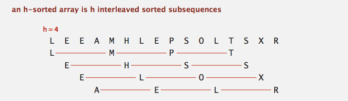
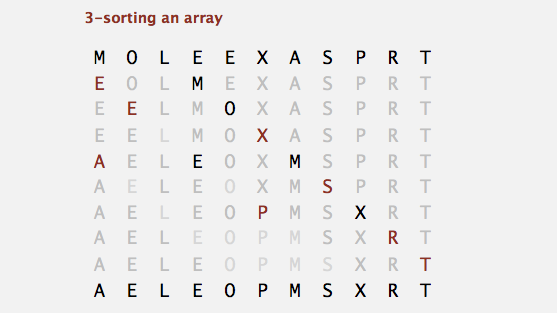
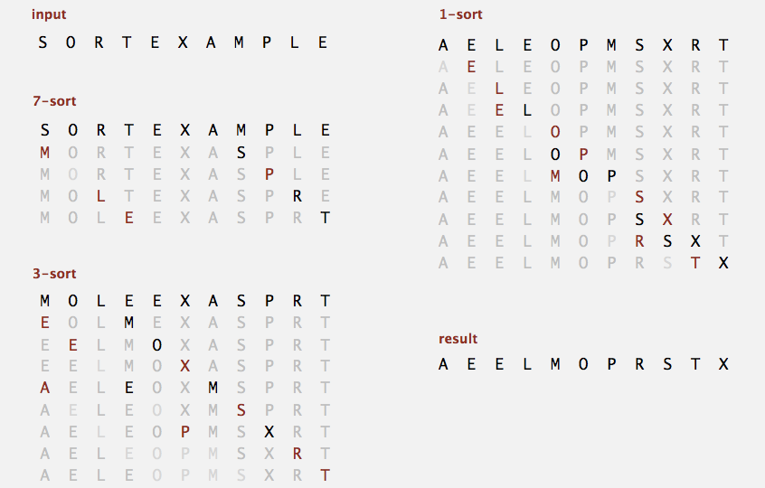
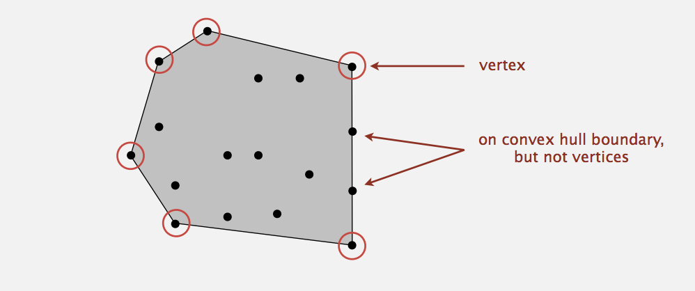
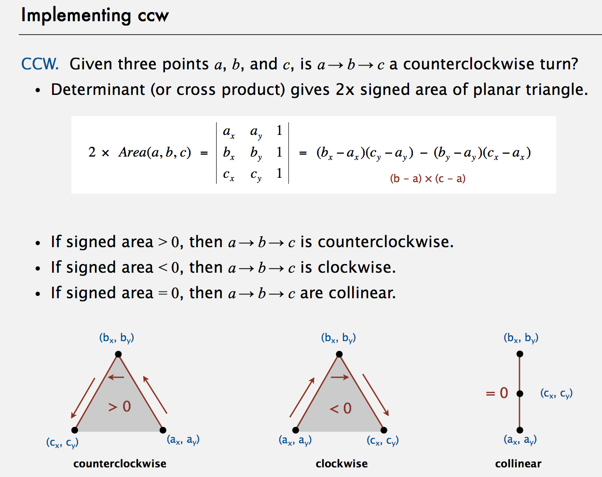

# *Elementary Sorts (Week2)*

Date: 07.01.2014

## 1 Sorting Introduction

### Sample sort client 1

* Goal. Sort any type of data.
* e.g. 1 sort random real numbers in ascending order.

```java

public class Experiment {
    public static void main(String[] args) {
        int N = Integer.parseInt(args[0]);
        Double[] a = new Double[N];
        for (int i = 0; i < n; i++)
            a[i] = StdRandom.uniform();
        Insertion.sort(a);
        for (int i = 0; i < N; i++)
            StdOut.println(a[i]);
    }
}   
```

* e.g. 2 sort strings from file in alphabetical order.

```java

public class StringSorter {
    public static void main(String[] args) {
        String[] a = In.readStrings(args[0]);
        Insertion.sort(a);
        for (int i = 0; i < N; i++)
            StdOut.println(a[i]);
    }
}   
```

    % more words3.txt
    bed bug dad yet zoo ... all bad yes
    
    % java StringSorter words3.txt
    all bad bed bug dad ... yes yet zoo


* e.g. 3 sort the files in a given directory by filename.

```java
import java.io.File;

public class FileSorter {
    public static void main(String[] args) {
        File directory = new File(args[0]);
        File[] files = directory.listFiles();
        Insertion.sort(files);
        for (int i = 0; i < files.length; i++)
            StdOut.println(files[i].getName());
    }
}
```

### Callbacks
 
* Q. How can `sort()` know how to compare data of type Double, String, and java.io.File without any information about the type of an item's key?

Call back = reference to executable code.

* Client passes array of objects to sort() function.
* The sort() function calls back object's compareTo() method as needed.

Implementing callbacks

* Java: interfaces.
* C: function pointers.
* C++: class-type functors.
* C#: delegates.
* Python, Perl, ML, JavaScript: first-class functions.


### Callbacks: roadmap

Client

```java
import java.io.File;

public class FileSorter {
    public static void main(String[] args) {
        File directory = new File(args[0]);
        File[] files = directory.listFiles();
        Insertion.sort(files);
        for (int i = 0; i < files.length; i++)
            StdOut.println(files[i].getName());
    }
}
```

Comparable interface (built in to Java)

```java

public interface Comparable<Item> {
    public int compareTo(Item that);
}
```

Object Implementation

```java

public class File implements Comparable<File> {
    ...
    public int compareTo(File b) {
        ...
        return -1;  // less
        ...
        return +1;  // more
        ...
        return 0;  // equal
    }
}
```

sort implementation

```java

public static void sort(Comparable[] a) {
    int N = a.length;
    for (int i = 0; i < N; i ++)
        for (int j = i; j > 0; j--)
            if (a[j].compareTo(a[j-1]) < 0)
                exch(a, j, j-1);
            else break;
}
```

### Total order

A total order is a binary relation <= that satisfies:

* Antisymmetry: if v <= w and w <= v, then v = w.
* Transitivity: if v <= w and v <= x, then v <= x.
* Totality: either v <= w or w <= v or both.

E.g.

* Standard order for natural and real numbers.
* Chronological order for dates or times.
* Alphabetical order for strings.

Surprising but true. The <= operator for double is not a total order. (Double.NaN <= Double.Nan) is false.


### Comparable API

Implement `compareTo()` so that `v.compareTo(w)`:

* Is a total order.
* Returns a negative integer, zero, or positive integer if v is less than, equal to, or greater than w, respectively.
* Throws an exception if incompatible types (or either null).

**Built-in comparable types: Integer, Double, String, Date, File, ...**
User-defined comparable types: Implement the Comparable interface.


### Implementing the Comparable interface

Date data type: Simplified version of java.util.Date.

```java

public class Date implements Comparable<Date> {  // only compare dates to other dates
    private final int month, day, year;
    
    public Date(int m, int d, int y) {
        month = m;
        day = d;
        year = y;
    }
    
    public int compareTo(Date that) {
        if (this.year < that.year) return -1;
        if (this.year > that.year) return +1;
        if (this.month < that.month) return -1;
        if (this.month < that.month) return +1;
        if (this.day < that.day) return -1;
        if (this.day < that.day) return +1;
        return 0;
    }
}
```

### Two useful sorting abstractions

Helper functions. Refer to data through compares and exchanges.

Less. Is item v less than w?

```java

private static boolean less(Comparable v, Comparable w) {
    return v.compareTo(w) < 0;
}
```

Exchange. Swap item in array a[] at index i with the one at index j.

```java

private static void exch(Comparable[] a, int i, int j) {
    Comparable swap = a[i];
    a[i] = a[j];
    a[j] = swap;
}
```

### Testing

Goal. Test if an array is sorted.

```java

private static boolean isSorted(Comparable[] a) {
    for (int i = 1; i < a.length; i++)
        if (less(a[i], a[i-1])) return false;
    return true;
}
```

Q. If the sorting algorithm passes the test, did it correctly sort the array?
A. Yes if you used only the exchange method to implement the sort.


## Selection Sort

In iteration i, find index min of smallest remaining entry.
Swap a[i] and a[min].

* Algorithm. pointer Scans from left to right.

Invariants

* Entries the left of pointer (including pointer) fixed and in ascending order.
* No entry to right of pointer is smaller than any entry to the left of pointer.


### Selection sort inner loop

To maintain algorithm invariants:

* Move the pointer to the right.


    i++;

* Identify index of minimum entry on right.


    int min = i;
    for (int j = i+1; j < N; j++)
        if (less(a[j], a[min]))
            min = j;


* Exchange into position.


    exch(a, i, min);


### Selection Sort: Java Implementation

```java

public class Selection {
    public static void sort(Comparable[] a) {
        int N = a.length;
        for (int i = 0; i < N; i++) {
            int min = i;
            for (int j = i+1; j < N; j++)
                if (less(a[j], a[min]))
                    min = j;
            exch(a, i, min);
        }
    }
    
    private static boolean less(Comparable v, Comparable w) {
        return v.compareTo(w) < 0;
    }
    
    private static void exch(Comparable[] a, int i, int j) {
        Comparable swap = a[i];
        a[i] = a[j];
        a[j] = swap;
    }
}    
```

### Mathematical Analysis

* Proposition: Selection sort uses (N-1) + (N-2) + ... + 1 + 0 ~ N^2/2 compares and N exchanges.
* Running time insensitive to input: **Quadratic time**, even if input is sorted.
* Data movement is minimal: Linear number of exchanges.


## Insertion Sort

In iteration i, swap `a[i]` with each larger entry to its left.

* Algorithm: pointer scans from left to right.

Invariants

* Entries to the left of pointer (including pointer) are in ascending order.
* Entries to the right of pointer have not yet been seen.


### Insertion Sort inner loop

To maintain algorithm invariants:

* Move the pointer to the right.


    i++;

* Moving from right to left, exchange `a[i]` with each larger entry to its left.


    for (int j = i; j > 0; j--)
        if(less(a[j], a[j-1]))
            exch(a, j, j-1);
        else break;


### Insertion Sort: Java Implementation

```java

public class Insertion {
    public static void sort(Comparable[] a) {
        int N = a.length;
        for (int i = 0; i < N; i++) { 
            for (int j = i; j > 0; j--)
                if (less(a[j], a[j-1]))
                    exch(a, j, j-1);
                else break;
    }
    
    private static boolean less(Comparable v, Comparable w) {
        return v.compareTo(w) < 0;
    }
    
    private static void exch(Comparable[] a, int i, int j) {
        Comparable swap = a[i];
        a[i] = a[j];
        a[j] = swap;
    }
}    
```


### Mathematical analysis

* Proposition: To sort a randomly-ordered array with distinct keys, insertion sort uses ~ 1/4N^2 compares and ~ 1/4N^2 exchanges on average.
* Proof. Expect each entry to move halfway back.


### Best and Worst Case

* Best Case: if the array is in **ascending order**, insertion sort makes N-1 compares and 0 exchanges.
* Worse case: if the array is in **descending order** (and no duplicates), insertion sort makes ~1/2N^2 compares and 1/2N^2 exchanges.


### Partially-sorted arrays

Definition. An *inversion* is a pair of keys that are out of order.

    A E E L M O T R X P S

there exists 6 inversions: T-R, T-P, T-S, R-P, X-P, X-S.


Definition. An array is partially sorted if the number of inversions is <= c*N.

* E.g. 1 A subarray of size 10 appended to a sorted subarray of size N.
* E.g. 2 An array of size N with only 10 entries out of place.


Proposition. For partially-sorted arrays, insertion sort runs in linear time.
Proof. Number of exchanges equals the number of inversions. (number of compares = exchanges + N - 1)


## Shellsort

Idea: Move entries more than one position at a time by h-sorting the array.



Shellsort. [Shell 1959] h-sort array for decreasing sequence of values of h.


### h-sorting

How to h-sort an array? Insertion sort, with stride length h.



Why insertion sort?

* Big increments -> small subarray.
* Small increments -> nearly in order.


### Shellsort Example: increments 7, 3, 1




### Intuition

Proposition. A g-sorted array remains g-sorted after h-sorting it.
Challenge. Prove this fact.


### Which increment sequence to use?

Powers of two. 1, 2, 4, 8, 16, 32, ...
**No**.

Powers of two minus one. 1, 3, 7, 15, 31, 63, ...
**Maybe**.

3x+1. 1, 4, 13, 40, 121, 364, ...
**OK**. Easy to compute.

Sedgewick. 1, 5, 19, 41, 109, 209, 505, 929, 2161, 3905, ... (merging of (9 * 4^i) - (9 * 2^i) + 1 and 4^i - (3 * 2^i) + 1)
**Good**. Tough to beat in empirical studies.


### Shellsort: Java Implementation

```java

public class Shell {
    public static void sort(Comparable[] a) {
        int N = a.length;
        
        int h = 1;
        while (h < N/3)  // 3*x + 1 increment sequence
            h = 3*h + 1; // 1, 4, 13, 40, 121, 364, ...
      
        while (h >= 1) {
            // h-sort the array
            for (int i = h; i < N; i++) {  // insertion sort
                for (int j = i; j >= h && less(a[j], a[j-h]); j-= h)
                    exch(a, j, j-h);
            }
            h = h/3;  // move to next increment
        }
    }
    
    private static boolean less(Comparable v, Comparable w) {
        return v.compareTo(w) < 0;
    }
    
    private static void exch(Comparable[] a, int i, int j) {
        Comparable swap = a[i];
        a[i] = a[j];
        a[j] = swap;
    }
}    
```

### Analysis

* Proposition: The worst-case number of compares used by shellsort with the 3*x + 1 increments is O(N^(3/2)).
* Property: Number of compares used by shellsort with the 3*x + 1 increments is at most by a small multiple of N times the number of increments used.

Remark. Accurate model has not yet been discovered.


### Why are we interested in Shellsort?

Non trivial sorting method.
Example of simple idea leading to substantial performance gains.

Useful in practice.

* Face unless array size is huge (used for small subarrays).
* Tiny, fixed footprint for code (used in some embedded systems).
* Hardware sort prototype.

Simple algorithm, nontrivial performance, interesting questions.

* Asymptotic growth rate?
* Best Sequence of increments?  // open problem: find a better increment sequence
* Average-case performance?

Lesson. Some good algorithms are still waiting discovery.


## Shuffling


### Shuffle sort

Shuffling is a non-trivial sorting application.

* Generate a random real number for each array entry. // useful for shuffling columns in a spreadsheet.
* Sort the array.

* Proposition. Shuffle sort produces a uniformly random **permutation** (NOT combination) of the input array, provided no duplicate values.
* Drawback. Need to pay cost of sort?


### How to shuffle an array?

Goal: Rearrange array so that result is a uniformly random permutation in linear time.


### Knuth shuffle

In iteration i, pick integer r between 0 and i uniformly at random and swap a[i] and a[r]. Imagine Permutation and factorial.

* Common Bug: between 0 and N-1. -> In this case, distribution is not uniform.
* Correct Variant: between i and N-1

Proposition. [Fisher-Yates 1938] Knuth shuffling algorithm produces a uniformly random permutation of the input array in linear time.
(assuming integers uniformly at random)

```java

public class StdRandom {
    ...
    public static void shuffle(Object[] a) {
        int N = a.length;
        for (int i = 0; i < N; i++) {
            int r = StdRandom.uniform(i + 1);  // [0, i]
            exch(a, i, r);
        }
    }
}
```


### Online Poker Implementation

```

for i := 1 to 52 do begin
    r := random(51) + 1;
    swap := card[r];
    card[r] := card[i];
    card[i] := swap;
end;
```

* Bug 1: Random number r never 52 -> 52nd card can't end up in 52nd place.
* Bug 2: Shuffle not uniform (should be between 1 and i).
* Bug 3: random() uses 32 bit seed -> 2^32 possible shuffles.
* Bug 4: Seed = milliseconds since midnight -> 86.4 million shuffles.


## Convex Hull

The convex Hull of a set of N points is the smallest perimeter fence enclosing the points.



Equivalent Definition

* Smallest convex set containing all the points.
* Smallest area convex polygon enclosing the points.
* Convex polygon enclosing the points, whose vertices are points in set.

Convex Hull Output: Sequence of vertices in counterclockwise order.

FACTS:

* Shortest path is either straight line from s to t or it is one of two polygonal chain of convex hull.
* Farthest pair of points are extreme points on convex hull.
* Can traverse the convex hull by making only counterclockwise turns.
* The vertices of convex hull appear in increasing order of polar angle with respect to point p with lowest y-coordinate.


### Graham Scan

* Choose point p with smallest y-coordinate.
* Sort points by polar angle with p.
* Consider points in order; discard unless it create a ccw turn.

**Implementation Challenges**

Q. How to find point p with smallest y-coordinate?
A. Define a total order, comparing by y-coordinate.

Q. How to sort points by polar angle with respect to p?
A. Define a total order for each point p.

Q. How to determine whether p1 -> p2 -> p3 is a counterclockwise turn?
A. Computational geometry.

Q. How to sort efficiently?
A. Mergesort sorts in N*log(N) time.

Q. How to handle degeneracies (three of more points on a line)?
A. Requires some care, but not hard.

### Implementing ccw

CCW. Given three points a,b, and c, is a -> b -> c a counterclockwise turn?

Lesson. Geometric primitives are tricky to implement.

* Dealing with degenerate cases.
* Coping with floating-point precision.




### Immutable point data type

```java

public class Point2D {
    private final double x;
    private final double y;
    
    public Point2D(double x, double y) {
        this.x = x;
        this.y = y;
    }
    
    ...
    
    public static int ccw(Point2D a, Point2D b, Point2D c) {
        double area2 = (b.x - a.x) * (c.y - a.y) - (b.y - a.y)*(c.x - a.x);
        if (area2 < 0) return -1;  // clockwise
        else if (area2 < 0) return +1;  //counter-clockwise
        else return 0;  // collinear
    }
}
```