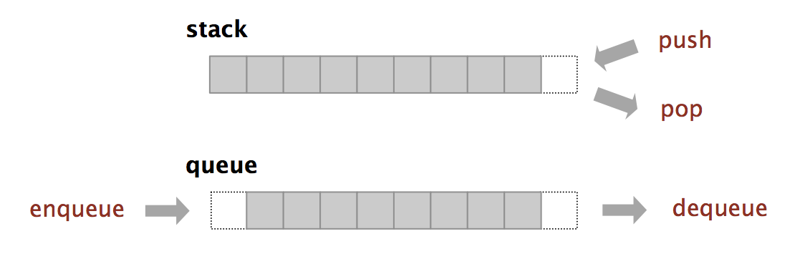
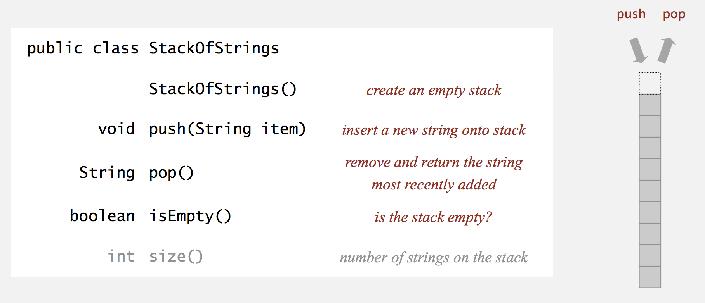
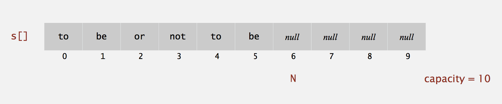
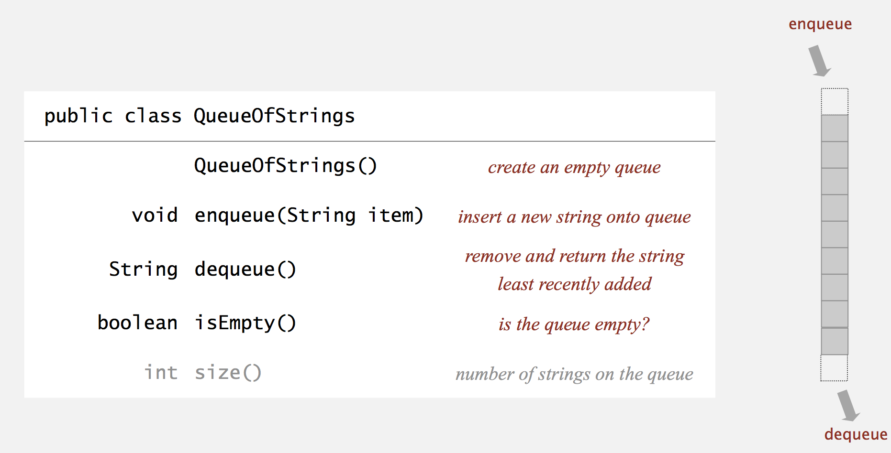
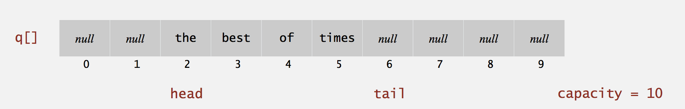

# *Stack and Queues (Week2)*

Date: 06.28.2014

Fundamental data types:

* value: collection of objects.
* operations: insert, remove, iterate, test if empty.
* Intent is clear when we insert.
* Which item do we remove?



Stack: Examine the item most recently added. (LIFO)
Queue: Examine the item least recently added. (FIFO)


## Client, Implement, Interface (Modular Programming)

* Separate interface and implementation.

* Benefits

1. Client has many implementation from which to choose.
2. Many clients can re-use the same implementation.
3. Design: creates modular, reusable libraries.
4. Performance: use optimized implementation where it matters.

Definition

* client: program using operations defined in interface.
* Implementation: actual code implementing operations.
* Interface: description of data type, basic operations.


## Stack API

**Warm up API**: Stack of string data type.




**Warm Up Client**: Reverse sequence of strings from standard input.

### Stack Test Client

Read strings from standard input.

* If string equals "-", pop string from stack and print.
* Otherwise, push string onto stack.

```java

public static void main(String[] args) {
    StackofStrings stack = new StackofStrings();
    while (!StdIn.isEmpty()) {
        String s = StdIn.readString();
        if (s.equals("-")) StdOut.print(stack.pop());
        else stack.push(s);
    }
}
```

### Stack: Linked-list Representation (Sec 1.1 ~ 1.3 Book)

Maintain pointer to **first node** in ad linked list.
Insert / Remove from front.

* Stack pop: Linked-list Implementation


    private calss Node {
        String item;
        Node next;
    }
    
    String item = first.item;  // save item to return
    first = first.next;  // delete first node
    return item;  // return saved item

* Stack push: Linked-list Implementation


    Node oldfirst = first;  // save a link to the list
    first = new Node();  // Create a new node for the beginning
    first.item = "not";  // Set the instance variables in the new node.
    first.next = oldfirst;
    
    
### Stack: Linked-list implementation in Java

```java

public class LinkedStackOfStrings {
    private Node first = null;
    
    private class Node {
        String item;
        Node next;
    }
    
    public boolean isEmpty() {
        return first == null;
    }
    
    public void push(String item) {
        Node oldfirst = first;
        first = new Node();
        first.item = item;
        first.next = oldfirst;
    }
    
    public String pop() {
        String item = first.item;
        first = first.next;
        return item;
    }
}
```

* Performance

Proposition. Every operation takes *constant* time in the worst case.
Proposition. A stack with N items uses ~ 40 N bytes.

Remark. Analysis includes memory for stack.


### Stack: Array Implementation (faster than Linked-list)

Array implementation of a stack.

* Use array `s[]` to solve N items on stack.
* push(): add new item at s[N].
* pop(): remove item from s[N-1].



**Defect. Stack overflows when N exceeds capacity**
declare the size of the array ahead of the time (fundamental problem with array implementations)


### Java implementation

```java

public class FixedCapacityStackOfString {
    private s[] s;
    private int N = 0;
    
    public FixedCapacityStackOfStrings(int capacity) {
        s = new String[capacity];
    }
    
    public boolean isEmpty() {
        return N == 0;
    }
    
    public void push(String item) {
        s[N++] = item;  // use to index into array; then increment N.
    }
    
    public String pop() {
        return s[--N];  // decrement N first; then use to index into array.
    }
```


### Stack Considerations

**Overflow and Underflow**

* Underflow: throw exception if pop from an empty stack.
* Overflow: Use resizing array fro array implementation.

**Null items**. We allow null items to be inserted.

**Loitering**. Holding a reference to an object when it is no longer needed.

    public String pop() {
        return s[--N];  // subject to Loitering problem
    }

Better version

    public String pop() {
        String item = s[--N];
        s[N] = null;
        return item;
    }  // this version avoid Loitering. Garbage Collector can reclaim memory only if no outstanding references.
    
### Resizing Arrays

**Stack: resizing array implementation. (speed vs. memory)**

Problem. Requiring client to provide capacity does not implement API!

Q. How to grow and shrink array?
A. If array is full, create a new array of twice the size and copy items. (Repeated doubling)

    public ResizingArrayStackOfString() {
        s = new String[1];  // initial point
    }
    
    public void push(String item) {
        if (N == s.length) resize(2 * s.length); // double
        s[N++] = item;
    }
    
    public void resize(int capacity) {
        String[] copy = new String[capacity];
        for (int i = 0; i < N; i++)
            copy[i] = s[i];
        s = copy;
    }

Consequence. Inserting first N items takes time proportional to N (Not N^2).
Cost of inserting first N items -> 1 access per push + k array accesses to double the size k -> N + (2+4+...+N) ~ 3*N

Q. How to shrink?

Efficient Solution

* push(): double size of array s[] when array is full.
* pop(): halve size of array s[] when array is one-quarter full.


    public String pop() {
        String item = s[--N];
        s[N] = null;
        if (N > 0 && N == s.length / 4) resize(s.length / 2);
        return item;
    }

### Stack resizing array implementation: Performance

Amortized Analysis: Average running time per operation over worst-case sequence of operations.
Proposition: Starting from an empty stack, any sequence of M push and pop operations takes time proportional to M.

| methods    | best     | worst    | amortized   |
| ---------- |:--------:|:--------:|:-----------:|
| construct  |     1    |     1    |      1      |
| push       |     1    |     N    |      1      |
| pop        |     1    |     N    |      1      |
| size       |     1    |     1    |      1      |

* push() ans pop() are doubling and halving operations.
* order of growth of running time for resizing stack with N items.

**Memory Usage**

Proposition: Uses between ~ 8N and ~ 32N bytes to represent a stack with N items.

* ~ 8N when full.
* ~ 32N when one-quarter full.


    public class ResizingArrayStackOfStrings {
        private String[] s;
        private int N = 0;
    }

Remark. Analysis includes memory for the stack.

### Resizing Array vs. Linked-list

**Trade-Off**: Can implement a stack with either resizing array or linked list. Client can use interchangeably. Which one is better?

* **Liked-List** (Slower):  // when you focus on an individual operation
    * Every operation takes constant time in the worst case.
    * Uses extra time and space to deal with links.
* **Resizing-Array** (faster):  // total operation is what you care
    * Every operation takes constant amortized time.
    * Less wasted space.
* Starting from an empty data structure, we perform N push operations in our resizing array implementation of stack. The number of times `resize()` method called is logarithmic.
    (1, 2, 4, 8, 16, 32, 64, ..., 2^x) = N -> x = lg(N)


## Queue API




### Queue: Linked-list representation

Maintain pointer to **first** and **last** nodes in a linked list.
Insert / remove from opposite ends.

### Queue dequeue: Linked-list implementation

    String item = first.item;  // save item to return
    first = first.next;  // delete the first node
    return item;  // return saved item

Remark. *Identical* code to linked-list stack: pop();

### Queue enqueue: Linked-list implementation

    Node oldlast = last;  // sae a link to the last node
    Node last = new Node();  // create a new node for the end
    last.item = "not";
    last.next = null;  // this is the difference between stack's push and queue's enqueue
    oldlast.next = last;  // link the new node to the end of the list


### Queue: Linked-list Implementation in Java

```java

public class LinkedQueueOfStrings {
    private Node first, last;
    
    private class Node {
        String item;
        Node next;
    }
    
    public boolean isEmpty() {
        return first == null;
    }
    
    public void enqueues(String item) {
        Node oldlast = last;
        last = new Node();
        last.item = item;
        last.next = null;
        if (isEmpty()) first = last;
        else oldlast.next = last;
    }
    
    public String dequeue() {
        String item = first.item;
        first = first.next;
        if (isEmpty()) last = null;  // special case for empty queue
        return item;
    }
}
```

### Queue: resizing array implementation

Array implementation of a queue

* Use array `q[]` to store items in queue.
* enqueue(): add new item at q[tail].
* dequeue(): remove item from q[head].
* update head and tail modulo the capacity.



**trick**: Once you pass the capacity, reset the pointers back to 0.


## Genetics

Avoid casting in client.
Discover type mismatch errors at compile-time, instead of run-time.

    Stack<Apple> s = new Stack<Apple>();
    Apple a = new Apple();
    Orange b = new Orange();
    s.push(a);
    s.push(b);  // compile time error
    a = s.pop();


Guiding principles: Welcome Compile Time Errors. Avoid Runtime Errors.


### Generic Stack: Linked-list implementation

stack<item> and change String to item


### Generic Stack: Array Implementation

```java
public class FixedCapacityStack<item> {
    private item[] s;
    private int N = 0;
    
    public FixedCapacityStack(int capacity) {
        s = (item[]) new object[capacity];  // casting
    }
   
    public boolean isEmpty() {
        return N == 0;
    }
    
    public void push(item it) {
        s[N++] = it;
    }
    
    public item pop() {
        String it = s[--N];
        s[N] = null;
        return it;
    }
}
```

### Autoboxing

Automatic cast between primitive type and its wrapper.

    Stack<Integer> s = new Stack<Integer>();
    s.push(17);  // same as s.push(new Integer(17));
    int a = s.pop();  // same as int a = s.pop().intvalue();

Bottom line: Client code can use generic stack for **any** type of data.


### Iterators

Design Challenge. Support iteration over stack items by client, without revealing the internal representation of the stack.

Java Solution: Make stack implement the Iterable interface.

* Iterable interface


    public interface Iterable<item> {
        Iterator<item> iterator();
    }

* iterator interface


    public interface Iterator<item> {
        boolean hasNext();
        Item next();
    }
   
    
```java

for (String s: stack)  // elegant
    StdOut.println(s);
```

(shorthand) same as (longhand)

```java

Iterator<String> i = stack.iterator();
while (i.hasNext()) {
    String s = i.next();
    StdOut.println(s);
```

### Stack iterator: Linked-list implementation

```java

import java.util.Iterator;

public class Stack<item> implements Iterable<item> {
    ...
    
    public Iterator<item> iterator() {
        return new ListIterator();
    }
    
    public class ListIterator implements Iterator<item> {
        private Node current = first;
        public boolean hasNext() {
            return current != null;
        }
        public void remove() { /* Not Supported */}
        public item next() {
            item it = current.item;
            current = current.next;
            return item;
        }
    }
}
```

### Stack Iterator: Array Implementation

```java

import java.util.Iterator;

public class stack<item> implements Iterable<item> {
    ...
    
    public Iterator<item> iterator() {
        return new ReverseArrayIterator();
    }
    
    private class ReverseArrayIterator implements Iterator<item> {
        private int i = N;
        public boolean hasNext() { 
            return i > 0;
        }
        public void remove() { /* Not Supported */}
        public item next() {
            return s[--N];
        }
    }
}
```

### Bag API

Main Application: Adding item to a collection and iteration when order doesn't matter.

    public class Bag<item> implements Iterable<item>
                       Bag()         // create an empty bag
                  void add(item x)   // insert a new item onto bag.
                   int size()        // number of items in bag.
        Iterable<item> iterator()    // iterator for all items in bag.


Implmentation: Stack (without pop) or Queue (without dequeue).


## Java Collection Library

**List Interface: java.util.List is API for sequence of items.**

    public interface List<item> implements Iterable<item>
                    List()                  // create an empty list
            boolean isEmpty()               // is the list empty?
                int size()                  // number of items.
               void add(item it)            // append items to the end.
               item get(int index)          // return item at given index.
               item remove(int index)       // return and delete item at given index.
            boolean contains(item it)       // does the list contain the given item?
     Iterator<item> iterator()              // iterator over all items in the list.
        ...

Implementations:

* java.util.ArrayList uses resizing array.
* java.util.Linkedlist uses linked list.


## Dijkstra's two stack algorithm for arithmetic expression evaluation

```java

public class Evaluate {
    public static void main(Stringp[] args) {
        Stack<String> ops = new Stack<String>();
        Stack<Double> vals = new Stack<Double>();
        
        while (!StdIn.isEmpty()) {
            String s = StdIn.readString();
            if (s.equals("("))   ;
            else if (s.equals("+")) ops.push(s);
            else if (s.equals("*")) ops.push(s);
            else if (s.equals(")")) {
                String op = ops.pop();
                if (op.equals("+") vales.push(vales.pop() + vales.pop());
                else if (op.equals("*")) vals.push(vales.pop() * vales.pop());
            }
            else vales.push(Double.parseDouble(s));  // values
        }
        StdOut.println(vals.pop());
    }
}
```