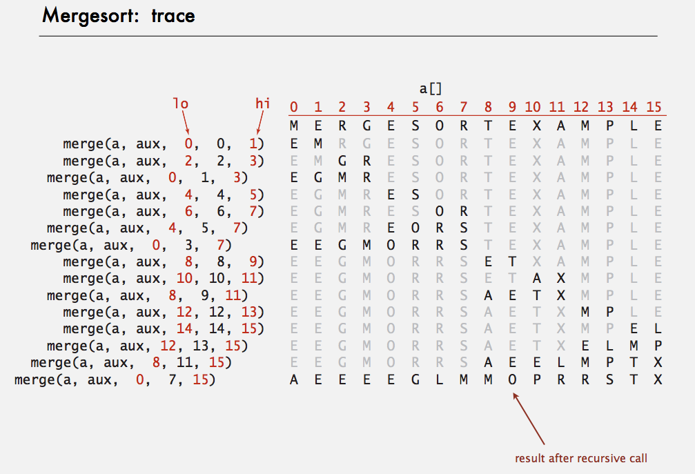
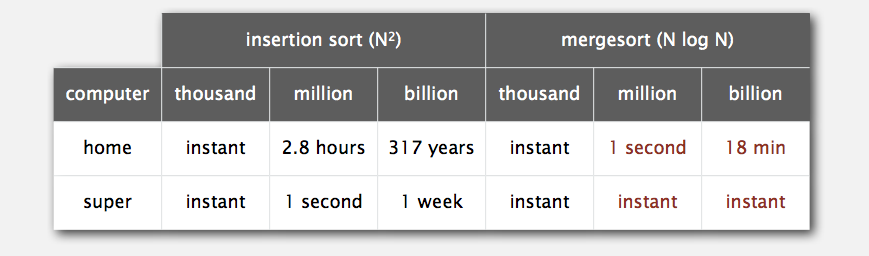
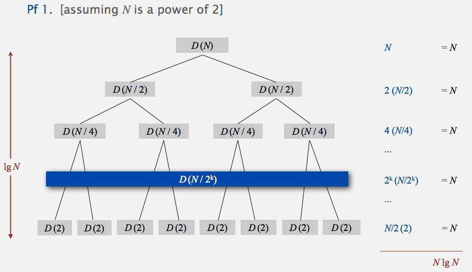
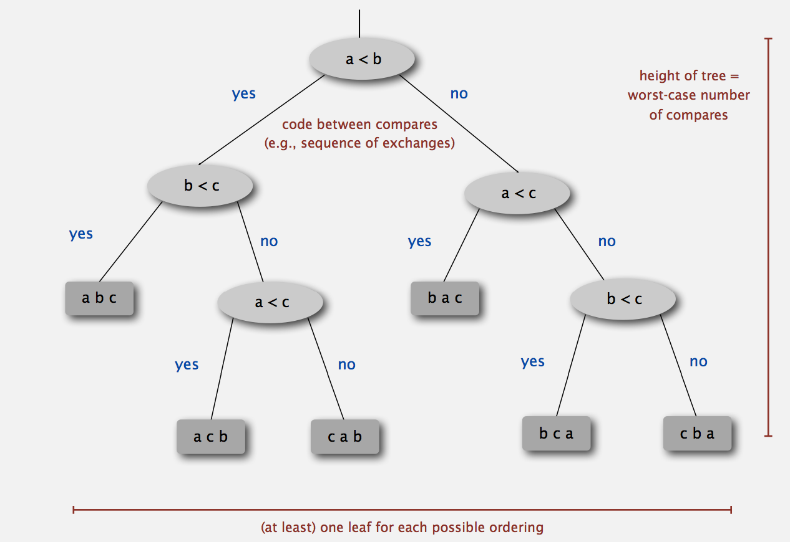
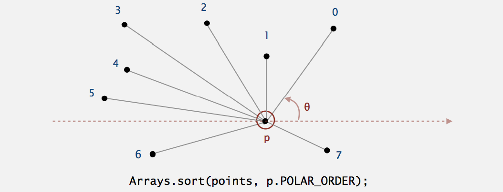

# *Merge Sort (Week3)*

Date: 07.08.2014

## Basic Plan

* Divide array into two halves
* Recursively sort each half.
* Merge two halves.


## Abstract in-place merge demo

### Goal

Given two sorted subarrays `a[lo]` to `a[mid]` and `a[mid+1]` to `a[hi]`, replace with sorted subarray `a[lo]` to `a[hi]`.


## Merging: Java implementation

```java

private static void merge(Comparable[] a, Comparable[] aux, int lo, int mid, int hi) {
    assert isSorted(a, lo, mid);    // precondition: a[lo..mid] sorted
    assert isSorted(a, mid+1, hi);  // precondition: a[mid+1..hi] sorted
    
    for (int k = lo; k <= hi; k++)
        aux[k] = a[k];              // copy
    
    int i = lo, j = mid+1;          // pointers
    for (int k = lo; k <= hi; k++) {
        if      (i > mid)               a[k] = aux[j++];
        else if (j > hi)                a[k] = aux[i++];
        else if (less(aux[j], aux[i]))  a[k] = aux[j++];
        else                            a[k] = aux[i++];
    }
    
    assert isSorted(a, lo, hi);     // precondition: a[lo..hi] sorted
}
```

### Assertion

Statement to test assumptions about your program

* Helps detect bugs
* Documents code.

**Java Assert Statement**: throws exception unless boolean condition is true.

```java
assert isSorted(a, lo, hi);
```

Can enable to disable at runtime -> No cost in production code.

    java -ea Myprogram  // enable assertions
    java -da Myprogram  // disable assertions (default)

Best Practice: Use assertions to check internal invariants. Assume assertions will be disabled in production code.


## Sort: Java implementation

```java

public class Merge {

    private static void merge(...) {
        /* as before */
    }
    
    private static void sort(Comparable[] a, Comparable[] aux, int lo, int hi) {
        if (hi <= lo) return;
        int mid = lo + (hi - lo) / 2;
        sort(a, aux, lo, mid);
        sort(a, aux, mid+1, hi);
        merge(a, aux, lo, mid, hi);
    }
    
    public static void sort(Comparable[] a) {   // actual sort
        aux = new Comparable[a.length];
        sort(a, aux, 0, a.length - 1);
    }
}
```

### Mergesort: Trace




## Mergesort: empirical analysis

Running time estimates:

* Laptop executes 10^8 compares / second.
* Supercomputer executes 10^12 compares / second.



**Bottom line**: Good algorithm are better than supercomputers.


### Number of compares and Array accesses

**Proposition**. Mergesort uses at most N*lg(N) compares and 6*N*lg(N) array accesses to sort any array of size N.

Proof Sketch. The number of compares C(N) and array accesses A(N) to mergesort an array of size N satisfy the recurrences:

    C(N) <= C([N/2])  +  C([N/2])  +  N for N > 1, with C(1) = 0.
                |           |         |
            left half   right half   merge
                |           |         |
    A(N) <= A([N/2])  +  A([N/2])  +  6N for N > 1, with A(1) = 0.


We solve the recurrence when N is a power of 2.  // result holds for all N

### Divide and Conquer recurrence

**Proposition**. If D(N) satisfies ProD(N) = 2D(N/2) + N for N > 1, with D(1) = 0, then D(N) = N*lg(N).



*Proof 2*

    D(N) = 2*D(N/2) + N
    D(N) / N = 2*D(N/2) / N + 1
             = D(N/2) / (N/2) + 1
             = D(N/4) / (N/4) + 1 + 1
             = D(N/8) / (N/8) + 1 + 1 + 1
             ...
             = D(N/N) / (N/N) + 1 + 1 + ... + 1     // D(1) = 0
             = lg(N)


### Mergesort analysis: Memory

**Proposition**. Mergesort uses extra space proportional to N.

pf. The array aux[] needs to be of size N for the last merge.

Def. A sorting algorithm is in-place if it uses <= c*log(N) extra memory.
E.g. Insertion sort, selection sort, shellsort.


## Practical Improvements

**Use insertion sort for small subarrays.**
* Mergesort has too much overhead for tiny subarrays.
* Cutoff to insertion sort for ~ 7 items.

```java

private static void sort(Comparable[] a, Comparable[] aux, int lo, int hi) {
    if (hi <= lo + CUTOFF - 1) {
        Insertion.sort(a, lo, hi);
        return;
    }
    int mid = lo + (hi - lo) / 2;
    sort(a, aux, lo, mid);
    sort(a, aux, mid+1, hi);
    merge(a, aux, lo, mid, hi);
}
```

**Stop if already sorted.**
* Is biggest item in first half <= smallest item in second half?
* Helps for partially-ordered arrays.

```java

private static void sort(Comparable[] a, Comparable[] aux, int lo, int hi) {
    if (hi <= lo) return;
    int mid = lo + (hi - lo) / 2;
    sort(a, aux, lo, mid);
    sort(a, aux, mid+1, hi);
    if (!less(a[mid+1], a[mid])) return;    // check for order of array
    merge(a, aux, lo, mid, hi);
}
```

**Eliminate the copy to the auxiliary array.** 
Save time (but not space) by switching the role of the input and auxiliary array in each recursive call.

```java

private static void merge(Comparable[] a, Comparable[] aux, int lo, int mid, int hi) { 
    int i = lo, j = mid+1;          // pointers
    for (int k = lo; k <= hi; k++) {
        if      (i > mid)               aux[k] = a[j++];
        else if (j > hi)                aux[k] = a[i++];
        else if (less(aux[j], aux[i]))  aux[k] = a[j++];
        else                            aux[k] = a[i++];
    }    
}

private static void sort(Comparable[] a, Comparable[] aux, int lo, int hi) {
    if (hi <= lo) return;
    int mid = lo + (hi - lo) / 2;
    sort(aux, a, lo, mid);
    sort(aux, a, mid+1, hi);        // sort(a) initializes aux[] and sets
    merge(a, aux, lo, mid, hi);     // aux[1] = a[1] for each 1.
}
```

## Bottom Up Mergesort

Basic Plan

* Pass through array, merging subarray of size 1.
* Repeat for subarrays of size 2, 4, 8, 16, ....

Bottom line: No recursion needed!


```java

public class MergeBU {
    private static Comparable[] aux;
    
    private static void merge(Comparable[] a, int lo, int mid, int hi) {
        /* as before */
    }
    
    public static void sort(Comparable[] a) {
        int N = a.length;
        aux = new Comparable[N];
        for (int sz = 1; sz < N; sz = sz + sz)
            for (int lo = 0; lo < N - sz; lo += sz + sz)
                merge(a, lo, lo + sz - 1, math.min(lo + sz + sz - 1, N - 1));
    }
}       
```

* It uses extra memory but in terms of speed, it's an industry strength.
* The Cost is N*lg(N)


## Complexity of sorting

    Computational complexity: Framework to study efficiency of algorithms for solving a particular problem X.
    Model of Computation: Allowable operations.
    Cost Model: Operation Counts.
    Upper bound: Cost guarantee provided by some algorithm for X.
    Lower bound: Proven limit on cost guarantee of all algorithms for X.
    Optimal algorithm: Algorithm with best possible cost guarantee for X.


**Example: Sorting**

* Model of computation: decision tree.
* Cost Model: # compares.
* Upper bound: ~ Nlg(N) from mergesort.
* Lower bound: ?
* Optimal algorithm: ?


### Decision Tree (for 3 distinct items a,b, and c)




### Compare-based lower bound for sorting

Proposition: Any compare-based sorting algorithm must use at least lg(N!) ~ Nlg(N) compares in the worst-case. 

**Pf.**

* Assume array consists of N distinct values `a1` through `aN`.
* Worst case dictated by height h of decision tree.
* Binary tree of height h has at most 2^h leaves.
* N! different orderings -> at least N! leaves.


    2^h >= # leaves >= N!
    -> h >= lg(N!) ~ Nlg(N)  (based on Stirling's formula)

Therefore, 

**Example: Sorting**

* Model of computation: decision tree.
* Cost Model: # compares.
* Upper bound: ~ Nlg(N) from mergesort.
* Lower bound: ?
* Optimal algorithm: Mergesort

First goal of algorithm design: optimal algorithms


### Complexity results in context

* Compares? Mergesort is optimal with respect to # compares.
* Space? Mergesort is not optimal with respect to space usage.


Lesson: Use theory as a guide.
e.g. Don't try to design sorting algorithm that guarantees 1/2Nlg(N) compares.
e.g. Design sorting algorithm that is both time and space optimal?


Lower bound may hold if the algorithm has information about:

* The initial order of the input.
* The distribution of key values.
* The representation of the keys.

Partially ordered arrays: Depending on the initial order of the input, we may not need Nlg(N) compares.  // insertion sort requires only N-1 compares if input array is sorted.

Duplicate keys: Depending on the input distribution of duplicates, we may not need Nlg(N) compares. // stay tuned for 3 way Quicksort.

Digital properties of keys: We can use digit/character compares instead of key compares for numbers and strings.  // stay tuned for radix sorts.


## Comparators

Comparator interface: sort using an alternate order.

```java

public interface Comparator<key>
    int compare(Key v, Key w)       // compare keys v and w
```

Require property: Must be a **total order**.


### System Sort

To use with java system sort:

* Create Comparator object.
* Pass as second argument to Arrays.sort().

```java

String[] a;
...
Arrays.sort(a)   // uses natural order
...
Arrays.sort(a, String.CASE_INSENSITIVE_ORDER);   // uses alternative order defined by Comparator<String> Object
...
Arrays.sort(a, Collator.getInstance(new Locale("es")));
...
Arrays.sort(a, new BritishPhoneBookOrder());
...
```

Bottom Line: Decouples the definition of the data type from the definition of what it means to compare two objects of that type.


To Support Comparators in our sort implementations:

* Use Object instead of Comparable.
* Pass comparator to sort() and less() and use it in less().

*Example: Insertion Sort Using a Comparator*

```java

public static void sort(Object[] a, Comparator comparator) {
    int N = a.length;
    for (int i = 0; i < N; i++)
        for (int j = i; j > 0 && less(comparator, a[j], a[j-1]); j--)
            exch(a, j, j-1);
}

private static boolean less(Comparator c, Object v, Object w) {
    return c.compare(v, w) < 0;
}

Private static void exch(Object[] a, int i, int j) {
    Object swap = a[i];
    a[i] = a[j];
    a[j] = swap;
}
```


### To implement a comparator

* Define a (nested) class that implements the Comparator interface.
* Implement the compare() method.

```java

public class Student {
    public static final Comparator<Student> BY_NAME = new ByName();
    public static final Comaprator<Student> BY_SECTION = new Bysection();
    private final String name;
    private final int section;
    ...
    
    private static class ByName implements Comparator<Student> {
        public int compare(Student v, Student w) {
            return v.name.compareTo(w.name);
        }
    }
    
    private static class BySection implements Comparator<Student> {
        public int compare(Student v, Student w) {
            return v.section - w.section;  // this technique works here since no danger of overflow
        }
    }
}
```


### Polar Order

Given a point `p`, order points by polar angle they make with `p`.



Application: Graham Scan algorithm for convex hull.

High-School Trig Solution: Compute polar angle theta w.r.t `p` using atan2().
Drawback: Evaluating a trigonometric function is expensive.


*A ccw-based solution*

If `q1` is above `p` and `q2` is below `p`, then `q1` makes smaller polar angle.
If `q1` is below `p` and `q2` is above `p`, then `q1` makes larger polar angle.
Otherwise, `ccw(p, q1, q2)` identifies which of `q1` or `q2` makes larger angle.


```java

public class Point2D {
    public final Comparator<Point2D> POLAR_ORDER = new PolarOrder();
    private final double x, y;  // one Comparator for each point (not static)
    ...
    
    public static int ccw(Point2D a, Point2D b, Point2D c) {
            double area2 = (b.x - a.x) * (c.y - a.y) - (b.y - a.y)*(c.x - a.x);
            if (area2 < 0) return -1;  // clockwise
            else if (area2 < 0) return +1;  //counter-clockwise
            else return 0;  // collinear
        }
    
    private class PolarOrder implements Comparator<Point2D> {
        public int compare(Point2D q1, Point2D q2) {
            double dy1 = q1.y - y;
            double dy2 = q2.y - y;
            
            if      (dy1 == 0 && dy2 == 0) { ... }      // p, q1, q2 horizontal
            else if (dy1 >= 0 && dy2 < 0)  return -1;   // q1 above p and q2 below p
            else if (dy2 >= 0 && dy1 < 0)  return +1;   // q1 below p and q2 above p
            else return -ccw(Point2D.this, q1, q2);     // to access invoking point from within inner class
        }
    }
}   
```

## Stability

A typical application: First, sort by name. Then, sort by section.
A stable sort preserves the relative order of items with equal keys.


Q. Which sorts are stable?
A. Insertion sort and Mergesort (but not selection sort or shellsort)

Note: Need to carefully check code ("less than" vs. "less than or equal to").


### Insertion Sort

Proposition. Insertion Sort is stable.

```java

public class Insertion {
    public static void sort(Comparable[] a) {
        int N = a.length;
        for (int i = 0; i < N; i++)
            for (int j = i; j > 0 && less(a[j], a[j-1]); j--)
                exch(a, j, j-1);
    }
}
```

**Pf**
Equal items never move past each other.


Proposition. Selection Sort is not stable.

```java

public class Selection {
    public static void sort(Comparable[] a) {
        int N = a.length;
        for (int i = 0; i < N; i++) {
            int min = i;
            for (int j = i+1; j < N; j++)
                if (less(a[j], a[min]))
                    min = j;
            exch(a, i, min);
        }
    }
}
```

**Pf by counterexample**: Long-distance exchange might over an item past some equal item.


Proposition. Shellsort is not stable.

```java

public class Shell {
    public static void sort(Comparable[] a) {
        int N = a.length;
        int h = 1;
        while (h < N/3) h = 3*h + 1;
        while (h >= 1) {
            for (int i = h; i < N; i++) {
                for (int j = i; j > h && less(a[j], a[j-h]); j-= h)
                    exch(a, j, j-h);
            }
            h = h/3;
        }
    }
}
```

**Pf by counterexample**: Long distance exchanges.


Proposition. Mergesort is stable.

```java

pbulic class Merge {
    private static Comparable[] aux;
    private static void merge(Comparable[] a. int lo, int mid, int hi) {
        for (int k = lo; k <= hi; k++)
            aux[k] = a[k];
        
        int i = lo, j = mid+1;
        for (int k = lo; k <= hi; k++) {
            if      (i > mid)              a[k] = aux[j++];
            else if (j > hi)               a[k] = aux[i++];
            else if (less(aux[j], aux[i])) a[k] = aux[j++];
            else                           a[k] = aux[i++];
        }
    }
    
    private static void sort(Comparable[] a, int lo, int hi) {
        if (hi <= lo)   return;
        int mid = lo + (hi - lo) / 2;
        sort(a, lo, mid);
        sort(a, mid+1, hi);
        merge(a, lo, mid, hi);
    }
    
    public static void sort(Comparable[] a) { 
            aux = new Comparable[a.length];
            sort(a, aux, 0, a.length - 1);
    }
}
```

**Pf**. Suffice verify merge opertion is stable.
Takes from left subarray if equal keys.


