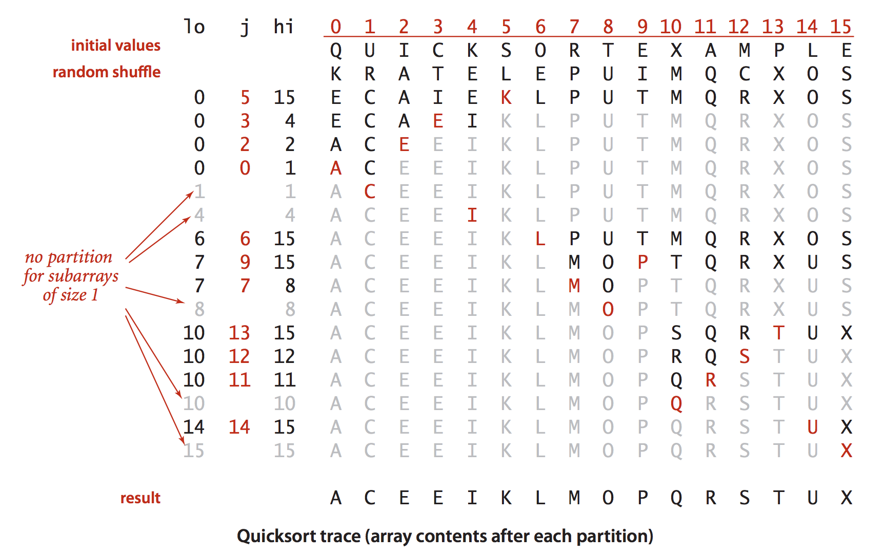
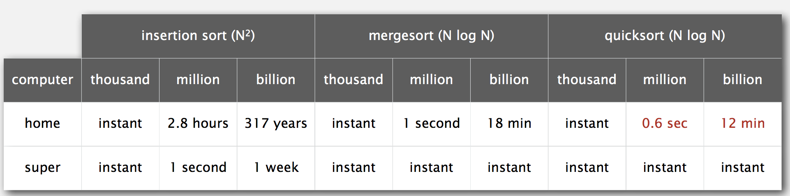

# *Quick Sort (Week3)*

Date: 07.12.2014

* Mergesort - Java sort for objects.
* Quicksort - Java sort for primitive types.

## Basic Plan

* Shuffle the array.
* Partition so that , for some j
    - entry a[j] is in place
    - no larger entry to the left of j
    - no smaller entry to the right of j
* Sort each piece recursively.


### Phase I: Repeat until i and j pointers cross.
*   Scan i from elft to right so long as (a[i] < a[lo]).
*   Scan j from right to left so long as (a[j] > a[lo]).
*   Exchange a[i] with a[j].


### Pharse II: When pointers cross
*   Exchange a[lo] with a[j].

### Java Implementation

```java

public class Quick {
    private static int partition(Comparable[] a, int lo, int hi) {
        int i = lo, j = hi + 1;
        while (true) {
            while (less(a[++i], a[lo]))
                if (i == hi) break;     // find item on left to swap
            
            while (less(a[lo], a[--j]))
                if (j == lo) break;     // find item on right to swap
            
            if (i >= j) break;          // check if pointers cross
                exch(a, i, j);          // swap
            
            exch(a, lo, j);             // swap with partitioning item
            return j;                   // return index on item now known to be in place
    }
    
    public void sort(Comparable[] a) {
        StdRandom.shuffle(a);
        sort(a, 0, a.length - 1);
    }
    
    private static void sort(Comparable[] a, int lo, int hi) {
        if (hi <= lo) return;
        int j = partition(a, lo, hi);
        sort(a, lo, j-1);
        sort(a, j+1, hi);
    }
}
```

### Implementation Details

* Partitioning in-place: 
    * Using an extra array makes partitioning easier (and stable), but is not worth the cost.
    * This is the advantage of Quicksort over Mergesort
    
* Terminating the loop: 
    * Testing whether the pointers cross is a bit trickier than it might seem.

* Staying in bounds: 
    * The (j == lo) test is redundant (why?), but the (i == hi) test is not.

* Preserving randomness: 
    * Shuffling is needed for performance guarantee.

* Equal keys: 
    * When duplicates are present, it is (counter-intuitively) better to stop on keys equal to the partitioning item's key.



### Empirical Analysis

Running time estimates:

* Home PC executes 10^8 compares / seconds.
* Supercomputer executes 10^12 compares / seconds.



Lesson 1: Good Algorithm are better than supercomputers.
Lesson 2: Great algorithms are better than good ones.


* Best Case: Number of compares ~ Nlg(N)
* Worst case: Number of compares ~ 1/2*N^2 but it's extremely unlikely
* Average case: 2(N+1)ln(N) is larger than Mergesort but in practice, faster than mergesort because of less data movement.


Random Shuffle
* Probabilistic guarantee against worse case.
* Basis for math model that can be validated with experiments.

Caveat emptor: Many textbook implementations go quadratic if array
* is sorted or reverse sorted.
* has many duplicates (even if randomized)


### Quicksort Properties

* In-pace sorting algorithm
* Not Stable

### Quicksort: Practical Improvements

1. Insertion sort small subarrays.
    * Even quicksort has too much overhead for tiny subarrays.
    * Cutoff to insertion sort for ~ 10 items.
    * Note: could delay insertion sort until one pass at end.

2. Median of sample.
    * Best choice of pivot item = median.
    * Estimate true median by taking median of sample.
    * Median of 3 random items.


```java

private static void sort(Comparable[] a, int lo, int hi) {
    // use insertion sort for small arrays
    if (hi <= lo + CUTOFF - 1) {
        Insertion.sort(a, lo, hi);
        return;
    }
    
    // median of sample
    int m = medianOf3(a, lo, lo + (hi - lo)/2, hi);
    swap(a, lo, m);
    
    int j = partition(a, lo, hi);
    sort(a, lo, j-1);
    sort(a, j+1, hi);
}
```


