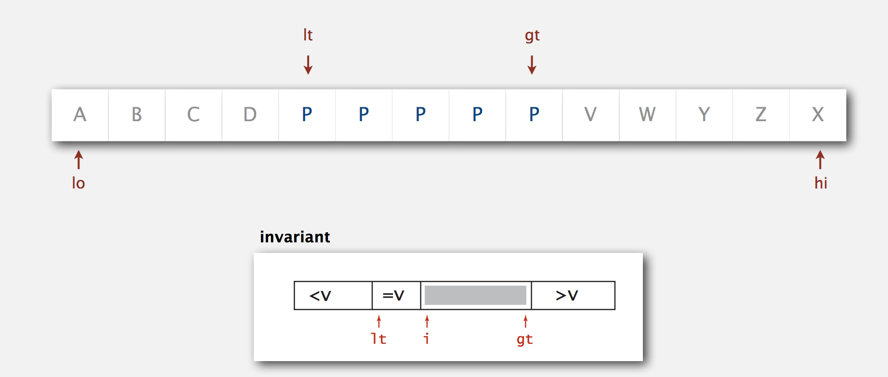
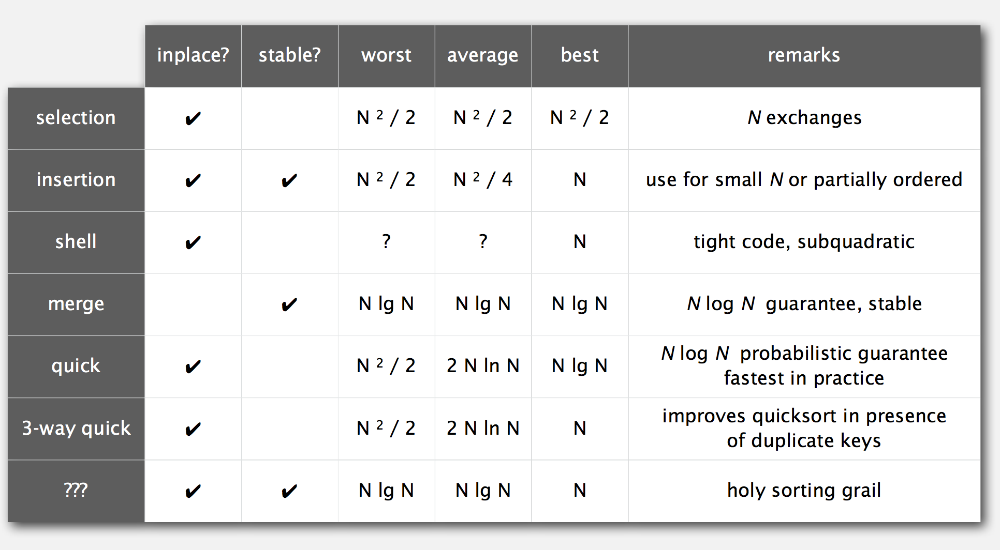

# *Quick Sort (Week3)*

Date: 07.12.2014

* Mergesort - Java sort for objects.
* Quicksort - Java sort for primitive types.

## Basic Plan

* Shuffle the array.
* Partition so that, for some j
    - entry `a[j]` is in place
    - no larger entry to the left of j
    - no smaller entry to the right of j
* Sort each piece recursively.


### Phase I: Repeat until i and j pointers cross.
*   Scan i from elft to right so long as (`a[i]` < `a[lo]`).
*   Scan j from right to left so long as (`a[j]` > `a[lo]`).
*   Exchange `a[i]` with `a[j]`.


### Pharse II: When pointers cross
*   Exchange `a[lo]` with `a[j]`.

### Java Implementation

```java

public class Quick {
    private static int partition(Comparable[] a, int lo, int hi) {
        int i = lo, j = hi + 1;
        while (true) {
            while (less(a[++i], a[lo]))
                if (i == hi) break;     // find item on left to swap
            
            while (less(a[lo], a[--j]))
                if (j == lo) break;     // find item on right to swap
            
            if (i >= j) break;          // check if pointers cross
                exch(a, i, j);          // swap
        }
        
        exch(a, lo, j);             // swap with partitioning item
        return j;                   // return index on item now known to be in place
    }
    
    public void sort(Comparable[] a) {
        StdRandom.shuffle(a);
        sort(a, 0, a.length - 1);
    }
    
    private static void sort(Comparable[] a, int lo, int hi) {
        if (hi <= lo) return;
        int j = partition(a, lo, hi);
        sort(a, lo, j-1);
        sort(a, j+1, hi);
    }
}
```

### Implementation Details

* Partitioning in-place: 
    * Using an extra array makes partitioning easier (and stable), but is not worth the cost.
    * This is the advantage of Quicksort over Mergesort
    
* Terminating the loop: 
    * Testing whether the pointers cross is a bit trickier than it might seem.

* Staying in bounds: 
    * The (j == lo) test is redundant (why?), but the (i == hi) test is not.

* Preserving randomness: 
    * Shuffling is needed for performance guarantee.

* Equal keys: 
    * When duplicates are present, it is (counter-intuitively) better to stop on keys equal to the partitioning item's key.


### Empirical Analysis

Running time estimates:

* Home PC executes 10^8 compares / seconds.
* Supercomputer executes 10^12 compares / seconds.


Lesson 1: Good Algorithm are better than supercomputers.
Lesson 2: Great algorithms are better than good ones.


* Best Case: Number of compares ~ Nlg(N)
* Worst case: Number of compares ~ 1/2*N^2 but it's extremely unlikely
* Average case: 2(N+1)ln(N), which is larger than Mergesort but in practice, faster than mergesort because of less data movement.


Random Shuffle
* Probabilistic guarantee against worse case.
* Basis for math model that can be validated with experiments.

Caveat emptor: Many textbook implementations go quadratic if array
* is sorted or reverse sorted.
* has many duplicates (even if randomized)


### Quicksort Properties

* In-pace sorting algorithm
* Not Stable

### Quicksort: Practical Improvements

1. Insertion sort small subarrays.
    * Even quicksort has too much overhead for tiny subarrays.
    * Cutoff to insertion sort for ~ 10 items.
    * Note: could delay insertion sort until one pass at end.

2. Median of sample.
    * Best choice of pivot item = median.
    * Estimate true median by taking median of sample.
    * Median of 3 random items.


```java

private static void sort(Comparable[] a, int lo, int hi) {
    // use insertion sort for small arrays
    if (hi <= lo + CUTOFF - 1) {
        Insertion.sort(a, lo, hi);
        return;
    }
    
    // median of sample
    int m = medianOf3(a, lo, lo + (hi - lo)/2, hi);
    swap(a, lo, m);
    
    int j = partition(a, lo, hi);
    sort(a, lo, j-1);
    sort(a, j+1, hi);
}
```

## Selection

Goal: Given an array of N items, find the kth largest.
e.g. Min(k = 0), max(k = N-1), median(k = N/2)


Use theory as a guide

* Easy Nlg(N) upper bound.
* Easy N upper bound for k = 1,2,3.
* Easy N lower bound.


### Quick-Select

Partition array so that:
* Entry `a[j]` is in place.
* No larger entry to the left of j.
* No smaller entry to the right of j.

Repeat in one subarray, depending on j. Finished when j equals k.

```java

public static Comparable select(Comparable[] a, int k) {
    StdRandom.shuffle(a);
    int lo = 0, hi = a.length - 1;
    while (hi > lo) {
        int j = partition(a, lo, hi);
        if      (j < k) lo = j + 1;
        else if (j > k) hi = j - 1;
        else            return a[k];
    }
    return a[k];
}
```

### Quick-Select: Mathematical analysis

proposition: Quick-Select takes **linear** time on average.

Intuitively, each partitioning step splits array approximately in half: N + N/2 + N/4 + .. + 1 ~ 2N compares.

* Theoretical Context for selection
    
    * Compare-based selection algorithm whose worst-case running time in linear. But constants are too high -> Not used in practice.

Remark: Quick-Select uses ~ 1/2N^2 compares in the worst case, but (as with quicksort) the random shuffle provides a probabilistic guarantee.


## Duplicate Keys

Often, purpose of sort is to bring items with equal keys together.

Mergesort with duplicate keys: Always between 1/2Nlg(N) and Nlg(N) compares.

Quicksort with duplicate keys:
*   Algorithm goes quadratic unless partitioning stops on equal keys!
*   1990s C users found this defect in qsort().

**Mistake**: Put all items equal to the partitioning item on one side.
Consequence: ~ 1/2N^2 compares when all keys equal.

Recommended: Stop scans on items equal to the partitioning item.
Consequence: ~Nlg(N) compares when all keys equal.

Desirable: Put all items equal to the partitioning item in place.


### 3-way partitioning

Goal: Partition array into 3parts so that:
* Entries between `lt` and `gt` equal to partition item `v`.
* No larger entries to left of `lt`.
* No smaller entries to right of `gt`.


**Dijkstra 3-way partitioning**

Let `v` be partitioning item `a[lo]`.
Scan `i` from left to right.

- (`a[i]` < v): exchange `a[lt]` with `a[i]`. increment both `lt` and `i`.
- (`a[i]` > v): exchange `a[gt]` with `a[i]`. decrement `gt`.
- (`a[i]` == v): increment `i`.




### 3-way Quicksort: Java implementation

```java

private static void sort(Comparable[] a, int lo, int hi) {
    if (hi <= lo)   return;
    int lt = lo, gt = hi;
    Comparable v = a[lo];
    int i = lo;
    while (i <= gt) {
        int cmp = a[i].compareTo(v);
        if      (cmp < 0) exch(a, lt++, i++);   // exchange i and lt and increment lt and i
        else if (cmp > 0) exch(a, i, gt--);     // exchange i and gt and decrement gt
        else              i++;                  // increment i
    }
    
    sort(a, lo, lt, - 1);
    sort(a, gt + 1, hi);
}
```

### Sorting Lower bound:
 
 Quicksort with 3-way partitioning is entropy-optimal.
 
* Nlg(N) compares in the worst case when all keys are distinct.
* linear compares when only a constant number of distant keys.
 
**Bottom line**: Randomized quicksort with 3-way partitioning reduces running time from *linearithmic* to *linear* in broad class of applications.
 
 
 
## System sorts 
 
 Sorting algorithms are essential in a broad variety of applications:
 
* sort a list of names.
* organize an MP3 library.
* Display Google PageRank result.
* List RSS reed in reverse chronological order.
 
* Find the median.
* Binary search in a database.
* Identify statistical outliers.
* Find duplicates in a mailing list.
 
* Data compression.
* Computer graphics.   // non-obvious applications.
* Computational biology.
* Load balancing on a parallel computer.
 
 
### Java system sorts

**Arrays.sort()**

- Has different method for each primitive type.
- Has a method for data types that implement Comparable.
- Has a method that uses a Comparator.
- Uses tuned quicksort for primitive types. tuned mergesort for objects.

```java

import java.util.Arrays;

public class StringSort {
    public static void main(String[] args) {
        String[] a = StdIn.readStrings();
        Arrays.sort(a);
        for (int i = 0; i < N; i++) {
            StdOut.println(a[i]);
        }
    }
}
```

### Engineering a system sort

Basic algorithm = quicksort.

* Cutoff to insertion sort for small subarrays.
* Partitioning scheme: 3-way partitioning.
* Partitioning item
    - small arrays: middle entry
    - medium arrays: median of 3
    - large arrays: Tukey's ninther


**Tukey's ninther**: Median of the median of 3 samples, each of 3 entries.
* Approximates the median of 9.
* Uses at most 12 compares.

Tukey's ninther is bettern partitioning than random shuffle and less costly.
But, shuffling is needed for performance guarantee.

### Which algorithm to use?

Many choose from...

* Internal sorts:
    * Insertionsort, Selectionsort, Bubblesort, Shakersort
    * Quicksort, Mergesort, Samplesort, Shellsort
    * Solitaire sort, Red-black sort, splaysort, Yaroslavskiy sort, psort, ...

* External sorts:
    * Poly-phase Mergesort, Cascade-Merge, Oscillating sort.

* String / Radix Sorts:
    * Distribution, MSD, LSD, 3-way string quicksort.
    
* Parallel Sorts:
    * Bitonic Sort, Batcher even-odd sort.
    * Smooth sort, cube sort, column sort.
    * GPUsort.


*Applications have diverse attributes.*

* Stable?
* Parallel?
* Deterministic?
* Keys all distinct?
* Multiple key types??
* Linked list or Arrays?
* Large or small items?
* Is your array randomly ordered?
* Need guaranteed performance?

Elementary sort may be method of choice for some combination.
Cannot cover all combination of attributes.

## Sorting Summary



