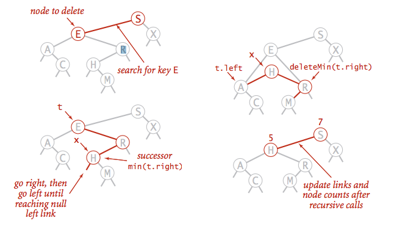

# *Binary Search Trees (Week 4)*

## BST

Definition: A BST is a binary tree in *symmetric* order.

Binary tree is either:
    
* empty
* two disjoint binary trees (left and right)

Symmetric order: each node has a key, and every node's key is:

* Larger than all keys in its left subtree.
* Smaller than all keys in its right subtree.


### BST representation in Java

A Node is comprised of four fields:

* A Key and a Value
* A reference to the left and right subtree.


```java

private class Node {
    private Key key;
    private Value val;
    Private Node left, right;
    
    public Node(Key key, Value val) {
        this.key = key;
        this.val = val;
    }
}
```

Key and Value are generic types; Key is Comparable.


* Get: Return value corresponding to given key, or *null* if no such key.

```java

pbulic Value get(Key key) {
    Node x = root;
    while (x != null) {
        int cmp = key.compareTo(x.key);
        if      (cmp < 0) x = x.left;
        else if (cmp > 0) x = x.right;
        else              return x.val;
    }
    return null;
}
```

Cost: Number of compares is equal to 1 + lg(N) depth of node.


* Put: Associate value with key
    Search for key, then two cases:
    * key in tree -> reset value
    * key not in tree -> add new node


```java

public void put(Key key, Value val) {
    root = put(root, key, val);
}

private Node put(Node x, Key key, Value val) {
    if (x == null) return new Node(key, val);
    int cmp = key.compareTo(x.key);
    if      (cmp < 0) x.left = put(x.left, key, val);
    else if (cmp > 0) x.right = put(x.right, key, val);
    else              x.val = val;      // (cmp == 0)
    return x;
}
```

Cost: Number of compares is equal to 1 + lg(N), the depth of node.


### Tree Shape

* Many BSTs correspond to same set of keys.
* Number of compares for search / insert is equal to 1 + lg(N), the depth of node.


**Remark: Tree shape depends on order of insertion.**


### Mathematical Analysis

Proposition: If `N` distinct keys are inserted into BST in random order, the expected number of compares for a search / insert is ~ 2 ln(N).
Pf. 1-1 correspondence with quicksort partitioning.

Proposition. [Reed, 2003] If `N` distinct keys are inserted in random order, expected height of tree is ~4.311*ln(N).
But.. Worst-case height is **N**. (exponentially samll chance when keys are inserted in random order)


## Ordered Operations

* Minimum and Maximum
    * minimum: smallest key in table.
    * maximum: largest key in table.


* Floor and Ceiling
    * floor: largest key <= a given key.
    * ceiling: smallest key >= a given key.


### Computing the floor

Case 1: The floor of k is k. (k equals the key at root)
Case 2: The floor of k is in the left subtree. (k is less than the key at root)
Case 3: The floor of k is in the right subtree (if there is any key <= k in right subtree), otherwise it is the key in the root.


```java

public key floor(Key key) {
    Node x = floor(root, key);
    if (x == null) return null;
    return x.key;
}

private Node floor(Node x, Key key) {
    if (x == null) return null;
    int cmp = key.compareTo(x.key);
    
    if (cmp == 0) return x;
    if (cmp < 0) return floor(x.left, key);
    
    Node t = floor(x.right, key);
    if (t != null) return t;
    else           return x;
}
```

### Subtree counts

In each node, we store the number of nodes in the subtree rooted at that node; to implement `size()`, return the count at the root.


Remark: This facilitates efficient implementation of `rank()` and `select()`.

```java

private class Node {
    private Key key;
    Private Value val;
    Private Node left;
    Private Node right;
    Private int count;      // number of nodes in subtree
}

public int size() {
    return size(root);
}

public int size(Node x) {
    if (x == null) return 0;    // ok to call when x is null
    return x.count;
}

private Node put(Node x, Key key, Value val) {
    if (x == null) return new Node(key, val, 1);
    int cmp = key.compareTo(x.key);
    if      (cmp < 0) x.left = put(x.left, key, val);
    else if (cmp > 0) x.right = put(x.right, key, val);
    else              x.val = val       // cmp == 0
    x.count = 1 + size(x.left) + size(x.right);
    return x;
}
```

### Rank

How many keys < k?

```java

public int rank(Key key) {
    return rank(key, too);
}

private int rank(Key key, Node x) {
    if (x == null) return 0;
    int cmp = key.compareTo(x.key);
    if      (cmp < 0) return rank(key, x.left);
    else if (cmp > 0) return 1 + size(x.left) + rank(key, x.right);
    else              return size(x.left);      // cmp == 0
}
```

### Inorder Traversal

* Traverse left subtree.
* Enqueue key.
* Traverse right subtree.

```java

public Iterable<Key> keys() {
    Queue<Key> q = new Queue<Key>();
    inorder(root, q);
    return q;
}

private void inorder(Node x, Queue<Key> q) {
    if (x == null) return;
    inorder(x.left, q);
    q.enqueue(x.key);
    inorder(x.right, q);
}
```

Property: Inorder traversal of a BST yields keys in **ascending order**.

### BST: Ordered symbol table operabtions summary


|                      |  sequential search  |  binary search  |    BST     |
|:--------------------:|:-------------------:|:---------------:|:----------:|
|    search            |           N         |       lg(N)     |     h      |
|    insert / delete   |           N         |        N        |     h      |
|    min / max         |           N         |        1        |     h      |
|    floor / ceiling   |           N         |       lg(N)     |     h      |
|    rank              |           N         |       lg(N)     |     h      |
|    select            |           N         |        1        |     h      |
|    ordered iteration |        N lg(N)      |        N        |     N      |

* h = height of BST (proportional to lg(N) if keys inserted in random order)


## Deletion

### BST deletion: lazy approach

To remove a node with a given key:

* set its value to *null*.
* leave key in tree to guide search (but don't consider it equal in search).

Cost: ~2ln(N') per insert, search, and delete (if keys in random order), where N' is the number of key-value pairs ever inserted in the BST.
Unsatisfactory solution: Tombstone (memory) overload.


### Deleting the minimum

To delete the minimum key:

* Go left until finding a node with a null left link.
* Replace that node by its right link.
* Update subtree counts.

```java

public void deleteMin() {
    roo = deleteMin(root);
}

private Node deleteMin(Node x) {
    if (x.left == null) return x.right;             // return null node's right link
    x.left = deleteMin(x.left);                     // go left until reaching null left link
    x.count = 1 + size(x.left) + size(x.right);     // update node counts after recursive calls
    return x;
}
```

### Hibbard deletion

To delete a node with key k: search for node t containing key k.

Case 1: [0 children] Delete t by setting parent link to null.


Case 2: [1 child] Delete t by replacing parent link.


Case 3: [2 children]

* Find successor x of t.                        // x has no left child
* Delete the minimum in t's right subtree       // but don't garbage collect x
* Put x in t's spot                             // still a BST



* Java Implementation

```java

public void delete(Key key) {
    root = delete(root, key);
}

private Node delete(Node x, Key key) {
    if (x == null) return null;
    int cmp = key.compareTo(x.key);
    if      (cmp < 0) x.left = delete(x.left, key);     // search for key
    else if (cmp > 0) x.right = delete(x.right, key);
    else {
        if (x.right == null) return x.left;             // no right child
        if (x.left == null) return x.right;             // no left child
        
        Node t = x;
        x = min(t.right);                               // replace with successor
        x.right = deleteMin(t.right);
        x.left = t.left;
    }
    x.count = size(x.left) + size(x.right) + 1;         // update subtree counts
    return x;
}
```

### Hibbard Deletion: Analysis

Unsatisfaction solution: Not Symmetric.
Surprising consequence: Trees not random (!) -> sqrt(N) per op.
Longstanding open problem: Simple and efficient delete for BSTs.


