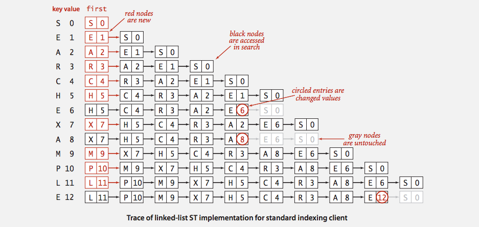
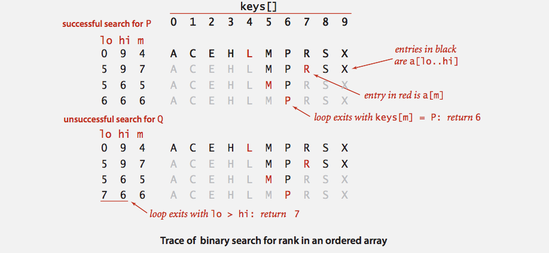
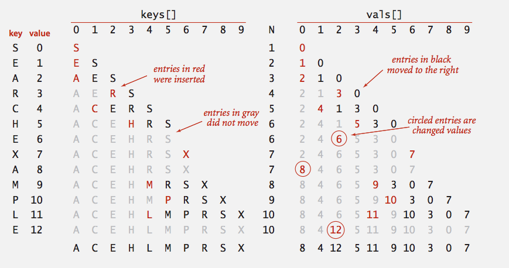
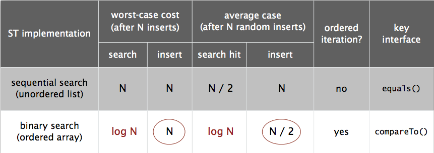

# *Elementary Symbol Tables (Week 4)*


## Symbol Table API

Key-value pair abstraction

* Insert a value with specified key.
* Given a key, search for the corresponding value.

Associative array abstraction: Associate one value with each key.

```java
public class ST<key, value> {
               ST()                       // create a symbol table
          void put(Key key, Value val)    // put key-value pair into the table (remove key from table if value is null)   
         Value get(Key key)               // value paired with key (null if key is absent)
          void delete(Key key)            // remove key (and its value) from table
       boolean isEmpty()                  // is the table empty?
           int size()                     // number of key-value pairs in the table
 Iterable<Key> keys()
}
```

### Conventions

* Values are not *null*.
* Method `get()` returns *null* if key not present.
* Method `put()` overwrites old value with new value.

**Intended consequences**

* Easy to implement `contains()`

```java
public boolean contains(Key key) {
    return get(key) != null;
}
```

* Can implement lazy version of `delete()`

```java
public boolean delete(Key key) {
    put(key, null);
}
```

### Keys and Values

* Value type: Any generic type.

* Key type: Several natural assumptions
    * Assume keys are `Comparable`, use `compareTo()`.  // specify Comparable in API
    * Assume keys are any generic type, use `equals()` to test equality.
    * Assume keys are any generic type, use `equals()` to test equality. Use `hashcode()` to scramble key.

* Best practices: Use immutable types for symbol table keys.
    * Immutable in Java: Integer, Double, String, java.io.File, ...
    * Mutable in Java: StringBuilder, java.net.URL, arrays, ...


### Equality Test

All Java classes inherit a method equals().

* Java requirements: For any references x,y, and z:
    * Reflexive: x.equals(x) is true.
    * Symmetric: x.equals(y) iff y.equals(x).
    * Transitive: if x.equals(y) and y.equals(z), then x.equals(z).
    * Non-null: x.equals(null) is false.

* Default implementation: x == y    // do x and y refer to the same object.

* Customized implementations: Integer, Double, String, java.io.File, ...

* User-defined implementations: Some care needed.


### Implementing equals for user-defined types

Seems easy, but require some care.

```java

public final class Date implements Comparable<Date> {   // typically unsafe to use equals() with inheritance
    private final int month;
    private final int day;
    private final int year;
    ...
    
    public boolean equals(Object y) {                 // must be Object
        if (y == this) return true;                   // optimize for true object equality
        if (y == null) return false;                  // check for null
        if (y.getClass() != this.getClass())
            return false;                             // object must be in the same class (getClass() vs. instanceof)
        
        Date that = (Date) y;                         // cast is guaranteed to succeed
        if (this.day   != that.day)   return false;   // check that all significant fields are the same.
        if (this.month != that.month) return false;
        if (this.year  != that.year)  return false;
        return true;
    }
}
```

### Equals Design

**"standard" recipe for user-defined types

* Optimization for reference equality
* Check against *null*
* Check that two objects are of the same type and cast
* Compare each significant field:
    * if field is a primitive type, use `==`
    * if filed is an object, use `equals()`
    * if field is an array, apply to each entry (alternatively, use `Arrays.equals(a, b)`
        or `Arrays.deepEquals(a, b)` but NOT `a.equals(b)`)

* Best Practices
    * No need to use calculated fields that depend on other fields.
    * Compare fields mostly likely to differ first.
    * Make compareTo() consistent with equals(). (x.equals(y) if and only if x.compareTo(y) == 0)


### ST test client for traces

Build ST by associating value i with ith string from standard input

```java

public static void main(String[] args) {
    ST<String, Integer> st = new ST<String, Integer>();
    
    for (int i = 0; !StdIn.isEmpty(); i++) {
        String key = StdIn.readString();
        st.put(key, i);
    }
    
    for (String s : st.keys())
        StdOut.println(s + " " + st.get(s));
}
```

### Frequency Counter: ST test client for Analysis

Read a sequence of strings from standard input and print out one that occurs with highest frequency.

```java

public class FrequencyCounter {
    public static void main(String[] args) {
        int minlen = Integer.parseInt(args[0]);
        ST<String, Integer> st = new ST<String, Integer>();     // create ST
        
        while (!StdIn.isEmpty()) {
            String word = StdIn.readString();                   
            if (word.length() < minlen) continue;               // ignore short strings
            if (!st.contains(Word)) st.put(word, 1);            // read string and update frequency
            else     st.put(word, st.get(word) + 1);
        }
        
        String max = "";
        st.put(max, 0);
        for (String word : st.keys())
            if (st.get(word) > st.get(max))
                max = word;
        StdOut.println(max + " " + st.get(max));                // print a string with max frequency
    }
}
```

## Elementary Implementations


### Sequential Search in a linked list

**Data Structure**: Maintain an (unordered) linked list of key-value pairs.

Search: Scan through all keys until find a match.
Insert: Scan through all keys until find a match. If no match add to front.




### Binary search in an ordered Array

**Data Structure**: Maintain an ordered array of key-value pairs.

Rank helper function: How many keys < k?




### Binary Search: Java Implementation

```java

public Value get(key key) {
    if (isEmpty()) return null;
    int i = rank(key);
    if (i < N && keys[i].compareTo(key) == 0) return vals[i];
    else return null;
}

private int rank(key key) {
    int lo = 0, hi = N - 1;
    while (lo <= hi) {
        int mid = lo + (hi - lo) / 2;
        int cmp = key.compareTo(keys[mid]);
        if      (cmp < 0) hi = mid - 1;
        else if (cmp > 0) lo = mid + 1;
        else              return mid;       // (emp == 0)
    }
    return lo;
}
```

### Binary Search: trace of standard indexing client

Problem: To insert, need to shift all greater keys over.




### Elementary ST implementation: Summary




## Ordered Operations


### Ordered Symbol Table API

```java

public class ST<Key extends Comparable<Key>, Value> {
                ST()                            // create an ordered symbol table
           void put(Key, key, Value val)        // put key-value pair into the table
          Value get(Key key)                    // value paired with key
           void delete(Key key)                 // remove key (and its value) from table
        boolean contains(Key key)               // is there a value paired with key?
        boolean isEmpty()                       // is the table empty?
            int size()                          // number of key-value paris
            Key min()                           // smallest key
            Key max()                           // largest key
            Key floor(Key key)                  // largest key less than or equal to key
            Key ceiling(Key key)                // smallest Key greater than or equal to key
            int rank(Key key)                   // number of keys less than key
            Key select(int k)                   // key of rank k
           void deleteMin()                     // delete smallest key
           void deleteMax()                     // delete largest key
            int size(Key lo, Key hi)            // number of keys in [lo, ..., hi]
  Iterable<Key> keys(Key lo, Key hi)            // keys in [lo, ..., hi], in sorted order
  Iterable<Key> keys()                          // all keys in the table, in sorted order
}
```

### Binary Search: ordered symbol table operations summary

|                      |  sequential search  |  binary search  |
|:--------------------:|:-------------------:|:---------------:|
|    search            |           N         |       lg(N)     |
|    insert / delete   |           N         |        N        |
|    min / max         |           N         |        1        |
|    floor / ceiling   |           N         |       lg(N)     |
|    rank              |           N         |       lg(N)     |
|    select            |           N         |        1        |
|    ordered iteration |        N lg(N)      |        N        |

order of growth of the running time for ordered symbol table operations

