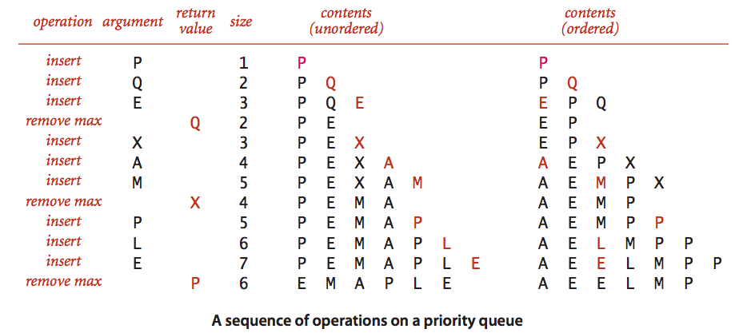
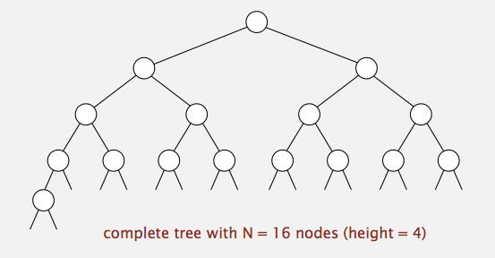
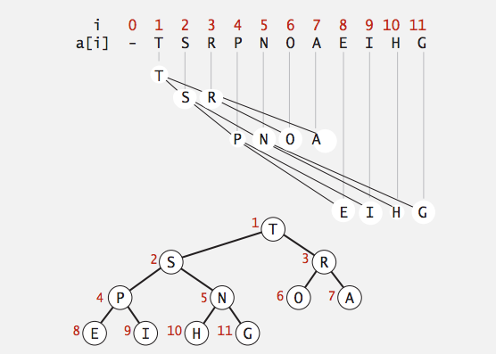
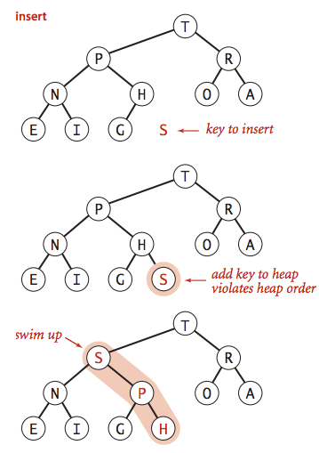
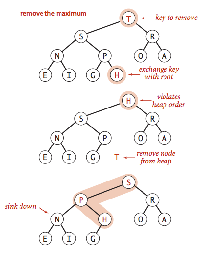
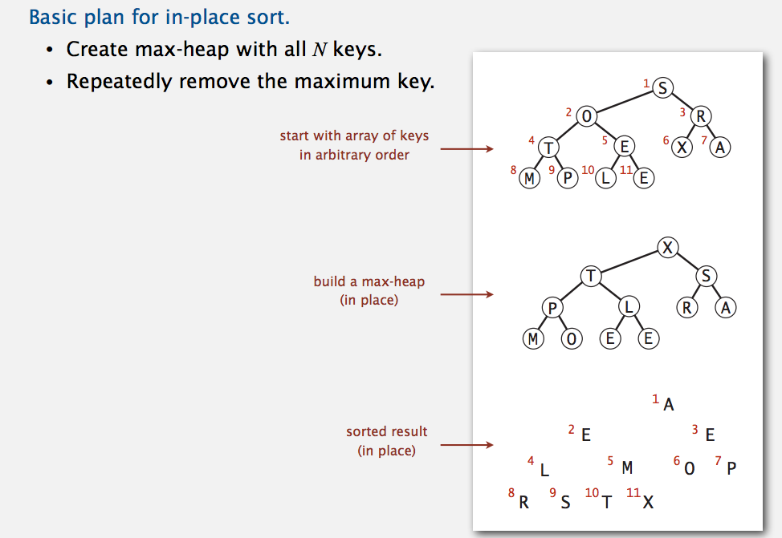
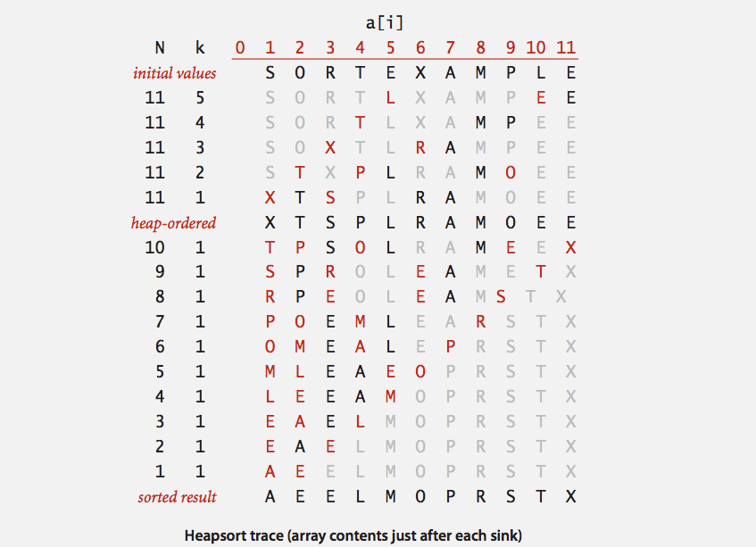
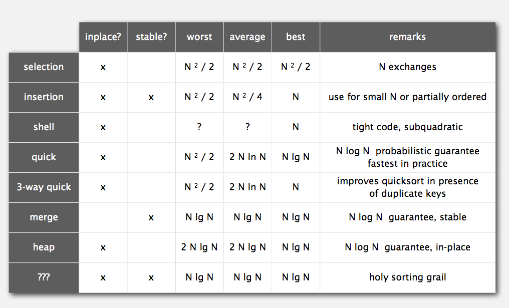

# *Priority Queue (Week 4)*


## Priority Queue

* Collections: Insert and delete items.
* Stack: Remove the item most recently added.
* Queue: Remove the item least recently added.
* Randomized Queue: Remove a random item.
* Priority Queue: Remove the largest (or smallest) item.


### Priority Queue API

Requirement: Generic items are `Comparable`.

```java

public class MaxPQ<Key extends Comparable<Key>> {   // Key must be Comparable (bounded type parameter)
            MaxPQ()             // create an empty priority queue
            MaxPQ(Key[] a)      // create a priority queue with given keys
       void insert(Key v)       // insert a key into the priority queue
        key delMax()            // return and remove the largest key
    boolean isEmpty()           // is the priority queue empty?
        key max()               // return the largest key
        int size()              // number of entries in the priority queue
}
```

Applications: Event-driven simulation, numerical computation, data compression, graph searching, ...


### Priority Queue Client Example

* Challenge: Find the largest `M` items in a stream of `N` items.
* Constraint: Not enough memory to store `N` items.

```java

MinPQ<Transaction> pq = new MinPQ<Transaction>();   // Transaction data type is Comparable (ordered by $$)

while (StdIn.hasNextLine()) {
    String line = StdIn.readLine();
    Transaction item = new Transaction(line);
    pq.insert(item);
    if (pq.size() > M)  // pq contains largest M items
        pq.delMin();
}
```


* order of growth of finding the largest M in a stream of N items

|    implementation    |    time    |  space  |
|:--------------------:|:----------:|:-------:|
|    sort              |  N log N   |    N    |
|    elementary PQ     |     M N    |    M    |
|    binary heap       |  N log M   |    M    |
|    best in theory    |     N      |    M    |


### unordered and ordered array implementation




### Unordered array implementation

```java

public class UnorderedMaxPQ<Key extends Comparable<Key>> {
    private Key[] pq;   // pq[i] = ith element on pq
    private int N;      // number of elements on pq
    
    public UnorderedMaxPq(int capacity) {
        pq = (Key[]) new Comparable[capacity];  // no generic array creation
    }
    
    public boolean isEmpty() {
        return N == 0;
    }
    
    public void insert(Key x) {
        pq[N++] = x;
    }
    
    public key delMax() {           // requires N compares
        int max = 0;
        for (int i = 1; i < N; i++)
            if (less(max, i))       // similar to sorting methods
                max = i;
        exch(max, N-1);             // similar to sorting methods
        return pq[--N];             // null out entry to prevent loitering
    }
}
```

* Priority queue elementary implementations

Challenge: Implement all operations efficiently

|    implementation    |  insert  |  del max  |   max   |
|:--------------------:|:--------:|:---------:|:-------:|
|    unordered array   |    1     |     N     |    N    |
|    ordered array     |    N     |     1     |    1    |
|    goal              |   log N  |   log N   |  log N  |


## Binary Heaps


### Complete Binary Tree



* Binary Tree: Empty or node with links to left and right binary trees.
* Complete tree: Perfectly balanced, except for bottom level.
* Property: Height of complete tree with N nodes is `lg N`.
    * Pf. Height only increases when N is a power of 2.


### Binary Heap Representation and Properties



* Binary Heap: Array representation of a heap-ordered complete binary tree.
* Heap-ordered binary tree
    * Keys in nodes.
    * Parent's key no smaller than children's keys.
* Array representation
    * Indices start at 1.
    * Take nodes in level order.
    * No explicit links needed!

**Property propositions**

1. Largest key is a[1], which is root of binary tree.
2. Can use array indices to move through tree.
    * Parent of node at k is at `k/2`. (integer division)
    * Children of node at k are at `2k` and `2k+1`.


### Promotion in a heap

Scenario: Child's key becomes **larger** key than its parent's key.

To eliminate the violation:

* Exchange key in child with key in parent.
* Repeat until heap order restored.

```java

private void swim(int k) {
    while (k > 1 && less(k/2, k)) {
        exch(k, k/2);
        k = k/2;    // parent of node at k is at k/2
    }
}
```

Peter Principle: Node promoted to level of incompetence.


### Insertion in a heap



Insert: Add node at end, then *swim* it up.
Cost: At most **1 + lg(N)** compares.

```java

public void insert(Key x) {
    pq[++N] = x;
    swim(N);
}
```

### Demotion in a heap

Scenario: Parent's key becomes smaller than one (or both) of its children's.

To eliminate the violation:

* Exchange key in parent with key in larger child.
* Repeat until heap ordered restored.

```java

private void sink(int k) {
    while (2 * k <= N) {        // a child exists
        int j = 2 * k;
        if (j < N && less(j, j+1))  j++;    // children of node at k are 2k (j) and 2k+1 (j+1)
        if (!less(k, j)) break;             // parent is larger than child
        exch(k, j);
        k = j;
    }
}
```

Power struggle: Better subordinate promoted.

## Delete the maximum in a heap



* Delete max: Exchange root with node at end, then *sink* it down.
* Cost: At most 2*lg(N) compares.

```java

public Key delMax() {
    Key max = pq[1];    // max should always be at pq[1]
    exch(1, N--);       // exchange top key and bottom key
    sink(1);            // sink down from top
    pq[N+1] = null;     // prevent loitering
    return max;         // return the max key, which is deleted
}
```

### Binary Heap: Java Implementation

```java

public class MaxPQ<Key extends Comparable<Key>> {
    private Key[] pq;
    private int N;
    
    public MaxPQ(int capacity) {
        pq = (Key[]) new Comparable[capacity+1];    // fix capacity (for simplicity)
    }                                               // but we can use resizing array
    
    /**
    * PQ operations
    */
    public boolean isEmpty() { 
        return N == 0;
    }
    
    public void insert(Key x) {
        pq[++N] = x;
        swim(N);
    }
    
    public Key delMax() {
        Key max = pq[1];                            // max should always be at pq[1]
        exch(1, N--);
        sink(1);
        pq[N+1] = null;                             // prevent loitering
        return max;
    }
    
    /**
    * heap helper functions
    */
    private void swim(int k) {                      // helper for insert()
        while (k > 1 && less(k/2, k)) {
            exch(k, k/2);
            k = k/2;                                // parent of node at k is at k/2
        }
    }
    
    private void sink(int k) {                      // helper for delMax()
        while (2 * k <= N) {                        // a child exists
            int j = 2 * k;
            if (j < N && less(j, j+1))  j++;        // children of node at k are 2k (j) and 2k+1 (j+1)
            if (!less(k, j)) break;                 // parent is larger than child
            exch(k, j);
            k = j;
        }
    }
    
    /**
    * array helper functions
    */
    private boolean less(int i, int j) {
        return pq[i].compareTo(pq[j]) < 0;
    }
    
    private void exch(int i, int j) {
        Key temp = pq[i];
        pq[i] = pq[j];
        pq[j] = temp;
    }
}
```

* Priority queues implementation cost summary

order-of-growth of running time for priority queue with N items

|    implementation    |  insert  |  del max  |   max   |
|:--------------------:|:--------:|:---------:|:-------:|
|    unordered array   |    1     |     N     |    N    |
|    ordered array     |    N     |     1     |    1    |
|    binary heap       |   log N  |   log N   |    1    |
|    impossible        |    1     |     1     |    1    |


### Binary Heap Considerations

* Immutability of Keys
    * Assumption: client does not change keys while they're on the PQ.
    * Best Practice: Use Immutable Keys.
    
* Underflow and overflow
    * Underflow: throw exception if deleting from empty PQ.
    * Overflow: add no-arg constructor and use resizing array.  // resizing array leads to log N amortized time per op
    
* Minimum-oriented priority queue
    * Replace less() with greater().
    * Implement greater().

* Other operations  (can implement with sink() and swim())
    * Remove an arbitrary item.
    * Change the priority of an item
    

### Immutability: Implementing in Java

Data type: set of values and operations on those values
Immutable data type: Can't change the data type value once created.

```java

public final class Vector {         // can't override instance methods
    private final int N;            // all instance variables private and final
    private final double[] data;
    
    public Vector(double[] data) {
        this.N = data.length;
        this.data = new double[N];  // defensive copy of mutable instance variables
        for (int i = 0; i < N; i++)
            this.data[i] = data[i];
    }
    
    ...                             // instance methods don't change instance variables
}
```

* Examples:
    * Immutable: String, Integer, Double, Color, Vector, Transaction, Point2D.
    * Mutable: StringBuilder, Stack, Counter, Java array.

* Properties:
    * Advantages
        * Simplifies debugging
        * Safer in presence of hostile code
        * Simplifies concurrent programming
        * Safe to use as key in priority queue or symbol table
    
    * Disadvantage
        * Must create new object for each data type value


## Heapsort




* Heap Construction: Build max heap using bottom-up method
* Sortdown: Repeatedly delete the largest remaining item


### Heapsort: Java Implementation

```java

public class Heap {
    public static void sort(Comparable[] a) {
        int N = a.length;
        for (int k = N/2; k >= 1; k--)          // heap construction
            sink(a, k, N);
        while (N > 1) {                         // Sort down
            exch(a, 1, N);
            sink(a, 1, --N);
        }
    }
    
    private static void sink(Comparable[] a, int k, int N) {
        /* as before */
    }
    private static void less(Comparable[] a, int k, int N) {
        /* as before */     // convert from 1-based indexing to 0-based indexing
    }
    private static void exch(Comparable[] a, int k, int N) {
        /* as before */     // convert from 1-based indexing to 0-based indexing
    }
}
```

**Trace**




### Heapsort: Mathematical Analysis

**Proposition**: Heap constuction uses <= 2N compares and exchanges.

**Proposition**: Heapsort uses <= 2N*lg(N) compares and exchanges.

**Significance**: In-place sorting algorithm with N*log(N) worst-case.

* Mergesort: no, linear extra space.
* Quicksort: no, quadratic time in worst case.
* Heapsort: Yes!

**Bottom Line**: Heapsort is optimal for both time and space, BUT:

* Inner loop longer than quicksort's.
* Makes poor use of cache memory due to the long distance exchange.
* Not stable.


### Sorting Algorithm Summary



