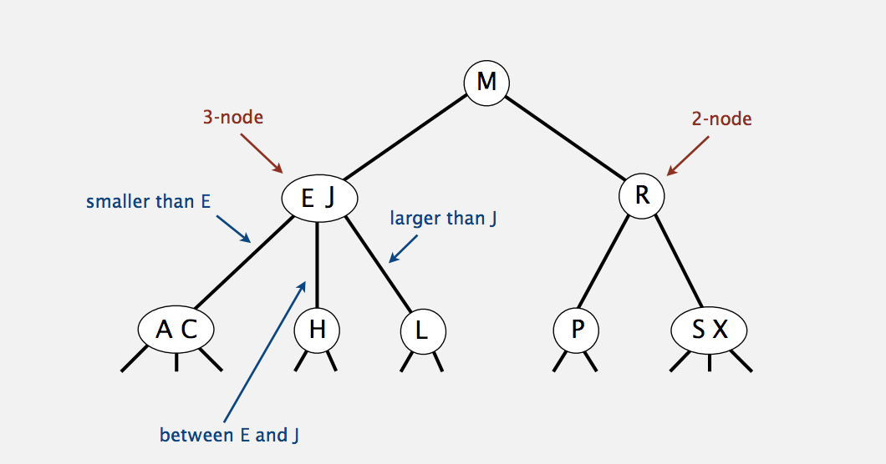
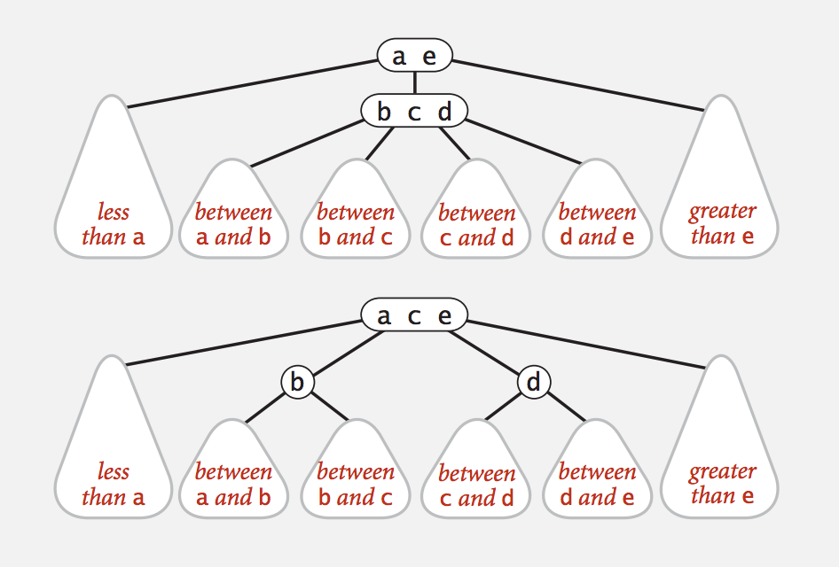
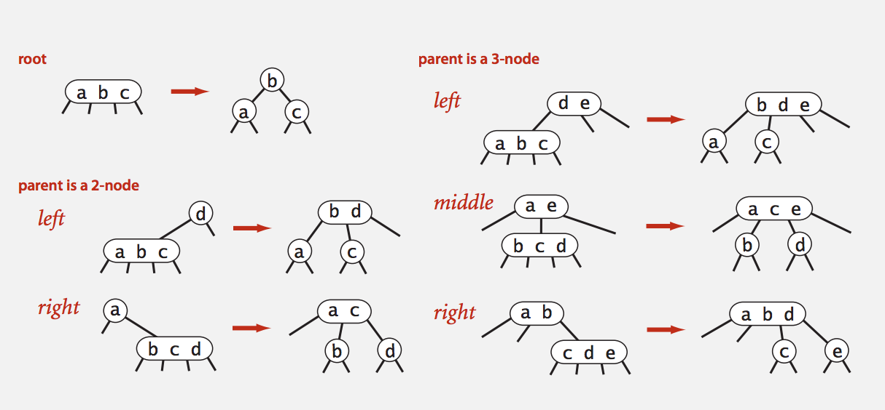
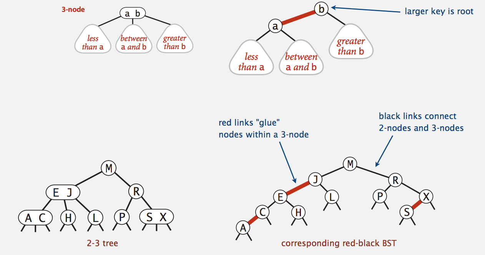
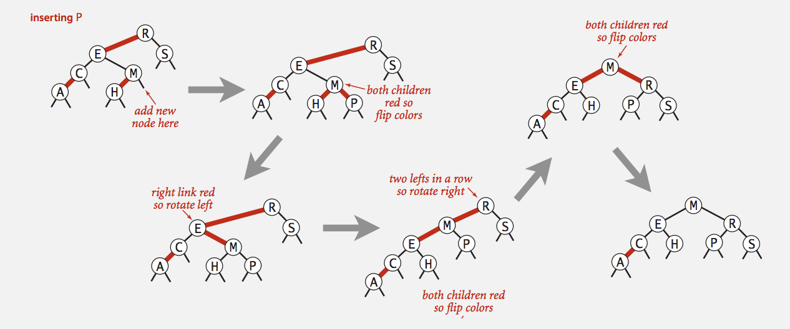
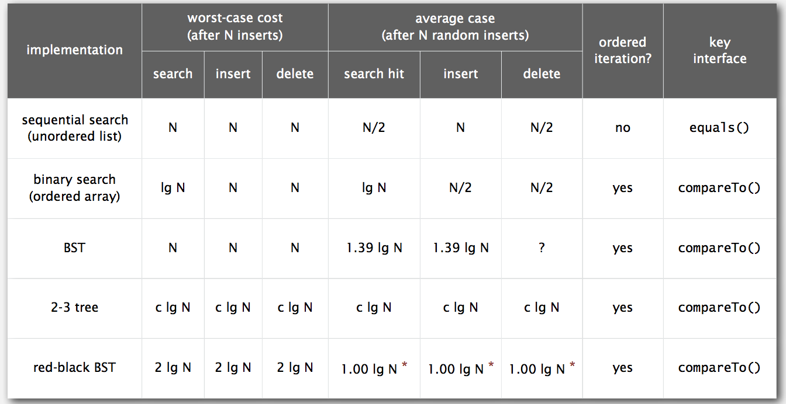
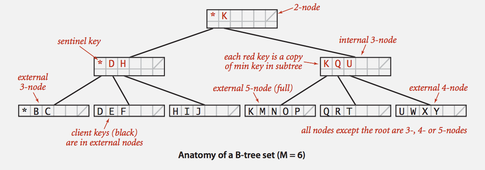

# *Balanced Search Trees (Week 5)*


## 2-3 Tree

* Allow 1 or 2 keys per node.
    * 2-node: one key, two children.
    * 3-node: two keys, three children.

* **Symmetric Order**: Inorder traversal yields keys in ascending order.
* **Perfect Balance**: Every path from root to null link has same length.





* **Search:**
    * compare search key against keys in node.
    * Find interval containing search key.
    * Follow associated link (recursively).
    
* **Insertion into a 3-node at bottom**:
    * Add new key to 3-node to create temporary 4-node.
    * Move middle key in 4-node into parent.
    * Repeat up the tree, as necessary.
    * If you reach the root and it's a 4-node, split it into three 2-nodes.

* Splitting a 4-node is a local transformation: constant number of operations.


* Invariants. Maintain symmetric order and perfect balance.
    **Pf**. Each transformation maintains symmetric order and perfect balance.


* **Perfect Balance**:
    * Every path from root to null link has same length.






* **Tree height**:
    * Worst case: lg(N) when all 2 nodes.
    * Best case: log3(N) when all 3 nodes.
    * Between 12 and 20 for a million nodes.
    * Between 18 and 30 for a billion nodes.


**Guaranteed logarithmic performance for search and insert.**


### 2-3 tree: Implementation?

* Direct implementation is complicated, because:
    * Maintaining multiple node types is cumbersome.
    * Need multiple compares to move down tree.
    * Need to move back up the tree to split 4-nodes.
    * Large number of cases for splitting.
    * there is a better way...
    

## Red-Black BST


### Left-Leaning Red-Black BSTs (LLBST)

by Guibas-Sedgewick 1979 and Sedgewick 2007


1. Represent 2-3 tree as a BST.
2. Use "internal" left-leaning links as "glue" for 3-nodes.




* A BST such that:
    * No node has two red links connected to it.
    * Every path from root to null link has the same number of black links. (Perfect Black Balance)
    * Red links lean left.

* Key Property:
    * 1-1 correspondence between 2-3 and LLRB.

* Observation: Search is the same as for elementary BST (ignore color).

```java

public Val get(Key key) {

    Node x = root;
    while (x != null) {
        int cmp = key.compareTo(x.key);
        if      (cmp < 0)   x = x.left;
        else if (cmp > 0)   x = x.right;
        else              return x.val;
    }
    return null;
}
```

* Remark: Most other ops (e.g. floor, iteration, selection) are also identical.


### Red-Black BST representation

Each node is pointed to by precisely one link (from its parent) => can encode color of links in nodes.


```java

private static final boolean RED   = true;
private static final boolean BLACK = false;

private class Node {
    Key key;
    Value val;
    Node left, right;
    boolean color;                  // color of parent link
}

private boolean isRed(Node x) {
    if (x == null) return false;    // null links are black
    return x.color == RED;
}
```


* Left Rotation: Orient a (temporarily) right-leaning red link to lean left.


```java

private Node rotateLeft(Node h) {
    assert isRed(h.right);
    Node x = h.right;
    h.right = x.left;
    x.left = h;
    x.color = h.color;
    h.color = RED;
    return x;
}
```

Invariants: Maintains symmetric order and perfect black balance.


* Right Rotation: Orient a left-leaning red link to (temporarily) lean right.


```java

private Node rotateRight(Node h) {
    assert isRed(h.left);
    Node x = h.left;
    h.left = x.right;
    x.right = h;
    x.color = h.color;
    h.color = RED;
    return x;
}
```


* Color Flip: Recolor to split a (temporary) 4-node.

```java

private void flipColors(Node h) {

    assert !isRed(h);
    assert isRed(h.left);
    assert isRed(h.right);
    h.color = RED;
    h.left.color = BLACK;
    h.right.color = BLACK;
}
```

### Insertion in a LLRB tree: Overview

* Basic Strategy: Maintain 1-1 correspondence with 2-3 trees by applying elementary red-black BST operations.

* **Warm up 1.** Insert into a tree with exactly 1 node.
* **Case 1.** Insert into a 2-node at the bottom.
    * Do standard BST insert; Color new link red.
    * If new red link is a right link, rotate left.


* **Warm up 2.** Insert into a tree with exactly 2 nodes.
* **Case 2.** Insert into a 3-node at the bottom.
    * Do standard BST insert; Color new link red.
    * Rotate to balance the 4-node (if needed).
    * Flip colors to pass red link up one level.
    * Rotate to make lean left (if needed).
    * Repeat case 1 or case 2 up the tree (if needed).





### Insertion into a LLRB tree: Java Implementation

* Same Code for all Cases.
    * Right child red, left child black: **rotate left**.
    * Left child, left-left grandchild red: **rotate right**.
    * Both children red: **flip colors**.


```java

private Node put(Node h, Key key, Value val) {

    if  (h = null) return new Node(key, val, RED);                   // insert at bottom (and color it red)
    int cmp = key.compareTo(h.key);
    if      (cmp < 0) h.left  = put(h.left, key, val);
    else if (cmp > 0) h.right = put(h.right, key, val);
    else              h.val   = val;
    
    // only a few extra lines of code provides near-perfect balance
    if (isRed(h.right) && !isRed(h.left))      h = rotateLeft(h);    // lean left
    if (isRed(h.left)  && isRed(h.left.left))  h = rotateRight(h);   // balance 4-node
    if (isRed(h.left)  && isRed(h.right))      flipColors(h);        // split 4-node
    
    return h;
}
```

* Balance in LLRB trees

* Proposition. Height of tree is <= 2lg(N) in the worst case.
* Pf.
    * Every path from root to null link has same number of black links.
    * Never two red links in-a-row.
* Property. Height of tree is ~1.00lg(N) in typical applications.


### Symbol Table Implementation Summary
 



## B-trees

* Generalize 2-3 trees by allowing up to `M-1` key-link pairs per node.
    * At least 2 key-link pairs at root.
    * At least M / 2 key-link paris in other nodes.
    * External nodes contain Client keys.
    * Internal Nodes contains copies of keys to guide search.





* Searching in a B-tree
    * Start at root.
    * Find interval for search key and take corresponding link.
    * Search terminates in external node.

* Insertion in a B-tree
    * Search for new key.
    * Insert at bottom.
    * Split nodes with M keys-link pairs on the way up the tree.

* Balance in B-tree
    * Proposition. A search or an insertion in a B-tree of order M with N keys requires between logM-1(N) and logM/2(N) probes.
    * Pf. All internal nodes (besides root) has between M/2 and M-1 links.
    * In practice. Number of probes is at most 4.   // when M = 1024; N = 62 billion
    * Optimization. Always keep root page in memory.

* Balance tree in the wild
    * Red-black trees are widely used as system symbol tables.
        * Java: java.util.TreeMap, java.util.TreeSet.
        * C++ STL: map, mutimap, mutiset.
        * Linux kernel: completely fair scheduler, linux/rbtree.h.
        * Emacs: conservative stack scanning.
    * B-tree variants. B+ tree, b* tree, b# tree, ...
    * B-trees (and variants) are widely used for file systems and databases.
        * Windows: NTFS
        * Mac: HFS, HFS+.
        * Linux: ReiserFS, XFS, Ext3FS, JFS.
        * Databases: ORACLE, DB2, INGRES, SQL, PostgreSQL.
    
    


    