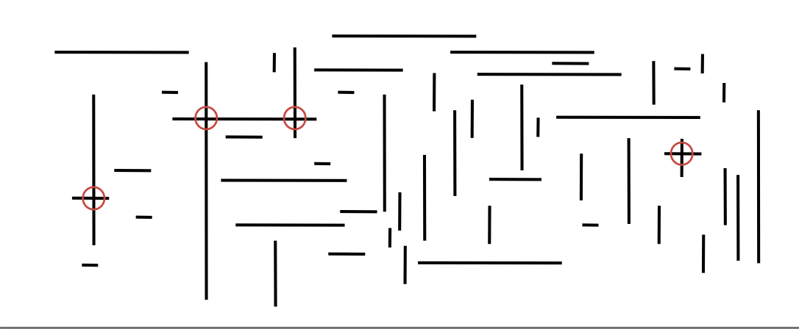

# *Geometric Applications of BST (Week 5)*


## 1D Range Search

* Extendsion of ordered symbol table.
    * Insert key-value pair.
    * Search for key k.
    * Delete key k.
    * Range Search: find all keys between `k1` and `k2`.
    * Rnage count: number of keys between `k1` and `k2`.

* Application. Database queries.


* Geometric Interpretation.
    * Keys are point on a line
    * Fiend / count points in a given 1d interval.


### 1D Range Search: Elementary Implementations.

* Unordered List: Fast Insert, Slow Range Search.
* Ordered Array: Slow Insert, Binary Search for `k1` and `k2` to do range search.


### 1D range Count: BST Implementation

* How many keys between `lo` and `hi`?


```java

public int size(Key lo, Key hi) {
    if (contains(hi))   return rank(hi) - rank(lo) + 1;
    else                return rank(hi0 - rank(lo);         // number of keys < hi
}
```

* Proposition. Running time proportional to log(N).
    Pf. Nodes examined = search path to `lo` + search path to `hi`.


* Find all keys between `lo` and `hi`.
    * Recursively find all keys in left subtree (if any could fall in range).
    * Check key in current node.
    * Recursively find all keys in right subtree (if any could fall in range).

* Proposition. Running time proportional to R + log(N).
    Pf. Nodes examined = search path to `lo` + search path to `hi` + matches.


## Line Segment Intersection

### Orthogonal Line Segment Intersection

Given `N` horizontal and vertical line segments, find all intersections.



* Quadratic Algorithm: Check all pairs of line segments for intersection.
* Nondegeneracy assumption: All x- and y-coordinates are distinct.


### Orthogonal line segment intersection: Sweep-Line Algorithm

* Sweep Vertical Line from Left to Right.
    * x-coordinates define events.
    * h-segment (left endpoint): insert y-coordinate into BST.
    * h-segment (right endpoint): remove y-coordinate from BST.
    * v-segment: range search for interval of y-endpoints.

* Sweep Line analysis
    * Proposition. The Sweep-Line Algorithm takes time proportional to Nlog(N) + R to find all R intersections among N orthogonal line segments.
    * Pf.

```shell

        Put x-coordinates on PQ (or sort).    // N log(N)
        Insert y-coordinates into BST.        // N log(N)
        Delete y-coordinates from BST.        // N log(N)
        Range searches in BST.                // N log(N) + R
```
    * Bottom Line. Sweep Line reduces 2d orthogonal line segment intersection search to 1d range search.


## Kd-Trees


### 2-d orthogonal range search

* Extension of ordered symbol-table to 2d keys.
    * Insert a 2d key.
    * Delete a 2d key.
    * Search for a 2d key.
    * Range Search: find all keys that lie in a 2d range.
    * Range Count: number of keys that lie in lie in a 2d range.

* Application. Networking, circuit design, databases, ...


* Geometric interpretation.
    * Keys are point in the plane.
    * Find / count points in a given h-v rectangle. (rectangle is axis-aligned)

* **Grid Implementation**
    * Divide space into M-by-M grid of squares.
    * Create list of points contained in each square.
    * Use 2d array to directly index relevant square.
    * Insert: add (x, y) to list for corresponding square.
    * Range Search: examine only squares that intersect 2d range query.

* Space-Time Trade off
    * Space: M^2 + N
    * Time: 1 + N / M^2 per square examined, on average.

* Choose grid square size to tune performance.
    * Too small: wastes space.
    * Too large: too many points per square.
    * Rule of thumb: sqroot(N) by sqroot(N) grid.

* Running time (in case points are evenly distributed)
    * Initialize data structure: N
    * Insert point: 1
    * Range Search: 1 per point in range
    

### Clustering

* Grid Implementation. Fast, simple solution for evenly-distributed points.


* Problem. Clustering a well-known phenomenon in geometric data.
    * Lists are too long, even though average length is short.
    * Need data structure that adapts gracefully to data.

* E.g. USA Map data - skewed


### Space-Partitioning trees

Uses a tree to represent a recursive subdivision of 2d space.

* Grid: Divide space uniformly into squares.
* 2d tree: Recursively divide space into two half planes.
* Quadtree: Recursively divide space into four half planes.
* BSP tree: Recursively divide space into two regions.


### 2d tree implementation

* Data Structure: BST, but alternate using x- and y-coordinates as key.
    * Search gives rectangle containing point.
    * Insert further subdivides the plane.


* Range Search in a 2d tree
    * Goal: Find all points in a query axis-aligned rectangle.
        * Check if point in node lies in given rectangle.
        * Recursively search left / bottom (if any could fall in rectangle).
        * Recursively search right / top (if any could fall in rectangle).
    * Analysis:
        * Typical case. R + log(N)
        * Worse Case (assuming tree is balanced). R + sqroot(N).

* Nearest Neighbor Search in a 2d tree
    * Goal: Find closest point to query point.
        * Check distance from point in node to query point.
        * Recursively search left / bottom (if it could contain a closer point).
        * Recursively search right / top (if it could contain a closer point).
        * Organize method so that it begins by searching for query point.
    * Analysis:
        * Typical case. log(N)
        * Worst Case (even if tree is balanced). N.


### Kd Tree

* Kd tree: Recursively partition k-dimensional space into 2 half spaces.
* Implementation: BST, but cycle through dimensions ala 2d trees.
* Efficient, Simple Data Structure for processing k-dimensional data.
    * Widely used
    * Adapts well to high-dimensional and clustered data.
    


## Interval Search Tree

### 1d interval search

* Data Structure to hold set of (overlapping) intervals.
    * Insert an interval `(lo, hi)`.
    * Search for an interval `(lo, hi)`.
    * Delete an interval `(lo, hi)`.
    * Interval Intersection query: given an interval `(lo, hi)`, find all intervals (or one interval) in data structure that intersects `(lo, hi)`.


### **1d Interval Search API**

```java

public class IntervalST<Key extends Comparable<Key>, Value> {
                    IntervalST()                                    // create interval search tree
               void put(Key lo, Key hi, Value val)                  // put interval-value pair into ST
              Value get(Key lo, Key hi)                             // value paired with given interval
               void delete(Key lo, Key hi)                          // delete the given interval
    Iterable<Value> intersects(Key lo, Key hi)                      // all intervals that intersects the given interval
}
```

* **Nondegeneracy Assumption**: No two intervals have the same left endpoint.


* Create BST, where each node stores an interval `(lo, hi)`.
    * Use left endpoint as BST key.
    * Store max endpoint in subtree rooted at node.


* To insert an interval `(lo, hi)`:
    * Insert into BST, using `lo` as the key.
    * Update max in each node on search path.


* To search for any one interval that intersects query interval `(lo, hi)`:
    * If interval in node intersects query interval, return it.
    * Else if left subtree is null, go right.
    * Else if max endpoint in left subtree is less than `lo`, go right.
    * Else go left.


### Search for an intersecting interval implementation

* To search for any one interval that intersects query interval `(lo, hi)`:
    * If interval in node intersects query interval, return it.
    * Else if left subtree is null, go right.
    * Else if max endpoint in left subtree is less than `lo`, go right.
    * Else go left.


```java

Node x = root;
while (x != null) {
    if      (x.interval.intersects(lo, hi)) return x.interval;
    else if (x.left == null)                x = x.right;
    else if (x.left.max < lo)               x = x.right;
    else                                    x = x.left;
}
return null;
```

* Case 1: If search goes right, then no intersection in left.
* Pf. Suppose search goes right and left subtree is non empty.
    * Max endpoint `max` in left subtree is less than `lo`.
    * For any interval `(a, b)` in left subtree of `x`, we have `b` <= `max` < `lo`.

* Case 2: If search goes left, then there is either an intersection in left subtree or no intersections in either.
* Pf. Suppose no intersection in left.
     * Since went left, we have `lo` <= `max`.
     * Then for any interval `(a, b)` in right subtree of `x`, `hi` < `c` <= `a` -> no intersection in right.
 
* Implementation: Use a red-black BST to guarantee performance. (easy to maintain auxiliary information using log(N) extra work per op)


## Rectangle intersection

### Orthogonal Rectangle Intersection

* Goal: Find all intersections among a set of `N` orthogonal rectangles.
* Quadratic Algorithm: Check all pairs of rectangles for intersection.
* Non-degeneracy Assumption: All x- and y-coordinates are distinct.


### Sweep Line Algorithm


* Sweep Vertical Line from Left to Right
    * x-coordinates of left and right endpoints define events.
    * Maintain set of rectangles that intersect the sweep line in an interval search tree (using y-interval of rectangle).
    * Left endpoint: interval search for y-interval of rectangle; insert y-interval.
    * Right endpoint: remove y-interval.

* Analysis
    * Proposition: Sweep line algorithm takes time proportional to Nlog(N) + Rlog(N) to find `R` intersections among a set of `N` Rectangles.
    * Pf.


```shell

        Put x-coordinates on a PQ ( or sort).     // N log(N)
        Insert y-intervals into ST.               // N log(N)
        Delete y-intervals from ST.               // N log(N)
        Interval Searches for y-intervals.        // N log(N) + R log(N)
```

* Bottom Line: Sweep line reduces 2d orthogonal rectangle intersection search to 1d interval search.

### Geometric Application of BSTs


