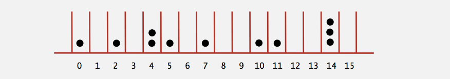
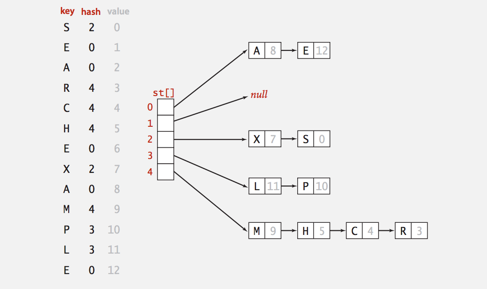
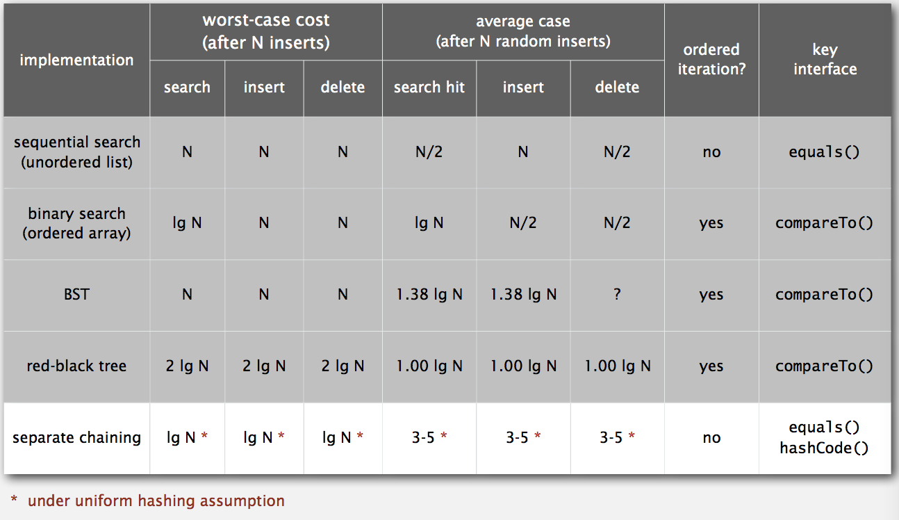
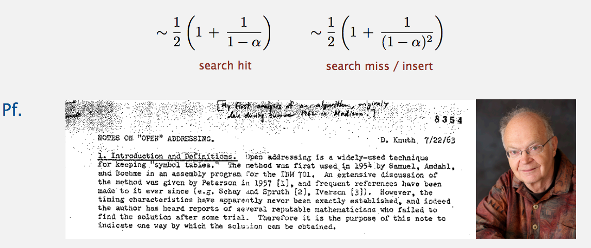
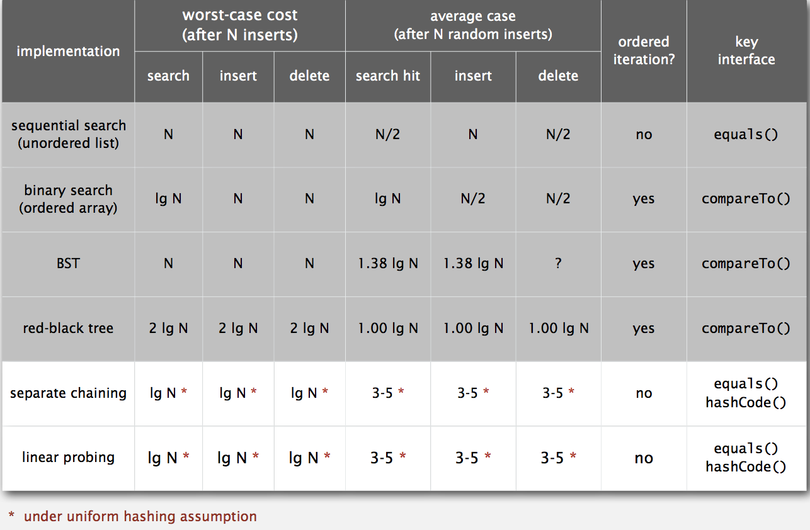
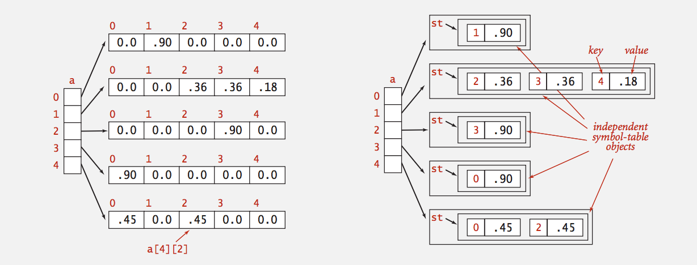

# *Hash Tables (Week 6)*


## Hash Functions

### Hashing: Basic Plan

Save item in a *key-indexed* table (where index is a function of the key).

* Hash Function: Method for computing array index from key.

* Issues:
    * Computing the hash function.
    * Equality Test: Method for checking whether two keys are equal.
    * Collision Resolution: Algorithm and Data Structure to handle two keys that hash to the same array index.

* Classic Space-Time Trade Off:
    * No space limitation: Trivial Hash Function with key as index.
    * No time limitation: Trivial collision resolution with sequential search.
    * Space and Time limitation: hashing (the real world).


### Computing the Hash Function

* Idealistic Goal: Scramble the keys uniformly to produce a table index.
    * Efficiency computable.
    * Each table index equally likely for each key.
    
* Ex 1. Phone Numbers
    * Bad: first three digits.
    * Better: Last three digits.

* Ex 2. Social Security Numbers
    * Bad: first three digits.
    * Better: last three digits.

* Practical Challenge: Need different approach for each key type.


### Java's Hash Code Conventions

All Java Classes inherit a method `hashCode()`, which returns a 32-bit int.

* Requirement: if `x.equals(y)`, then `(x.hashCode() == y.hashCode())`.
* Highly Desirable: if `!x.equals(y)`, then `(x.hashCodE() != y.hashCode())`.
* Default Implementation: Memory Address of `x`.
* Legal (but poor) implementation: Always return 17.
* Customized implementations: `Integer`, `Double`, `String`, `File`, `URL`, `Date`, ...
* User-defined types: Users are one their own.


**Java Library Implementations**

```java

public final class Integer {
    private final int value;
    ...
    
    public int hashCode() {
        return value;
    }
}

public final class Double {
    private final double value;
    ...
    
    public int hashCode() {
        long bits = doubleToLongBits(value);
        return (int) (bits ^ (bits >>> 32));    // convert to IEEE 64-bit representation.
    }
}

public final class Boolean {
    private final boolean value;
    ...
    
    public int hashCode() {
        if (value) return 1231;
        else       return 1237;
    }
}
```

### Implementing Hash Code: Strings

```java

public final class String {

    private final char[] s;
    ...
    
    public int hashCode() {
        int hash = 0;
        for (int i = 0; i < length(); i++)
            hash = s[i] + (31 * hash);          // Horner's method
        return hash;   // ith character of s
    }
}
```

* Horner's method to hash string of length L: L multiplies / adds.
* Equivalent to `h = s[0] * 31^(L-1) + ... + s[L-2] * 31^1 + s[L-1] * 31^0`.


* Performance Optimization
    * Cache the hash value in an instance variable.
    * Return cached value.
     
```java

public final class String {
    private int hash = 0;                       // cache of hash code
    private final char[] s;
    ...
    
    public int hashCode() {
        int h = hash;                           // return cached value
        if (h != 0) return h;
        for (int i = 0; i < length(); i++)
            h = s[i] + (31 * h);
        hash = h;                               // store cache of hash code
        return h;
    }
}
```

### Implementing Hash Code: User-Defined Types

```java

public final class Transaction implements Comparable<Transaction> {
    private final String who;
    private final Date   when;
    private final double amount;

    public Transaction(String who, Date when, double amount) {
        /* as before */
    }
    ...
    
    public boolean equals(Object y) {
        /* as before */
    }
    
    public int hashCode() {
        int hash = 17;
        hash = 31*hash + who.hashCode();                // for reference types, use hashCode()
        hash = 31*hash + when.hashCode();               // for primitive types, use hashCode() of wrapper type
        hash = 31*hash + ((Double) amount).hashCode();
        return hash;
    }
}
```

### Hash Code Design

* *Standard* recipe for user-defined types.
    * Combine each significant field using the 31*x + y rule.
    * If field is a primitive type, use wrapper type `hashCode()`.
    * If field is null, return 0.
    * If field is a reference type, use `hashCode()`.       // applies rule recursively.
    * If field is an array, apply to each entry.            // or use Arrays.deepHashCode()
    
* In Practice: Recipe works reasonably well; used in Java libraries.
* In theory: Keys are bitstring; "universal" hash functions exist.

* Basic Rule: Need to user the whole key to compute hash code. Consult an expert for state-of-art hash codes.


### Modular Hashing

* Hash Code: An `int` between -2^31 and 2^31 - 1.
* Hash Function: An `int` between 0 and `M - 1` (for use as array index).   // typically a prime or power of 2

```java

// bug
private int hash(Key key) {
    return key.hashCode() % M;
}

// 1-in-a-billion bug
private int hash(Key key) {
    return Math.abs(key.hashCode()) % M;
}

// Correct
private int hash(Key key) {
    return (key.hashCode() & 0x7fffffff) % M;
}
```

### Uniform Hashing Assumption

* Uniform Hashing Assumption: Each eky is equally likely to hash to an integer between 0 and M-1.
* Bins and Balls: Throw balls uniformly at random into M bins.



* Birthday problem: Experect two balls in the same bin after `~ sqrt(pi * M / 2)` tosses.
* Coupon collector: Expect every bin has >= 1 ball after `~ Mln(M)` tosses.
* Load Balancing: After M tosses, expect most loaded bin has `theta(log(M) / log(log(M)))` balls.


## Separate Chaining

### Collisions

* Collision: Two distinct keys hashing to same index.
    * Birthday problem: Can't avoid collision unless you have a rediculous (quadratic) amount of memory.
    * Coupon collector + load balancing: Collisions are evenly distributed.

* Challenge: Deal with collisions efficiently.


### Separate Chaining Symbol Table

* Use an array of M < N linked lists:
    * Hash: map key to integer i between 0 and M-1.
    * Insert: put at front of ith chain (if not already there).
    * Search: need to search only ith chain.




### Java Implementation

```java

public class SeparateChainingHashST<Key, Value> {
    private int M = 97;                 // number of chains
    private Node[] st = new Node[M];    // array of chains

    private static class Node {
        private Object key;
        private Object val;
        private Node next;
        ...
    }
    
    private int hash(Key key) {
        return (key.hashCode() & 0x7fffffff) % M;
    }
    
    public void put(Key key, Value val) {
        int i = hash(key);
        for (Node x = st[i]; x != null; x = x.next) {
            if (key.equals(x.key)) {
                x.val = val;
                return;
            }
        }
        st[i] = new Node(key, val, st[i]);
    }
}
```

### Analysis of Separate Chaining

* Proposition: Under uniform hashing assumption, prob. that the number of keys in a list is within a constant factor N / M is extremely clsoe to 1.
* Pf sketch: Distribution of list size obeys a binomial distribution.
* Consequence: Number of probes for search / insert is proportional to N / M.  (M times faster than sequential search)
    * M too large: too many empty chains.
    * M too small: chains too long.
    * Typical Choice: M ~ N / 5 -> constant-time ops.




## Linear Probing

### Collision Resolution: Open Addressing

* Open Addressing: When a new key collides, find next empty slot, and put it there.

### Linear Probing Hash Table Summary

* Hash: Map key to integer i between 0 and M-1.
* Insert: Put at table index i if free. If not, try i+1, i+2, ...
* Search: Search table index i. If occupied but no match, try i+1, i+2, ...

Note: Array size M *must be* greater than number of key-value pair N.


### Linear Probing ST Implementation

```java

public class LinearProbingHashST<Key, Value> {
    private int M = 30001;
    private Value[] vals = (Value[]) new Object[M];     // array doubling and halving code omitted
    private Key[]   keys = (Key[])   new Object[M];
    
    private int hash(Key key) {
        /* as before */
    }
    
    public void put(Key key, Value val) {
        int i;
        for (i = hash(key); keys[i] != null; i = (i+1) % M)
            if (keys[i].equals(key))
                break;
        keys[i] = key;
        vals[i] = val;
    }
    
    public Value get(Key key) {
        for (int in = hash(key); keys[i] != null; i = (i+1) % M)
            if (key.equals(keys[i]))
                return vals[i];
        return null;
    }
}
```

### Clustering

* Cluster: A contiguous block of items.
* Observation: New keys likely to hash into middle of big clusters.


### Knuth's parking problem

* Model: Cars arrive at one-way street with M parking spaces. Each desires a random space i: if space i is taken, try i+1, i+2, etc.

* Q: What is mean displacement of a car?

* Half-full: With M / 2 cars, mean displacement is `~ 3/2`.
* Full: With M cars, mean displacement is `~ sqrt(pi * M / 8)`.


### Analysis of Linear Probing

* Proposition: Under uniform hashing assumption, the average # of probes in a linear probing hash table of size M that contains N = a * M keys is:



* Parameters:
    * M too large: too many empty array entries.
    * M too small: search time blows up.
    * Typical choice: a = N / M ~ 1/2.



## Context

### Separate Chaining vs. Linear Probing

* Separate Chaining
    * Easier to implement delete.
    * Performance degrades gracefully.
    * Clustering less sensitive to poorly-designed hash function.

* Linear Probing
    * Less wasted space.
    * Better Cache Performance.


### Hashing: Variations on the theme

Many improved versions have been studied.

* Two-probe hashing (separate-chaining variant)
    * Hash to two positions, insert key in shorter tf the two chains.
    * Reduces expected length of the longest chain to log(log(N)).

* Double Hashing (linear-probing variant)
    * Use linear probing, but skip a variable amount, not just 1 each time.
    * Effectively eliminates clustering.
    * Can allow table to become nearly full.
    * More difficult to implement delete.

* Cuckoo hashing (linear-probing variant)
    * Hash key to two positions. Insert key into either position. If occupied, reinsert displaced key into its alternative position.
    * Constant worst case time for search.


### Hash Tables vs. Balance Search Trees.

* Hash Tables
    * Simpler to code.
    * No effective alternative for unordered keys.
    * Faster for simple keys (a few arithmetic ops versus log(N) compares).
    * Better system support in Java for strings (e.g., cached hash code).

* Balanced Search Trees
    * Strong performance guarantee.
    * Support for ordered ST operations.
    * Easier to implement `compareTo()` correctly than `equals()` and `hashCode()`.

* Java system includes both
    * Red-black BSTs: java.util.TreeMap, java.util.TreeSet.
    * Hash tables: java.util.HashMap, java.util.IdentityHashMap.


## Symbol Table Applications

### Set API

Mathematical Set: A collection of distinct Keys.

```java

public class SET<Key extends Comparable<Key>> {
                SET()               // create an empty set
           void add(Key key)        // add the key to the set
        boolean contains(Key key)   // is the key in the set?
           void remove(Key key)     // remove the key from the set
            int size()              // return the number of keys in the set
  Iterator<Key> iterator()          // iterator through keys in the set
}
```

### Exception Filter: Java Implementation

* Read in a list of words from one file.
* Print out all words from standard input that are in the list.

```java

public class WhiteList {
    public static void main(String[] args) {
        SET<String> set = new SET<String>();    // create empty set of strings
        
        In in = new In(args[0]);                // read in whitelist
        while (!in.isEmpty())
            set.add(in.readString());
            
        while (!StdIn.isEmpty()) {
            String word = StdIn.readString(); 
            if (set.contains(word))              // print words in list
                StdOut.println(word);
        }
    }
}

* Read in a list of words from one file.
* Print out all words from standard input that are NOT in the list.

public class BlackList {
    public static void main(String[] args) {
        SET<String> set = new SET<String>();    // create empty set of strings
        
        In in = new In(args[0]);                // read in whitelist
        while (!in.isEmpty())
            set.add(in.readString());
            
        while (!StdIn.isEmpty()) {
            String word = StdIn.readString(); 
            if (!set.contains(word))            // print words not in list
                StdOut.println(word);
        }
    }
}
```

### Dictionary Look Up: Java Implementation

```java

public class LookupCSV {
    public static void main(String[] args) {
        In in = new In(args[0]);
        int keyField = Integer.parseInt(args[1]);           // process input file
        int valField = Integer.parseInt(args[2]);
        
        ST<String, String> st = new ST<String, String>();   // build symbol table
        while (!in.isEmpty()) {
            String line = in.readLine();
            String[] tokens = line.split(",");
            String key = token[keyField];
            String val = tokens[valField];
        }
        
        while (!StdIn.isEmpty()) {
            String s = StdIn.readString();                  // process lookups with standard I/O
            if (!st.contains(s)) StdOut.println("Not Found");
            else                 StdOut.println(st.get(s));
        }
    }
}
```


### File Indexing

``` java

import java.io.File;

public class FileIndex {
    public static void main(String[] args) {
        ST<String, SET<File>> st = new ST<String, SET<File>>();     // symbol table
        
        for (String filename: args) {                               // list of file names from command line
            File file = new File(filename);
            In in = new In(file);
            while (!in.isEmpty()) {
                String key = in.readString();                       // for each word in file, add file to corresponding set.
                if (!st.contains(key))
                    st.put(key, new SET<File>());
                SET<File> set = st.get(key);
                set.add(file);
            }
        }
        
        while (!StdIn.isEmpty()) {
            String query = StdIn.readString();                      // process queries
            StdOut.println(st.get(query));
        }
    }
}
```

### Concordance

```java

public class Concordance {
    public static void main(String[] args) {
        In in = new In(args[0]);
        String[] words = in.readAllStrings();
        ST<String, SET<Integer>> st = new ST<String, SET<Integer>>();
        for (int i = 0; i < words.length; i++) {    // read text and build index
            String s = words[i];
            if (!st.contains(s))
                st.put(s, new SET<Integer>());
            SET<Integer> set = st.get(s);
            set.add(i);
        }
        
        while (!StdIn.isEmpty()) {                  // process queries and print concordances
            String query = StdIn.readString();
            Set<Integer> set = st.get(query);
            for (int k : set)
                // print words[k-4] to words[k+4]
        }
    }
}
```


### Sparse Vector

* Symbol table representation
    * Key = index, value = entry
    * Efficient iterator
    * Space proportional to number of nonzeros.


**Sparse Vector Data Type**

```java

public class SparseVector {
    private HashST<Integer, Double> v;          // HastST because order not important
    
    public SparseVector() {                     // empty ST represents all 0s vector
        v = new HashST<Integer, Double>();
    }
    
    public void put(int i, double x) {          // a[i] = value
        v.put(i, x);
    }
    
    public double get(int i) {                  // return a[i]
        if (!v.contains(i)) return 0.0;
        else                return v.get(i);
    }
    
    public Iterable<Integer> indices() {
        return v.keys();
    }
    
    public double dot(double[] that) {          // dot product is constant time for sparse vectors
        double sum = 0.0;
        for (int i : indices())
            sum += that[i] * this.get(i);
        return sum;
    }
}
```

* 2D Array (Standard) matrix representation: Each row of matrix is an array.
    * Constant time access to elements.
    * Space proportional to N^2.
    
* Sparse Matrix Representation: Each row of matrix is a sparse vector.
    * Efficient access to elements.
    * Space proportional to number of nonzeros (plus N).


