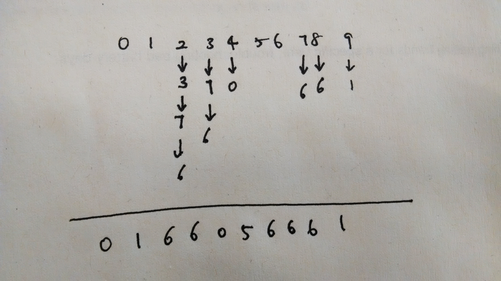
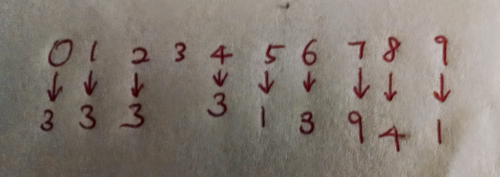

# Union Find

To specify an array or sequence of values in an answer, separate the values in
the sequence by whitespace. For example, if the question asks for the first
ten powers of two (starting at 1), then the following answer is acceptable:

    1 2 4 8 16 32 64 128 256 512

If you wish to discuss a particular question and answer in the forums, please post
the entire question and answer, including the seed (which can be used by the course
staff to uniquely identify the question) and the explanation (which contains the
correct answer).

## Question 1

Give the `id[]` array that results from the following sequence of 6 union
operations on a set of 10 items using the quick-find algorithm.

    2-3 3-7 3-6 9-1 4-0 8-7 

Recall: our quick-find convention for the union operation p-q is to change `id[p]`
(and perhaps some other entries) but not `id[q]`.

### Answer

    0 1 6 6 0 5 6 6 6 1
 
Check out the question1.java

* by hand

## Question 2

Give the `id[]` array that results from the following sequence of 9 union
operations on a set of 10 items using the weighted quick-union algorithm from lecture.

    4-8 3-6 9-7 1-5 3-0 5-9 4-3 3-5 3-2 

Recall: when joining two trees of equal size, our weighted quick union convention is to
make the root of the second tree point to the root of the first tree. Also, our weighted
quick union algorithm uses union by size (number of nodes), not union by height.

### Answer

    3 3 3 3 3 1 3 9 4 1

Check out the question2.java

* by hand

## Question 3

Which of the following `id[]` array(s) could be the result of running the weighted quick union
algorithm on a set of 10 items? Check all that apply.

* 5 5 5 5 5 8 1 1 7 5
* 2 2 2 1 1 1 8 2 1 1
* 0 0 9 9 0 0 9 0 6 0 
* 5 9 2 3 4 5 6 9 8 9 
* 0 7 0 2 2 4 2 6 8 2 

### Answer

    0 0 9 9 0 0 9 0 6 0 
    5 9 2 3 4 5 6 9 8 9 

Weighted Quick Union determines which one to be child of the other based on the size of nodes.
Check out the largest nodes and see if that makes sense to you. Can a larger node be a child of a smaller node?
(Prove by Contradiction)

