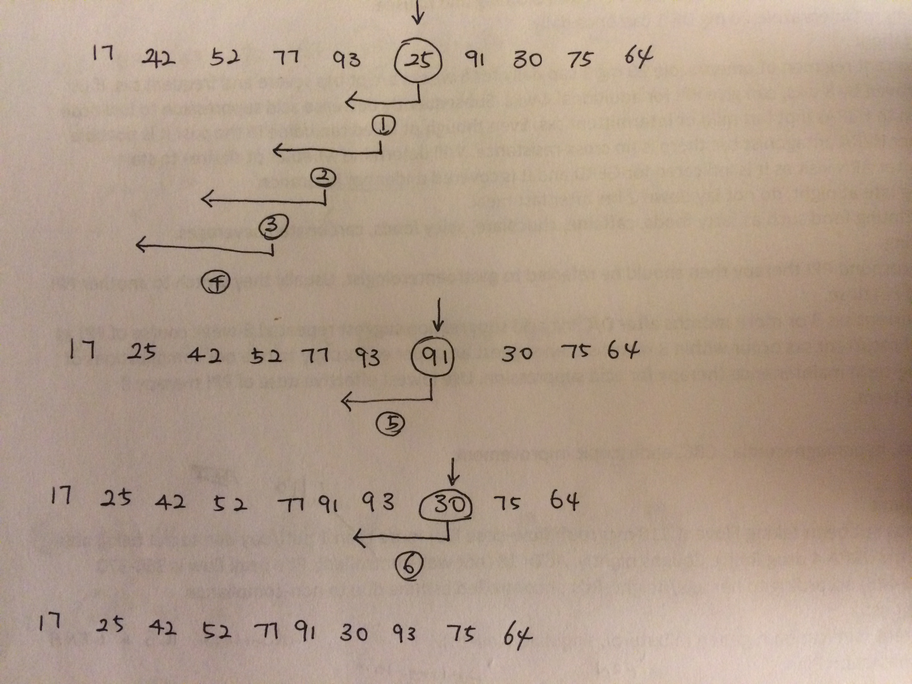
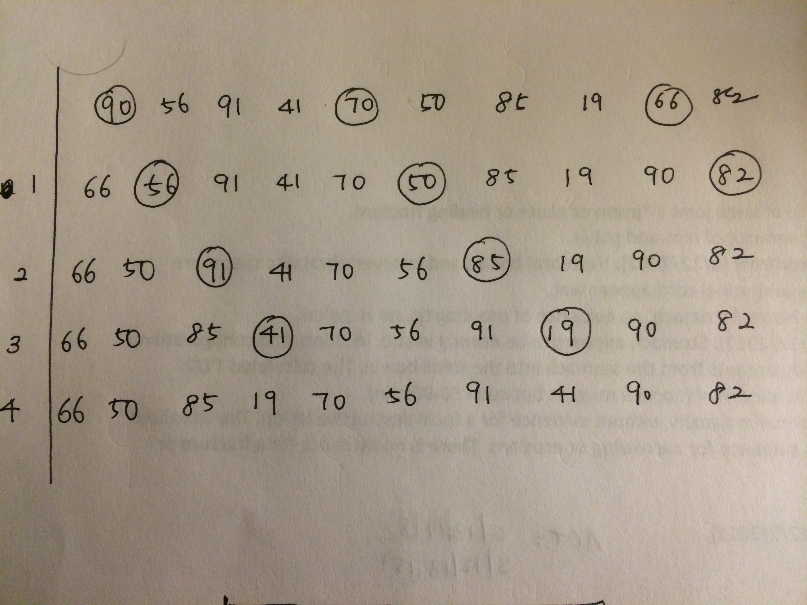

# Elementary Sorts

To specify an array or sequence of values in an answer, separate the values in
the sequence by whitespace. For example, if the question asks for the first
ten powers of two (starting at 1), then the following answer is acceptable:

     1 2 4 8 16 32 64 128 256 512

If you wish to discuss a particular question and answer in the forums, please
post the entire question and answer, including the seed (which can be used by
the course staff to uniquely identify the question) and the explanation (which
contains the correct answer).

## Question 1

Give the array that results after the first 6 exchanges (not iterations!)
when insertion sorting the following array:

    17 42 52 77 93 25 91 30 75 64 
    
    
### Answer

    17 25 42 52 77 91 30 93 75 64

Approach:

## Question 2

Give the array that results immediately after the 4-sorting phase
(not necessarily after 4 exchanges) of Shellsort using Knuth's 3x+1 increments
(...-121-40-13-4-1) on the following array:

    90 56 91 41 70 50 85 19 66 82 

### Answer

    66 50 85 19 70 56 91 41 90 82

Approach:

## Question 3

Which of the following statements about elementary sorting algorithms are true? Check all that apply. 
Unless otherwise specified, assume that the sorting implementations are the ones from the lectures.

1. If two items a and b have equal keys and a appears before b in the input array, 
    then a appears before b in the array after selection sorting the array. 
2. Just after the 4-sorting pass in Shellsort (with Knuth's 3x+1 increments), the array is 4-sorted, 5-sorted, and 6-sorted.
3. An embedded systems programmer might prefer Shellsort to quicksort because it is easy to code and does not use recursion.
4. The number of compares to insertion sort an array of N/2 0s followed by N/2 1s (e.g., 0 0 0 0 0 1 1 1 1 1) is ~ N.
5. The number of compares to insertion sort an array of N/2 1s followed by N/2 0s (e.g., 1 1 1 1 1 0 0 0 0 0) is ~ 1/2 N^2.

### Answer

    1, 3, 4, 5

