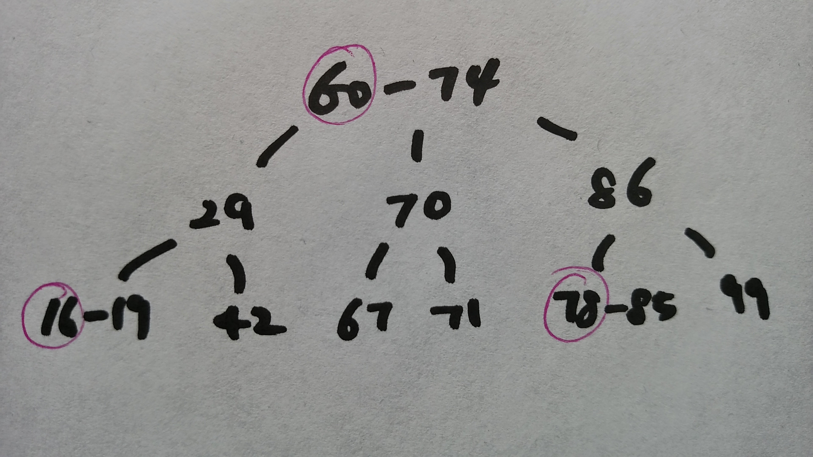
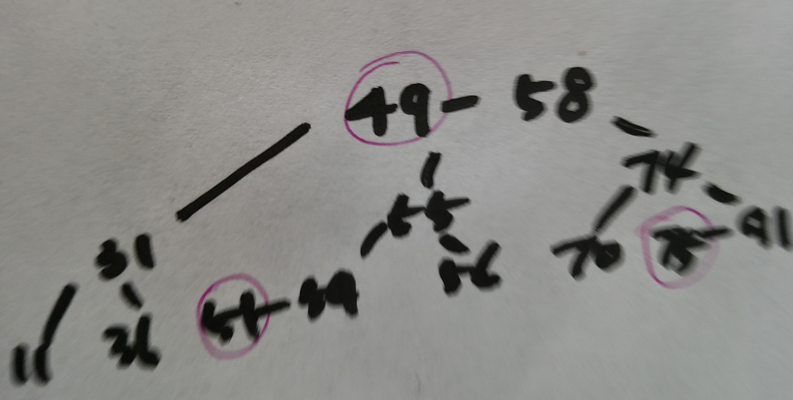

# Balanced Search Trees

To specify an array or sequence of values in an answer, separate the values in
the sequence by whitespace. For example, if the question asks for the first
ten powers of two (starting at 1), then the following answer is acceptable:

     1 2 4 8 16 32 64 128 256 512

If you wish to discuss a particular question and answer in the forums, please
post the entire question and answer, including the seed (which can be used by
the course staff to uniquely identify the question) and the explanation (which
contains the correct answer).

# Question 1

Consider the left-leaning red-black BST whose level-order traversal is:

    74 60 86 29 70 85 99 19 42 67 71 78 16 

List (in ascending order) the keys in the red nodes. A node is red if the link
from its parent is red.

## Answer

    16, 60, 78 

# Question 2

Consider the left-leaning red-black BST whose level-order traversal is

    49 31 74 11 36 55 91 51 70 75          ( red links = 55 75 )

What is the level-order traversal of the red-black BST that results after
inserting the following sequence of keys:

    56 54 58 

## Answer

    58 49 74 31 55 70 91 11 36 54 56 75 51

Here is the level-order traversal of the red-black BST after each insertion: 

        49 31 74 11 36 55 91 51 70 75          ( red links = 55 75 )
    56: 49 31 74 11 36 55 91 51 70 75 56       ( red links = 55 56 75 )
    54: 49 31 74 11 36 55 91 54 70 75 51 56    ( red links = 51 55 56 75 )
    58: 58 49 74 31 55 70 91 11 36 54 56 75 51 ( red links = 49 51 75 )

# Question 3

Which of the following statements about balanced search trees are true? Check all that apply. 
Unless otherwise specified, assume that the 2-3 tree and red-black BSTs are as described in lecture 
(e.g., 2-3 trees are perfectly balanced and red-black BST are left-leaning red-black BSTs with internal links colored either red or black).

1. In the worst case, the number of rotation operations (left or right) triggered by inserting a key into a red-black BST on N nodes is ~ lg N.
2. Given a red-black BST, it is possible to change the colors of some of the links and produce a different red-black BST.
3. The order of growth of the maximum number of nodes in a red-black BST of black height h is 2^h.
4. Inserting a key into a 2-3 tree can make its height strictly decrease.
5. The black height (number of black links on any path from the root to a null link) of a red-black BST equals the height of the corresponding 2-3 tree.

## Answer

    5