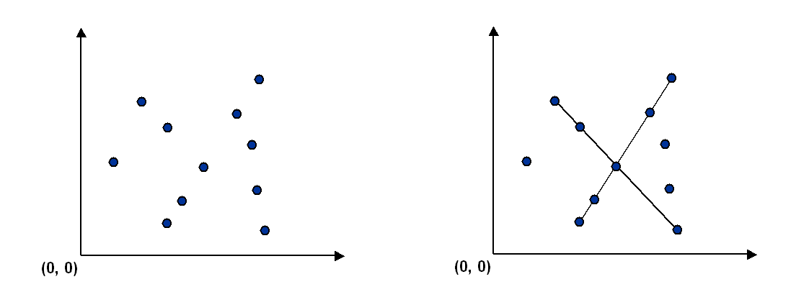
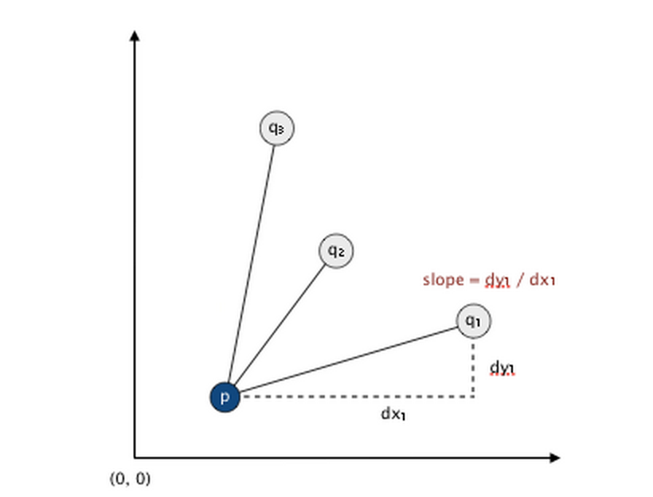

# [Programming Assignment 3: Pattern_Recognition](http://coursera.cs.princeton.edu/algs4/assignments/collinear.html)

Write a program to recognize line patterns in a given set of points. Computer vision involves analyzing patterns in visual images and reconstructing the real-world objects that produced them. The process in often broken up into two phases: feature detection and pattern recognition. Feature detection involves selecting important features of the image; pattern recognition involves discovering patterns in the features. We will investigate a particularly clean pattern recognition problem involving points and line segments. This kind of pattern recognition arises in many other applications such as statistical data analysis.


## The problem. 

Given a set of N distinct points in the plane, draw every (maximal) line segment that connects a subset of 4 or more of the points.




## Point data type. 

Create an immutable data type Point that represents a point in the plane by implementing the following API:


```java

public class Point implements Comparable<Point> {
   public final Comparator<Point> SLOPE_ORDER;        // compare points by slope to this point

   public Point(int x, int y)                         // construct the point (x, y)

   public   void draw()                               // draw this point
   public   void drawTo(Point that)                   // draw the line segment from this point to that point
   public String toString()                           // string representation

   public    int compareTo(Point that)                // is this point lexicographically smaller than that point?
   public double slopeTo(Point that)                  // the slope between this point and that point
}
```

To get started, use the data type Point.java, which implements the constructor and the draw(), drawTo(), and toString() methods. Your job is to add the following components.

* The compareTo() method should compare points by their y-coordinates, breaking ties by their x-coordinates. Formally, the invoking point (x0, y0) is less than the argument point (x1, y1) if and only if either y0 < y1 or if y0 = y1 and x0 < x1.

* The slopeTo() method should return the slope between the invoking point (x0, y0) and the argument point (x1, y1), which is given by the formula (y1 − y0) / (x1 − x0). Treat the slope of a horizontal line segment as positive zero; treat the slope of a vertical line segment as positive infinity; treat the slope of a degenerate line segment (between a point and itself) as negative infinity.

* The SLOPE_ORDER comparator should compare points by the slopes they make with the invoking point (x0, y0). Formally, the point (x1, y1) is less than the point (x2, y2) if and only if the slope (y1 − y0) / (x1 − x0) is less than the slope (y2 − y0) / (x2 − x0). Treat horizontal, vertical, and degenerate line segments as in the slopeTo() method.

## Brute force. 

Write a program Brute.java that examines 4 points at a time and checks whether they all lie on the same line segment, printing out any such line segments to standard output and drawing them using standard drawing. To check whether the 4 points p, q, r, and s are collinear, check whether the slopes between p and q, between p and r, and between p and s are all equal.

The order of growth of the running time of your program should be N4 in the worst case and it should use space proportional to N.

## A faster, sorting-based solution. 

Remarkably, it is possible to solve the problem much faster than the brute-force solution described above. Given a point p, the following method determines whether p participates in a set of 4 or more collinear points.

* Think of p as the origin.
* For each other point q, determine the slope it makes with p.
* Sort the points according to the slopes they makes with p.
* Check if any 3 (or more) adjacent points in the sorted order have equal slopes with respect to p. If so, these points, together with p, are collinear.

Applying this method for each of the N points in turn yields an efficient algorithm to the problem. The algorithm solves the problem because points that have equal slopes with respect to p are collinear, and sorting brings such points together. The algorithm is fast because the bottleneck operation is sorting.




Write a program Fast.java that implements this algorithm. The order of growth of the running time of your program should be N2 log N in the worst case and it should use space proportional to N.

## APIs

Each program should take the name of an input file as a command-line argument, read the input file (in the format specified below), print to standard output the line segments discovered (in the format specified below), and draw to standard draw the line segments discovered (in the format specified below). Here are the APIs.

```java
public class Brute {
   public static void main(String[] args)
}
```

```java
public class Fast {
   public static void main(String[] args)
}
```


## Input format. 

Read the points from an input file in the following format: An integer N, followed by N pairs of integers (x, y), each between 0 and 32,767. Below are two examples.


    % more input6.txt       % more input8.txt
    6                       8
    19000  10000             10000      0
    18000  10000                 0  10000
    32000  10000              3000   7000
    21000  10000              7000   3000
     1234   5678             20000  21000
    14000  10000              3000   4000
                             14000  15000
                              6000   7000

## Output format. 

Print to standard output the line segments that your program discovers, one per line. Print each line segment as an ordered sequence of its constituent points, separated by " -> ".


    % java Brute input6.txt
    (14000, 10000) -> (18000, 10000) -> (19000, 10000) -> (21000, 10000)
    (14000, 10000) -> (18000, 10000) -> (19000, 10000) -> (32000, 10000)
    (14000, 10000) -> (18000, 10000) -> (21000, 10000) -> (32000, 10000)
    (14000, 10000) -> (19000, 10000) -> (21000, 10000) -> (32000, 10000)
    (18000, 10000) -> (19000, 10000) -> (21000, 10000) -> (32000, 10000)
    
    % java Brute input8.txt
    (10000, 0) -> (7000, 3000) -> (3000, 7000) -> (0, 10000) 
    (3000, 4000) -> (6000, 7000) -> (14000, 15000) -> (20000, 21000) 
    
    % java Fast input6.txt
    (14000, 10000) -> (18000, 10000) -> (19000, 10000) -> (21000, 10000) -> (32000, 10000) 
    
    % java Fast input8.txt
    (10000, 0) -> (7000, 3000) -> (3000, 7000) -> (0, 10000)
    (3000, 4000) -> (6000, 7000) -> (14000, 15000) -> (20000, 21000)


Also, draw the points using draw() and draw the line segments using drawTo(). Your programs should call draw() once for each point in the input file and it should call drawTo() once for each line segment discovered. Before drawing, use StdDraw.setXscale(0, 32768) and StdDraw.setYscale(0, 32768) to rescale the coordinate system.
*For full credit, do not print permutations of points on a line segment (e.g., if you output p→q→r→s, do not also output either s→r→q→p or p→r→q→s)*. Also, for full credit in Fast.java, *do not print or plot subsegments of a line segment containing 5 or more points (e.g., if you output p→q→r→s→t, do not also output either p→q→s→t or q→r→s→t)*; you should print out such subsegments in Brute.java.


## Deliverables 

Submit only **Brute.java**, **Fast.java**, and **Point.java**. 
We will supply stdlib.jar and algs4.jar. Your may not call any library functions other than those in java.lang, java.util, stdlib.jar, and algs4.jar.


## Checklist

### FAQ

* Can the same point appear more than once as input to Brute or Fast? 
    * You may assume the input to Brute and Fast are N distinct points. Nevertheless, the methods implemented as part of the Point data type must correctly handle the case when the points are not distinct: for the slopeTo() method, this requirement is explicitly stated in the API; for the comparison methods, this requirement is implict in the contracts for Comparable and Comparator.

* The reference solution outputs a line segment in the order p→q→r→s but my solution outputs it in the reverse order s→r→q→p. Is that ok? 
    * Yes, there are two valid ways to output a line segment.

* The reference solution outputs the line segments in a different order than my solution. Is that ok? 
    * Yes, if there are k line segments, then there are k! different possible ways to output them.

* Can I draw a line segment containing 4 (or more) points by drawing several subsegments? 
    * No, you should draw one (and only one) line segment for each set of collinear points discovered: For example, you should draw the line segment p→q→r→s, with either p.drawTo(s) or s.drawTo(p).

* How do I sort a subarray? 
    * Arrays.sort(a, lo, hi) sorts the subarray from a[lo] to a[hi-1] according to the natural order of a[]. You can use a Comparator as the fourth argument to sort according to an alternate order.

* Where can I see examples of Comparable and Comparator? 
    * See the lecture slides. We assume this is new Java material for most of you, so don't hesitate to ask for clarifications in the Discussion Forums.

* My program fails only on (some) vertical line segments. 
    * What could be going wrong? Are you dividing by zero? With integers, this produces a runtime exception. With floating-point numbers, 1.0/0.0 is positive infinity and -1.0/0.0 is negative infinity. You may also use the constants Double.POSITIVE_INFINITY and Double.NEGATIVE_INFINITY.

* What does it mean for slopeTo() to return positive zero? 
    * Java (and the IEEE 754 floating-point standard) define two representations of zero: negative zero and positive zero.

```java
double a = 1.0;
double x = (a - a) /  a;   // positive zero ( 0.0)
double y = (a - a) / -a;   // negative zero (-0.0)
```

Note that while (x == y) is guaranteed to be true, Arrays.sort() treats negative zero as strictly less than positive zero. Thus, to make the specification precise, we require you to return positive zero for horizontal line segments. Unless your program casts to the wrapper type Double (either explicitly or via autoboxing), you probably will not notice any difference in behavior; but, if your program does cast to the wrapper type and fails only on (some) horizontal line segments, this may be the cause.

* Is it ok to compare two floating-point numbers a and b for exactly equality? 
    * In general, that is hazardous to compare a and b for equality if either is susceptible to floating-point roundoff error. However, in our case, we are computing b/a, where a and b are integers between -32,767 and 32,767. In Java (and the IEEE 754 floating-point standard), the result of a floating-point operation (such as division) is the nearest representable value. Thus, for example, it is guaranteed that (9.0/7.0 == 45.0/35.0). In other words, it's sometimes ok to compare floating-point numbers for exact equality (but only when you know exactly what you are doing!)
        
    Note also that it is possible to implement compare() and Fast using only integer arithmetic, though you are not required to do so.

* I'm having trouble avoiding subsegments Fast.java when there are 5 or more points on a line segment. Any advice? 
    * Not handling the 5-or-more case is a bit tricky, so don't kill yourself over it.

* I created a nested Comparator class within Point. Within the nested Comparator class, the keyword this refers to the Comparator object. How do I refer to the Point instance of the outer class? 
    * Use Point.this instead of this. Note that you can refer directly to instance methods of the outer class (such as slopeTo()); with proper design, you shouldn't need this awkward notation.

### Testing

**Sample data files**:
The directory collinear contains some sample input files in the specified format. Assoicated with some of the input .txt files are output .png files that contains the desired graphical output. For convenience, collinear-testing.zip contains all of these files bundled together. Thanks to Jesse Levinson '05 for the remarkable input file rs1423.txt; feel free to create your own and share with us in the Discussion Forums.


### Possible Progress Steps

These are purely suggestions for how you might make progress. You do not have to follow these steps.

1. Getting started. 
    * Download Point.java and PointPlotter.java. The latter takes a command-line argument, reads in a list of points from the file specified as a command-line argument (in the format specified) and plots the results using standard draw. To plot the points, type the following at the command line
    
    ```
            % java PointPlotter input56.txt
    ```

2. Slope. 
    * To begin, implement the slopeTo() method. Be sure to consider a variety of corner cases, including horizontal, vertical, and degenerate line segments.

3. Brute force algorithm. 
    * Write code to iterate through all 4-tuples and check if the 4 points are collinear. To draw the line segment, you need to know the endpoints. One approach is to print out a line segment only if the 4 points are in ascending order (say, relative to the natural order), in which case, the endpoints are the first and last points.
    
    * Hint: don't waste time micro-optimizing the brute-force solution. Though, if you really want to, there are two easy opportunities. First, you can iterate through all combinations of 4 points (N choose 4) instead of all 4 tuples (N^4), saving a factor of 4! = 24. Second, you don't need to consider whether 4 points are collinear if you already know that the first 3 are not collinear; this can save you a factor of N on typical inputs.

4. Fast algorithm.
    * Implement the SLOPE_ORDER comparator in Point. The complicating issue is that the comparator needed to compare the slopes that two points q and r make with a third point p, which changes from sort to sort. To do this include a public and final (but not static) instance variable SLOPE_ORDER in Point of type Comparator<Point>. This Comparator has a compare() method so that compare(q, r) compares the slopes that q and r make with the invoking object p.
    
    * Implement the sorting solution. Watch out for corner cases. Don't worry about 5 or more points on a line segment yet.


### Enrichment

* Can the problem be solved in quadratic time and linear space? 
    * Yes, but the only compare-based algorithm I know of that guarantees quadratic time in the worst case is quite sophisticated. It involves converting the points to their dual line segments and topologically sweeping the arrangement of lines by Edelsbrunner and Guibas.

* Can the decision version of the problem be solved in subquadratic time? 
    * The original version of the problem cannot be solved in subquadratic time because there might be a quadratic number of line segments to output. (See next question.) The decision version asks whether there exists a set of 4 collinear points. This version of the problem belongs to a group of problems that are known as 3SUM-hard. A famous unresolved conjecture is that such problems have no subquadratic algorithms. Thus, the sorting algorithm presented above is about the best we can hope for (unless the conjecture is wrong). Under a restricted decision tree model of computation, Erickson proved that the conjecture is true.

* What's the maximum number of (maximal) collinear sets of points in a set of N points in the plane? 
    * It can grow quadratically as a function of N. Consider the N points of the form: (x, y) for x = 0, 1, 2, and 3 and y = 0, 1, 2, ..., N / 4. This means that if you store all of the (maximal) collinear sets of points, you will need quadratic space in the worst case.
    

## Assessment Summary

* Compilation:  PASSED
* Style:        FAILED
* Findbugs:     No potential bugs found.
* API:          PASSED

* Correctness:  34/36 tests passed
* Memory:       1/1 tests passed
* Timing:       17/17 tests passed

**Raw score: 96.39%** [Correctness: 65%, Memory: 10%, Timing: 25%, Style: 0%]
