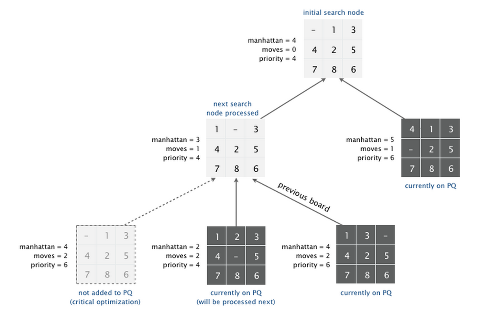

# [Programming Assignment 4: 8_Puzzle](http://coursera.cs.princeton.edu/algs4/assignments/8puzzle.html)

## Instruction

Write a program to solve the 8-puzzle problem (and its natural generalizations) using the A* search algorithm.

### The problem. 

The 8-puzzle problem is a puzzle invented and popularized by Noyes Palmer Chapman in the 1870s. It is played on a 3-by-3 grid with 8 square blocks labeled 1 through 8 and a blank square. Your goal is to rearrange the blocks so that they are in order, using as few moves as possible. You are permitted to slide blocks horizontally or vertically into the blank square. The following shows a sequence of legal moves from an initial board (left) to the goal board (right).

    
        1  3        1     3        1  2  3        1  2  3        1  2  3
     4  2  5   =>   4  2  5   =>   4     5   =>   4  5      =>   4  5  6
     7  8  6        7  8  6        7  8  6        7  8  6        7  8 
    
     initial        1 left          2 up          5 left          goal

### Best-first search. 

Now, we describe a solution to the problem that illustrates a general artificial intelligence methodology known as the A* search algorithm. We define a search node of the game to be a board, the number of moves made to reach the board, and the previous search node. First, insert the initial search node (the initial board, 0 moves, and a null previous search node) into a priority queue. Then, delete from the priority queue the search node with the minimum priority, and insert onto the priority queue all neighboring search nodes (those that can be reached in one move from the dequeued search node). Repeat this procedure until the search node dequeued corresponds to a goal board. The success of this approach hinges on the choice of priority function for a search node. We consider two priority functions:

* Hamming priority function. 
    * The number of blocks in the wrong position, plus the number of moves made so far to get to the search node. Intutively, a search node with a small number of blocks in the wrong position is close to the goal, and we prefer a search node that have been reached using a small number of moves.

* Manhattan priority function. 
    * The sum of the Manhattan distances (sum of the vertical and horizontal distance) from the blocks to their goal positions, plus the number of moves made so far to get to the search node.


For example, the Hamming and Manhattan priorities of the initial search node below are 5 and 10, respectively.

     8  1  3        1  2  3     1  2  3  4  5  6  7  8    1  2  3  4  5  6  7  8
     4     2        4  5  6     ----------------------    ----------------------
     7  6  5        7  8        1  1  0  0  1  1  0  1    1  2  0  0  2  2  0  3
    
     initial          goal         Hamming = 5 + 0          Manhattan = 10 + 0

We make a key observation: To solve the puzzle from a given search node on the priority queue, the total number of moves we need to make (including those already made) is at least its priority, using either the Hamming or Manhattan priority function. (For Hamming priority, this is true because each block that is out of place must move at least once to reach its goal position. For Manhattan priority, this is true because each block must move its Manhattan distance from its goal position. Note that we do not count the blank square when computing the Hamming or Manhattan priorities.) Consequently, when the goal board is dequeued, we have discovered not only a sequence of moves from the initial board to the goal board, but one that makes the fewest number of moves. (Challenge for the mathematically inclined: prove this fact.)


### A critical optimization. 

Best-first search has one annoying feature: search nodes corresponding to the same board are enqueued on the priority queue many times. To reduce unnecessary exploration of useless search nodes, when considering the neighbors of a search node, don't enqueue a neighbor if its board is the same as the board of the previous search node.

    
     8  1  3       8  1  3       8  1       8  1  3     8  1  3
     4     2       4  2          4  2  3    4     2     4  2  5
     7  6  5       7  6  5       7  6  5    7  6  5     7  6
    
     previous    search node    neighbor   neighbor    neighbor
                                          (disallow)

### Game tree

One way to view the computation is as a game tree, where each search node is a node in the game tree and the children of a node correspond to its neighboring search nodes. The root of the game tree is the initial search node; the internal nodes have already been processed; the leaf nodes are maintained in a priority queue; at each step, the A* algorithm removes the node with the smallest priority from the priority queue and processes it (by adding its children to both the game tree and the priority queue).



### Detecting infeasible puzzles 

Not all initial boards can lead to the goal board such as the one below.

     1  2  3
     4  5  6
     8  7

    infeasible

To detect such situations, use the fact that boards are divided into two equivalence classes with respect to reachability: (i) those that lead to the goal board and (ii) those that lead to the goal board if we modify the initial board by swapping any pair of adjacent (non-blank) blocks in the same row. (Difficult challenge for the mathematically inclined: prove this fact.) To apply the fact, run the A* algorithm simultaneously on two puzzle instances—one with the initial board and one with the initial board modified by swapping a pair of adjacent blocks in the same row. Exactly one of the two will lead to the goal board.


### Board and Solver data types

Organize your program by creating an immutable data type Board with the following API:

```java
public class Board {
    public Board(int[][] blocks)           // construct a board from an N-by-N array of blocks
                                           // (where blocks[i][j] = block in row i, column j)
    public int dimension()                 // board dimension N
    public int hamming()                   // number of blocks out of place
    public int manhattan()                 // sum of Manhattan distances between blocks and goal
    public boolean isGoal()                // is this board the goal board?
    public Board twin()                    // a board obtained by exchanging two adjacent blocks in the same row
    public boolean equals(Object y)        // does this board equal y?
    public Iterable<Board> neighbors()     // all neighboring boards
    public String toString()               // string representation of the board (in the output format specified below)
}
```
and an immutable data type Solver with the following API:

```java
public class Solver {
    public Solver(Board initial)            // find a solution to the initial board (using the A* algorithm)
    public boolean isSolvable()             // is the initial board solvable?
    public int moves()                      // min number of moves to solve initial board; -1 if no solution
    public Iterable<Board> solution()       // sequence of boards in a shortest solution; null if no solution
    public static void main(String[] args)  // solve a slider puzzle (given below)
}
```

To implement the A* algorithm, you must use the `MinPQ` data type from algs4.jar for the priority queues.
Solver test client. Use the following test client to read a puzzle from a file (specified as a command-line argument) and print the solution to standard output.

```java
public static void main(String[] args) {
    // create initial board from file
    In in = new In(args[0]);
    int N = in.readInt();
    int[][] blocks = new int[N][N];
    for (int i = 0; i < N; i++)
        for (int j = 0; j < N; j++)
            blocks[i][j] = in.readInt();
    Board initial = new Board(blocks);

    // solve the puzzle
    Solver solver = new Solver(initial);

    // print solution to standard output
    if (!solver.isSolvable())
        StdOut.println("No solution possible");
    else {
        StdOut.println("Minimum number of moves = " + solver.moves());
        for (Board board : solver.solution())
            StdOut.println(board);
    }
}
```

### Input and output formats

The input and output format for a board is the board dimension N followed by the N-by-N initial board, using 0 to represent the blank square. As an example,

    % more puzzle04.txt
    3
     0  1  3
     4  2  5
     7  8  6
    
    % java Solver puzzle04.txt
    Minimum number of moves = 4
    
    3
     0  1  3 
     4  2  5 
     7  8  6 
    
    3
     1  0  3 
     4  2  5 
     7  8  6 
    
    3
     1  2  3 
     4  0  5 
     7  8  6 
    
    3
     1  2  3 
     4  5  0   
     7  8  6 
    
    3
     1  2  3 
     4  5  6 
     7  8  0
    % more puzzle-unsolvable3x3.txt
    3
     1  2  3
     4  5  6
     8  7  0
    
    % java Solver puzzle3x3-unsolvable.txt
    No solution possible

Your program should work correctly for arbitrary N-by-N boards (for any 2 ≤ N < 128), even if it is too slow to solve some of them in a reasonable amount of time.

### Deliverables 

* Submit the files **Board.java** and **Solver.java** (with the Manhattan priority). 
* We will supply stdlib.jar and algs4.jar. 
* Your may not call any library functions other than those in java.lang, java.util, stdlib.jar, and algs4.jar. 
* You must use the MinPQ data type from algs4.jar for the priority queues.


## [Checklist](http://coursera.cs.princeton.edu/algs4/checklists/8puzzle.html)

### FAQ

**Can I use different class names, method names, or method signatures from those prescribed in the API?** No, as usual, your assignment will not be graded if it violates the API.

**Can I assume that the puzzle inputs (arguments to the Board constructor and input to Solver) are valid?** Yes, though it never hurts to include some basic error checking.

**Do I have to implement my own stack, queue, and priority queue?** You must use either MinPQ or MaxPQ for your priority queue (because we will intercept calls in order to do performance analysis). For the other data types, you may use versions from either algs4.jar or java.util.

**How do I return an Iterable<Board>?** Add the items you want to a Stack<Board> or Queue<Board> and return that.

**How do I implement equals()?** Java has some arcane rules for implementing equals(), discussed on p. 103 of Algorithms, 4th edition. Note that the argument to equals() is required to be Object. You can also inspect Date.java or Transaction.java for online examples.

**Must I implement the toString() method for Board exactly as specified?** Yes. Be sure to include the board dimension and use 0 for the blank square. Use String.format() to format strings—it works like StdOut.printf(), but returns the string instead of printing it to standard output. For reference, our implementation is below, but yours may vary depending on your choice of instance variables.

```java
public String toString() {
    StringBuilder s = new StringBuilder();
    s.append(N + "\n");
    for (int i = 0; i < N; i++) {
        for (int j = 0; j < N; j++) {
            s.append(String.format("%2d ", tiles[i][j]));
        }
        s.append("\n");
    }
    return s.toString();
}
```

**Should the hamming() and manhattan() methods in Board return the Hamming and Manhattan priority functions, respectively?** No, hamming() should return the number of blocks out of position and manhattan() should return the sum of the Manhattan distances between the blocks and their goal positions. Recall that the blank square is not considered a block. You will compute the priority function in Solver by calling hamming() or manhattan() and adding to it the number of moves.

**I'm a bit confused about the purpose of the twin() method.** You will use it to determine whether a puzzle is solvable: exactly one of a board and its twin are solvable. A twin is obtained by swapping two adjacent blocks (the blank does not count) in the same row. For example, here is a board and its 5 possible twins. Your solver will use only one twin.

        1  3       3  1       1  3       1  3       1  3       1  3
     4  2  5    4  2  5    2  4  5    4  5  2    4  2  5    4  2  5
     7  8  6    7  8  6    7  8  6    7  8  6    8  7  6    7  6  8
    
      board      twin       twin       twin       twin       twin

**How do I reconstruct the solution once I've dequeued the goal search node?** Since each search node records the previous search node to get there, you can chase the pointers all the way back to the initial search node (and consider them in reverse order).

**Can I terminate the search as soon as a goal search node is enqueued (instead of dequeued)?** No, even though it does lead to a correct solution for the slider puzzle problem using the Hamming and Manhattan priority functions, it's not techincally the A* algorithm (and will not find the correct solution for other problems and other priority functions).

**I noticed that the priorities of the search nodes dequeued from the priority queue never decrease. Is this a property of the A* algorithm?** Yes. In the language of the A* algorithm, the Hamming and Manhattan distances (before adding in the number of moves so far) are known as heuristics. If a heuristic is both admissible (never overestimates the number of moves to the goal search node) and consistent (satisfies a certain triangle inequality), then this noticed property is guaranteed. The Hamming and Manhattan heuristics are both admissible and consistent. You may use this noticed property as a debugging clue: if the priority of the search node dequeued from the priority queue decreases, then you know you did something wrong.

**Even with the critical optimization, the priority queue may contain two or more search nodes corresponding to the same board. Should I try to eliminate these?** You can easily do so with a set data type such as SET in algs4.jar or java.util.TreeSet. However, almost all of the benefit from avoiding duplicate boards is already extracted from the critical optimization.

**Can I put the logic for detecting whether a puzzle is infeasible in Board instead of Solver?** There is a elegant algorithm for determining whether a board is solvable that relies on a parity argument (and occasionally we change our API to require this solution). However, the current API requires you to detect infeasiblity in Solver by using two priority queues.

**I run out of memory when running some of the large sample puzzles. What should I do?** Be sure to ask Java for additional memory, e.g., java -Xmx1600m Solver puzzle36.txt. We recommend running from the command line (and not from the DrJava interaction pane). You should expect to run out of memory when using the Hamming priority function. Be sure not to put the JVM option in the wrong spot or it will be treated as a command-line argument, e.g., java Solver -Xmx1600m puzzle36.txt.

**My program can't solve puzzle4x4-hard1.txt or puzzle4x4-hard2.txt, even if I give it a huge amount of space. What am I doing wrong?** Probably nothing. The A* algorithm will struggle to solve even some 4-by-4 instances.

### Testing

**Input files.**   The directory [8puzzle](http://coursera.cs.princeton.edu/algs4/testing/8puzzle/) contains many sample puzzle input files. For convenience, [8puzzle-testing.zip](http://coursera.cs.princeton.edu/algs4/testing/8puzzle-testing.zip) contains all of these files bundled together.

* The shortest solution to puzzle[T].txt requires exactly T moves.
* The shortest solution to puzzle4x4-hard1.txt and puzzle4x4-hard2.txt are 38 and 47, respectively.
* Warning: puzzle36.txt is especially difficult.

**Test client.** A good way to automatically run your program on our sample puzzles is to use the client [PuzzleChecker.java](http://coursera.cs.princeton.edu/algs4/checklists/PuzzleChecker.java).

**Priority queue trace.**

* Here are the contents of our priority queue (sorted by priority) just before dequeueing each node when using the Manhattan priority function on *puzzle04.txt*.

    Step 0:    priority  = 4
               moves     = 0
               manhattan = 4
               3            
                0  1  3     
                4  2  5     
                7  8  6     
    
    Step 1:    priority  = 4    priority  = 6
               moves     = 1    moves     = 1
               manhattan = 3    manhattan = 5
               3                3            
                1  0  3          4  1  3     
                4  2  5          0  2  5     
                7  8  6          7  8  6     
    
    Step 2:    priority  = 4    priority  = 6    priority  = 6
               moves     = 2    moves     = 1    moves     = 2
               manhattan = 2    manhattan = 5    manhattan = 4
               3                3                3            
                1  2  3          4  1  3          1  3  0     
                4  0  5          0  2  5          4  2  5     
                7  8  6          7  8  6          7  8  6     
    
    Step 3:    priority  = 4    priority  = 6    priority  = 6    priority  = 6    priority  = 6
               moves     = 3    moves     = 3    moves     = 2    moves     = 3    moves     = 1
               manhattan = 1    manhattan = 3    manhattan = 4    manhattan = 3    manhattan = 5
               3                3                3                3                3            
                1  2  3          1  2  3          1  3  0          1  2  3          4  1  3     
                4  5  0          4  8  5          4  2  5          0  4  5          0  2  5     
                7  8  6          7  0  6          7  8  6          7  8  6          7  8  6     
    
    Step 4:    priority  = 4    priority  = 6    priority  = 6    priority  = 6    priority  = 6    priority  = 6
               moves     = 4    moves     = 3    moves     = 4    moves     = 2    moves     = 3    moves     = 1
               manhattan = 0    manhattan = 3    manhattan = 2    manhattan = 4    manhattan = 3    manhattan = 5
               3                3                3                3                3                3            
                1  2  3          1  2  3          1  2  0          1  3  0          1  2  3          4  1  3     
                4  5  6          0  4  5          4  5  3          4  2  5          4  8  5          0  2  5     
                7  8  0          7  8  6          7  8  6          7  8  6          7  0  6          7  8  6     


There were a total of 10 search nodes enqueued and 5 search nodes dequeued. In general, the number of search nodes enqueued and dequeued may vary slightly, depending the order in which the search nodes with equal priorities come off the priority queue, which depends on the order in which neighbors() returns the neighbors of a board. However, for this input, there are no such ties, so you should have exactly 10 search nodes enqueued and 5 search nodes dequeued.

* The contents of our priority queue (sorted by priority) just before dequeueing each node when using the Hamming priority function on puzzle04.txt turns out to be identical to the results above: for this input file, throughout the A* algorithm, a block is never more than one position away from its goal position, which implies that the Hamming function and the Manhattan functions are equal.

* Write the class Solver that uses the A* algorithm to solve puzzle instances. -->

### Enrichment

**How can I reduce the amount of memory a Board uses?** For starters, recall that an N-by-N int[][] array in Java uses about 24 + 32N + 4N^2 bytes; when N equals 3, this is 156 bytes. To save memory, consider using an N-by-N char[][] array or a length N^2 char[] array. In principle, each board is a permutation of size N^2, so you need only about lg ((N^2)!) bits to represent it; when N equals 3, this is only 19 bits.

**Any ways to speed up the algorithm?** One useful trick is to cache the Manhattan distance of a board. That is, maintain an extra instance variable and initialize it the first time that manhattan() is called or when you construct the board; afterwards, just return the cached value.

**Is there an efficient way to solve the 8-puzzle and its generalizations?** Finding a shortest solution to an N-by-N slider puzzle is NP-hard, so it's unlikely that an efficient solution exists.

**What if I'm satisfied with any solution and don't need one that uses the fewest number of moves?** Yes, change the priority function to put more weight on the Manhattan distance, e.g., 100 times the Manhattan distance plus the number of moves made already. This paper describes an algorithm that guarantees to perform at most N^3 moves.

**Are there better ways to solve 8- and 15-puzzle instances using the minimum number of moves?** Yes, there are a number of approaches.

* Use the A* algorithm with a better admissible priority function:
    * Linear conflict: add two to the Manhattan priority function whenever two tiles are in their goal row (or column) but are reversed relative to their goal position.
    * Pattern database: For each possible configuration of 4 tiles and the blank, determine the minimum number of moves to put just these tiles in their proper position and store these values in a database. The heuristic value is the maximum over all configurations, plus the number of moves made so far. This can reduce the number of search nodes examined for random 15-puzzle instances by a factor of 1000.

* Use a variant of the A* algorithm known as IDA* (for iterative deepening). [This paper](http://cseweb.ucsd.edu/~ccalabro/essays/15_puzzle.pdf) describes its application to the 15-slider puzzle.

* Another approach is to use bidirectional search, where you simultaneously search from the initial board to find the goal board and from the goal board to find the initial board, and have the two search trees meet in the middle. Handling the stopping condition is delicate.

**Can a puzzle have more than one shortest solution?** Yes. See puzzle07.txt.

     Solution 1
     ------------------------------------------------------------------------------------
     1  2  3    1  2  3    1  2  3    1  2  3    1  2  3    1  2  3    1  2  3    1  2  3 
        7  6    7     6    7  4  6    7  4  6       4  6    4     6    4  5  6    4  5  6 
     5  4  8    5  4  8    5     8       5  8    7  5  8    7  5  8    7     8    7  8   
    
     Solution 2
     ------------------------------------------------------------------------------------
     1  2  3    1  2  3    1  2  3    1  2  3    1  2  3    1  2  3    1  2  3    1  2  3
        7  6    5  7  6    5  7  6    5     6       5  6    4  5  6    4  5  6    4  5  6 
     5  4  8       4  8    4     8    4  7  8    4  7  8       7  8    7     8    7  8  
 
In such cases, you are required to output any one such solution.


