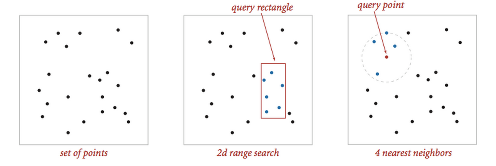
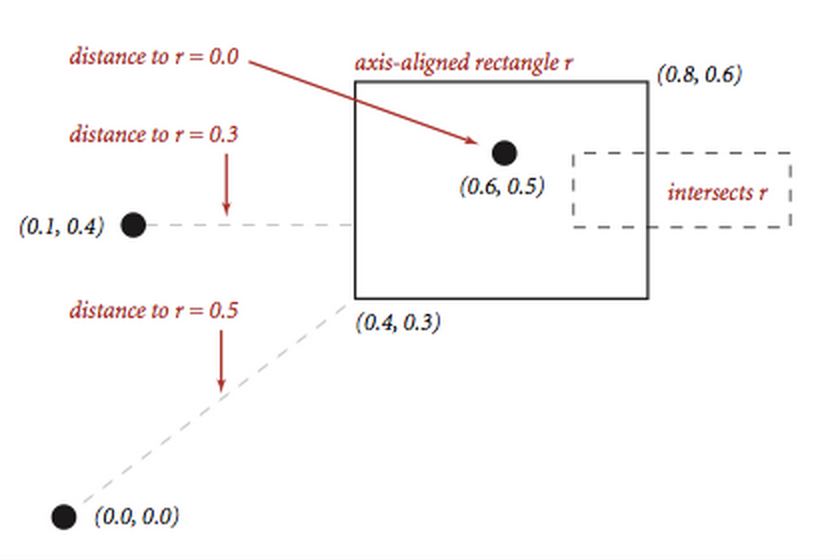
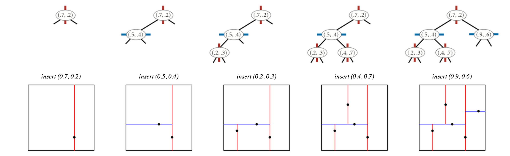
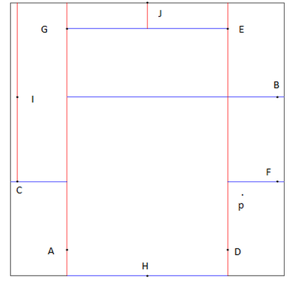

# [Programming_Assignment_5: Kd-Trees](http://coursera.cs.princeton.edu/algs4/assignments/kdtree.html)

Write a data type to represent a set of points in the unit square (all points have x- and y-coordinates between 0 and 1) using a 2d-tree to support efficient range search (find all of the points contained in a query rectangle) and nearest neighbor search (find a closest point to a query point). 2d-trees have numerous applications, ranging from classifying astronomical objects to computer animation to speeding up neural networks to mining data to image retrieval.



## Geometric primitives

* To get started, use the following geometric primitives for points and axis-aligned rectangles in the plane.



Use the immutable data type Point2D.java (part of algs4.jar) for points in the plane. Here is the subset of its API that you may use:

```java
public class Point2D implements Comparable<Point2D> {
   public Point2D(double x, double y)              // construct the point (x, y)
   public double x()                               // x-coordinate
   public double y()                               // y-coordinate
   public double distanceTo(Point2D that)          // Euclidean distance between two points
   public double distanceSquaredTo(Point2D that)   // square of Euclidean distance between two points
   public int compareTo(Point2D that)              // for use in an ordered symbol table
   public boolean equals(Object that)              // does this point equal that?
   public void draw()                              // draw to standard draw
   public String toString()                        // string representation
}
```

Use the immutable data type RectHV.java (not part of algs4.jar) for axis-aligned rectanges. Here is the subset of its API that you may use:

```java
public class RectHV {
   public RectHV(double xmin, double ymin,         // construct the rectangle [xmin, xmax] x [ymin, ymax]
                 double xmax, double ymax)         // throw a java.lang.IllegalArgumentException if (xmin > xmax) or (ymin > ymax)
   public double xmin()                            // minimum x-coordinate of rectangle
   public double ymin()                            // minimum y-coordinate of rectangle
   public double xmax()                            // maximum x-coordinate of rectangle
   public double ymax()                            // maximum y-coordinate of rectangle
   public boolean contains(Point2D p)              // does this rectangle contain the point p (either inside or on boundary)?
   public boolean intersects(RectHV that)          // does this rectangle intersect that rectangle (at one or more points)?
   public double distanceTo(Point2D p)             // Euclidean distance from point p to the closest point in rectangle
   public double distanceSquaredTo(Point2D p)      // square of Euclidean distance from point p to closest point in rectangle
   public boolean equals(Object that)              // does this rectangle equal that?
   public void draw()                              // draw to standard draw
   public String toString()                        // string representation
}
```

Do not modify these data types.

## Brute-force implementation. 

* Write a mutable data type PointSET.java that represents a set of points in the unit square. Implement the following API by using a red-black BST (using either SET from algs4.jar or java.util.TreeSet).

```java
public class PointSET {
   public PointSET()                               // construct an empty set of points
   public boolean isEmpty()                        // is the set empty?
   public int size()                               // number of points in the set
   public void insert(Point2D p)                   // add the point p to the set (if it is not already in the set)
   public boolean contains(Point2D p)              // does the set contain the point p?
   public void draw()                              // draw all of the points to standard draw
   public Iterable<Point2D> range(RectHV rect)     // all points in the set that are inside the rectangle
   public Point2D nearest(Point2D p)               // a nearest neighbor in the set to p; null if set is empty
}
```

Your implementation should support insert() and contains() in time proportional to the logarithm of the number of points in the set in the worst case; it should support nearest() and range() in time proportional to the number of points in the set.

## 2d-tree implementation. 

Write a mutable data type KdTree.java that uses a 2d-tree to implement the same API (but replace PointSET with KdTree). A 2d-tree is a generalization of a BST to two-dimensional keys. The idea is to build a BST with points in the nodes, using the x- and y-coordinates of the points as keys in strictly alternating sequence.

* Search and insert. 
    * The algorithms for search and insert are similar to those for BSTs, but at the root we use the x-coordinate (if the point to be inserted has a smaller x-coordinate than the point at the root, go left; otherwise go right); then at the next level, we use the y-coordinate (if the point to be inserted has a smaller y-coordinate than the point in the node, go left; otherwise go right); then at the next level the x-coordinate, and so forth.



* Draw. 
    * A 2d-tree divides the unit square in a simple way: all the points to the left of the root go in the left subtree; all those to the right go in the right subtree; and so forth, recursively. Your draw() method should draw all of the points to standard draw in black and the subdivisions in red (for vertical splits) and blue (for horizontal splits). This method need not be efficient—it is primarily for debugging.


The prime advantage of a 2d-tree over a BST is that it supports efficient implementation of range search and nearest neighbor search. Each node corresponds to an axis-aligned rectangle in the unit square, which encloses all of the points in its subtree. The root corresponds to the unit square; the left and right children of the root corresponds to the two rectangles split by the x-coordinate of the point at the root; and so forth.

* Range search. 
    * To find all points contained in a given query rectangle, start at the root and recursively search for points in both subtrees using the following pruning rule: if the query rectangle does not intersect the rectangle corresponding to a node, there is no need to explore that node (or its subtrees). A subtree is searched only if it might contain a point contained in the query rectangle.

* Nearest neighbor search. 
    * To find a closest point to a given query point, start at the root and recursively search in both subtrees using the following pruning rule: if the closest point discovered so far is closer than the distance between the query point and the rectangle corresponding to a node, there is no need to explore that node (or its subtrees). That is, a node is searched only if it might contain a point that is closer than the best one found so far. The effectiveness of the pruning rule depends on quickly finding a nearby point. To do this, organize your recursive method so that when there are two possible subtrees to go down, you always choose the subtree that is on the same side of the splitting line as the query point as the first subtree to explore—the closest point found while exploring the first subtree may enable pruning of the second subtree.
    

## Clients  

You may use the following interactive client programs to test and debug your code.

* KdTreeVisualizer.java computes and draws the 2d-tree that results from the sequence of points clicked by the user in the standard drawing window.
* RangeSearchVisualizer.java reads a sequence of points from a file (specified as a command-line argument) and inserts those points into a 2d-tree. Then, it performs range searches on the axis-aligned rectangles dragged by the user in the standard drawing window.
* NearestNeighborVisualizer.java reads a sequence of points from a file (specified as a command-line argument) and inserts those points into a 2d-tree. Then, it performs nearest neighbor queries on the point corresponding to the location of the mouse in the standard drawing window.

## Analysis of running time and memory usage (optional and not graded). 

* Give the total memory usage in bytes (using tilde notation) of your 2d-tree data structure as a function of the number of points N, using the memory-cost model from lecture and Section 1.4 of the textbook. Count all memory that is used by your 2d-tree, including memory for the nodes, points, and rectangles.
* Give the expected running time in seconds (using tilde notation) to build a 2d-tree on N random points in the unit square. (Do not count the time to read in the points from standard input.)
* How many nearest neighbor calculations can your 2d-tree implementation perform per second for input100K.txt (100,000 points) and input1M.txt (1 million points), where the query points are random points in the unit square? (Do not count the time to read in the points or to build the 2d-tree.) Repeat this question but with the brute-force implementation.

## Submission  

Submit only **PointSET.java** and and **KdTree.java**. 
We will supply RectHV.java, stdlib.jar, and algs4.jar. 
Your may not call any library functions other than those in java.lang, java.util, stdlib.jar, and algs4.jar.

# Checklist

## FAQ

* What should I do if a point has the same x-coordinate as the point in a node when inserting / searching in a 2d-tree? 
    * Go the right subtree as specified.
* Can I assume that all x- or y-coordinates of points inserted into the KdTree will be between 0 and 1? 
    * Yes. You may also assume that the insert(), contains(), and nearest() methods in KdTree are passed points with x- and y-coordinates between 0 and 1. You may also assume that the range() method in KdTree is passed a rectangle that lies in the unit box.
* What should I do if a point is inserted twice in the data structure? 
    * The data structure represents a set of points, so you should keep only one copy.
* How should I scale the coordinate system when drawing? 
    * Don't, please keep the default range of 0 to 1.
* How should I set the size and color of the points and rectangles when drawing? 
    * Use StdDraw.setPenColor(StdDraw.BLACK) and StdDraw.setPenRadius(.01) before before drawing the points; use StdDraw.setPenColor(StdDraw.RED) or StdDraw.setPenColor(StdDraw.BLUE) and StdDraw.setPenRadius() before drawing the splitting lines.
* What should range() return if there are no points in the range? 
    * It should return an Iterable<Point2D> object with zero points.
* How much memory does a Point2D object use? 
    * For simplicity, assume that each Point2D object uses 32 bytes—in reality, it uses a bit more because of the Comparator instance variables.
* How much memory does a RectHV object use? 
    * You can look at the code and analyze it.
* I run out of memory when running some of the large sample files. What should I do? 
    * Be sure to ask Java for additional memory, e.g., java -Xmx1600m RangeSearchVisualizer input1M.txt.

## Testing

* Testing. 
    * A good way to test KdTree is to perform the same sequence of operations on both the PointSET and KdTree data types and identify any discrepancies. The sample clients RangeSearchVisualizer.java and NearestNeighborVisualizer.java take this approach.

* Sample input files.   
    * The directory kdtree contains some sample input files in the specified format. For convenience, kdtree-testing.zip contains all of these files bundled together.
        * circleN.txt contains N points on the circumference of the circle centered on (0.5, 0.5) of radius 0.5.

The result of calling draw() on the points in circle10.txt should look like the following: 



If nearest() is called with p = (.81, .30) the number of nodes visited in order to find that F is nearest is 5.
Starting with circle10k.txt if nearest is called with p = (.81, .30) the number of nodes visited in order to find that K is nearest is 6.

## Possible Progress Steps

These are purely suggestions for how you might make progress. You do not have to follow these steps.

1. Node data type. 
    * There are several reasonable ways to represent a node in a 2d-tree. One approach is to include the point, a link to the left/bottom subtree, a link to the right/top subtree, and an axis-aligned rectangle corresponding to the node.
```java
private static class Node {
   private Point2D p;      // the point
   private RectHV rect;    // the axis-aligned rectangle corresponding to this node
   private Node lb;        // the left/bottom subtree
   private Node rt;        // the right/top subtree
}
```
Unlike the Node class for BST, this Node class is static because it does not refer to a generic Key or Value type that depends on the object associated with the outer class. This saves the 8-byte inner class object overhead. Also, since we don't need to implement the rank and select operations, there is no need to store the subtree size.

2. Writing KdTree. 
* Start by writing isEmpty() and size(). These should be very easy. From there, write a simplified version of insert() which does everything except set up the RectHV for each node. Write the contains() method, and use this to test that insert() was implemented properly. Note that insert() and contains() are best implemented by using private helper methods analogous to those found on page 399 of the book or by looking at BST.java. We recommend using orientation as an argument to these helper methods.
Now add the code to insert() which sets up the RectHV for each Node. Next, write draw(), and use this to test these rectangles. Finish up KdTree with the nearest and range methods. Finally, test your implementation using our interactive client programs as well as any other tests you'd like to conduct.

## Optimizations

These are many ways to improve performance of your 2d-tree. Here are some ideas.

* Squared distances. 
    * Whenever you need to compare two Euclidean distances, it is often more efficient to compare the squares of the two distances to avoid the expensive operation of taking square roots. Everyone should implement this optimization because it is both easy to do and likely a bottleneck.
* Range search. 
    * Instead of checking whether the query rectangle intersects the rectangle corresponding to a node, it suffices to check only whether the query rectangle intersects the splitting line segment: if it does, then recursively search both subtrees; otherwise, recursively search the one subtree where points intersecting the query rectangle could be.
* Save memory. 
    * You are not required to explictily store a RectHV in each 2d-tree node (though it is probably wise in your first version).